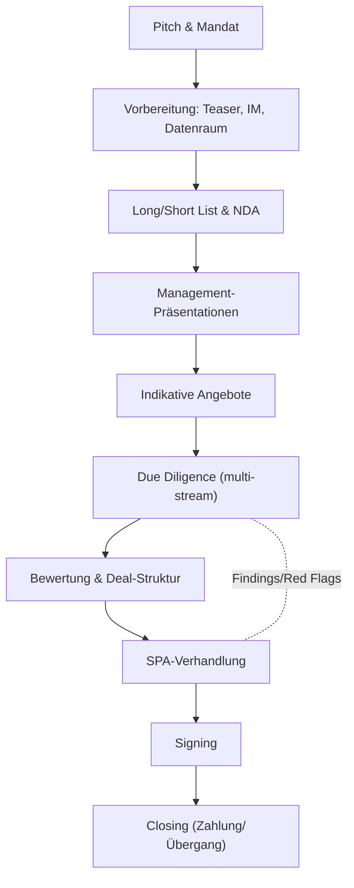
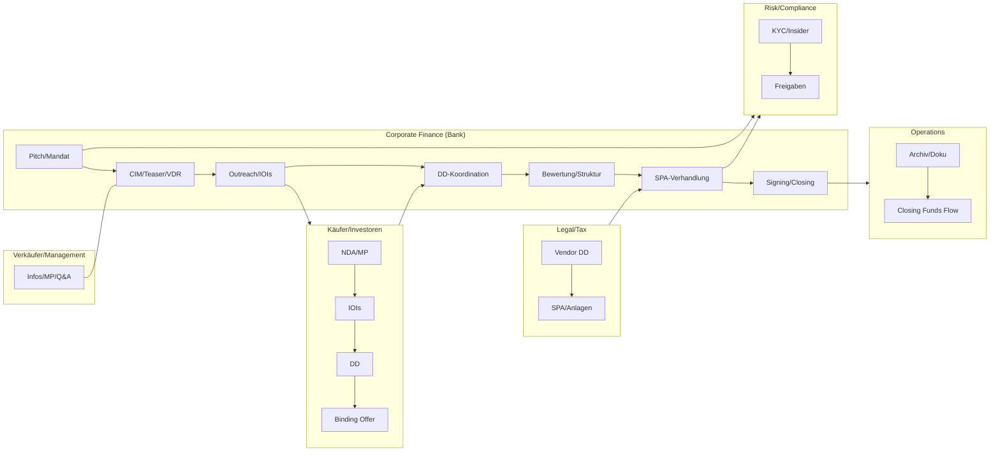
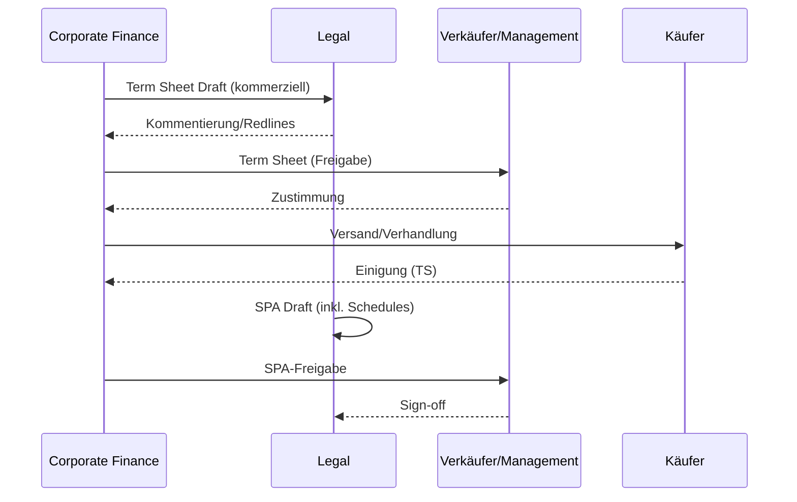

# Corporate Finance – M&A und Finanzierung (Mittelstand)

- Zweck: Wertmaximierender Kauf/Verkauf, Nachfolge lösen, Wachstum/Strategie finanzieren.
- Output: Signiertes SPA/SSA, Preis/Konditionen, gesicherte Finanzierung, Closing.
- Scope: Sell-Side, Buy-Side, Carve-out, MBO/MBI, Add-on-Akquisitionen.

## Kurzüberblick Prozess

- Pitch & Mandat: Vertrauensaufbau, Erwartungsmanagement, Mandatsumfang fixieren.
- Vorbereitung: Teaser, Informationsmemorandum (CIM), Financials, Datenraum, Long/Short List.
- Vermarktung: NDA, Management-Präsentationen, Q&A, indikative Angebote, Bieterverfahren optional.
- Due Diligence: Fachstreams (Finanzen, Legal, Tax, Commercial, Tech), Findings-Management.
- Bewertung & Struktur: Bewertungsband (Multiples/DCF), Earn-out/Locked Box, W&I-Insurance.
- Verhandlung & Signing: SPA/SSA Terms, Garantien, Covenants, Conditions Precedent.
- Finanzierung & Closing: Debt/Equity-Funding, CP-Fulfilment, Zahlungsfluss, Übergang.

## Prozessfluss (Sell-Side)

## Visualisierte Rollen & Schnittstellen

## Detaillierter Ablauf (Sell-Side)

1) Origination & Mandat
- Owner: CF MD/VP • Support: Analyst, Legal extern
- Inputs: Sektor-Thesen, Screening, Vorgespräche
- Outputs: Engagement Letter, Fee-Grid, Projektplan, Kommunikationsregeln
- Dauer: 2–4 Wochen • Kontrollen: KYC/Conflicts, Insiderliste anlegen

2) Vorbereitung & Vendor Readiness
- Owner: CF VP • Support: Management, Finance/HR/IT, DD-Berater
- Inputs: Historik, Forecasts, Verträge, Organigramme, KPI-Deck
- Outputs: Teaser, CIM, Financials Pack, VDR-Struktur, Long/Short List
- Dauer: 4–8 Wochen • Kontrollen: Zahlenabgleich HGB/IFRS, Legal Read, ESG-Check

3) Outreach & NDA
- Owner: CF Team • Support: Senior Advisor
- Inputs: Longlist, Outreach-Skripte, FAQ, Insiderhinweise
- Outputs: NDA-Signaturen, Datenraumzugänge, Interessenindikationen
- Dauer: 2–3 Wochen • Kontrollen: Gleichbehandlung, Logging sämtlicher Kontakte

4) Management-Präsentationen & IOIs
- Owner: CF Team • Support: Management, FP&A
- Inputs: MP-Deck, Q&A-Log, CIM
- Outputs: IOIs (Preisband/Struktur), Shortlist, Vendor Questions
- Dauer: 2–4 Wochen • Kontrollen: Versionierung, Fair Disclosure

5) Due Diligence (Binding Phase)
- Owner: CF • Support: Financial/Legal/Tax/Commercial/Tech/HR/DD
- Inputs: Vollständiger VDR, Site Visits, Expert Sessions
- Outputs: DD-Reports, Red-Flag-Liste, Purchase Price Mechanisms
- Dauer: 4–8 Wochen • Kontrollen: Berechtigungen, Findings-Tracker, Data Quality Gate

6) Bewertung & Strukturierung
- Owner: CF • Support: Tax/Legal, Debt Advisory
- Inputs: DD-Findings, Business Plan, Net Debt & NWC Definitionen
- Outputs: Valuation Range, Locked Box vs. Closing Accounts, Earn-out-Mechanik
- Dauer: 1–2 Wochen • Kontrollen: Peer-Review Model, Sensitivitäten, IC-Genehmigung

7) Term Sheet & SPA-Verhandlung
- Owner: CF/Legal • Support: Management
- Inputs: Term Sheet, SPA-Drafts, R&W, Covenants, CPs
- Outputs: TS-Signoff, Near-final SPA/Anlagen, Disclosure Schedules
- Dauer: 2–4 Wochen • Kontrollen: Clause Library, Issues-List, 4-Augen-Freigabe

8) Finanzierung (falls relevant)
- Owner: Debt Advisory • Support: Kreditgeber/PE
- Inputs: Struktur, Sicherheiten, Pro-forma KPIs
- Outputs: Debt Term Sheets, Commitment Letters, Intercreditor-Grundzüge
- Dauer: parallel 3–6 Wochen • Kontrollen: Covenant-Headroom, Sensitivitäten

9) Signing & Closing
- Owner: CF/Legal • Support: Notar, Banken, IT/HR/Finance
- Inputs: Final SPA, CP-Checkliste, Funds Flow Memo, Offenlegungspflichten
- Outputs: Signing Minutes, Closing Agenda, Zahlungsfluss, Übergangsplan (TSAs)
- Dauer: 1–2 Wochen bis Closing • Kontrollen: CP-Fulfilment, Funds-Flow-Controls

## Governance & Freigaben
- Conflicts/KYC vor Mandat; Aktualisierung vor Binding Phase.
- Investment Committee: Valuation-Range, Deal-Struktur, Go/No-Go.
- Disclosure/Insider: MAR-konforme Listen, Ad-hoc-Pflichten prüfen.

## Zeitplan (Beispiel, Wochen 1–20)
- W1–4: Vorbereitung/VDR • W5–6: Outreach/IOIs • W7–10: DD • W11–12: Struktur • W13–16: SPA • W17: Signing • W18–20: Closing.

## Regulatorik (DE/EU – Auswahl)
- MAR (EU 596/2014) Insider/Ad-hoc, WpHG; Kartellrecht (GWB/EU); AWV-Prüfung.

## Risiko-Matrix je Phase (Auszug)
- Leaks/ungleiche Info: zentrale Q&A, Watermarks, strikte Verteiler.
- Bewertungs-/Modellfehler: Second Pair of Eyes, Audit Trail, Sensitivitäten.
- DD-Scope-Creep: Scope-Freeze, Change-Log, Priorisierung Red Flags.
- Finanzierungssicherheit: MAC-Klauseln, Underwriting-Optionen, Flex Mechanisms.

## Vorlagen/Artefakte
- Engagement Letter, Teaser/CIM Templates, Buyer List, Q&A-Playbook, Issues-List, Funds Flow Memo, CP-Checklist.

## Governance & Policies

- Interessenkonflikte/Insider: Chinese Wall, Insiderlisten, Informationsverteilung.
- Gleichbehandlung der Bieter: einheitliche Unterlagen, zentraler Q&A‑Prozess.
- Dokumentation: Versionierung, Issues‑Listen, Entscheidungsprotokolle.

## Freigabe‑Sequence (Term Sheet/SPA)

## Kontrollmatrix (Auszug)

| Phase | Hauptrisiko | Kontrolle | Nachweis |
|---|---|---|---|
| Vorbereitung | Zahleninkonsistenz | Financials‑Abgleich, Peer‑Review | Reconciliation, Review‑Protokoll |
| Outreach | Ungleiche Info/Leaks | Standardisierte Kommunikation, Watermarks | Kontakt‑Log, VDR‑Logs |
| DD | Scope‑Creep/Leak | Scope Freeze, Berechtigungen, Tracker | Scope‑Dok., Zugriffslogs |
| Struktur/SPA | Klausellücken | Clause‑Library, 4‑Augen‑Review | Redlines, Issues‑List |
| Finanzierung | Covenant‑Risiko | Sensitivitäten, Headroom‑Check | Debt Memo, IC‑Protokoll |
| Closing | Funds‑Flow‑Fehler | 4‑Augen‑Check, Probelauf | Funds Flow, Checklisten |

## RACI (Sell‑Side)

| Aktivität | R | A | C | I |
|---|---|---|---|---|
| Origination/Mandat | CF MD | CF MD | Legal | Management |
| Vorbereitung/VDR | CF VP | CF MD | Management/Advisors | Buyer (später) |
| Outreach/NDA | CF Team | CF VP | Legal/Compliance | Management |
| MP/IOIs | CF Team | CF VP | Management | Advisors |
| Due Diligence | CF | CF MD | Fach‑DD | Management |
| Struktur/Bewertung | CF | CF MD | Legal/Tax/Debt | Management |
| SPA/Signing | Legal | CF MD | CF | Management |
| Closing | CF/Legal | CF MD | Ops | Management |

## Rollen & Schnittstellen

- Verkäufer/Management: Informationen, Management-Pitches, Verhandlungsmandat.
- Corporate Finance (Lead): Prozessdesign, Timelines, Bieterkommunikation, Koordination.
- Recht/Steuern: Vertragsgestaltung, Strukturierung, W&I, SPA/SSA-Anlagen.
- Fachdue-Diligence: Financial, Legal, Tax, Commercial, Tech/IT, HR, ESG.
- Finanzierer: Debt-Advisor/Bankenkonsortium für LBO/Refinanzierung.
- Middle/Back Office: KYC/Onboarding des Käufers, Dokumentation, Archivierung.

## Schlüsselentscheidungen

- Prozessdesign: Bieterverfahren vs. bilateral; Ein-/Mehrstufigkeit; Zeitplan.
- Valuation: Methodik, Bandbreite, Umgang mit Synergien; Sensitivitäten.
- Struktur: Share vs. Asset Deal; Earn-out/Locked Box; Reps & Warranties.
- Finanzierungsrahmen: Leverage, Covenants, Sicherheiten; Debt vs. Equity-Anteil.

## Artefakte/Dokumente

- Teaser (anonymisiert), NDA, CIM/IM, Management-Presentation, Q&A-Log.
- Prozessbrief und Angebotsvorlage, Term Sheet, SPA/SSA mit Anlagen.
- VDR-Struktur, DD-Reports, Financial Model, Valuation-Workbook.

## Risiken & Kontrollen

- Informationslecks: Strenge Bieterlisten, VDR-Berechtigungen, Watermarking.
- Bewertungsfehler: Peer-Review der Modelle, Plausibilisierungen, Sensitivitäten.
- Deal-Fallout: Alternativszenarien, Break Fees, klare Meilensteine.
- Compliance: Chinese Wall, Insiderlisten, MAR-konforme Kommunikation.

## KPIs

- Durchlaufzeit bis Signing/Closing; Anzahl indikative/finale Gebote; Preisband vs. Ziel.
- DD-Findings gelöst; Abbruchquote; Zufriedenheit Verkäufer/Management.

## IT-Systeme

- VDR/Dealroom, Collaboration (Dataroom/Q&A), Valuation-Tools, E-Signing.
- CRM/Deal-Pipeline, Aktenführung, sichere Kommunikation.

## Checkliste (Kurz)

- Mandat/Scope geklärt • Datenraum strukturiert • Longlist/Shortlist abgestimmt.
- Q&A-Prozess aufgesetzt • Bewertungsband intern freigegeben • Term Sheet verhandelt.
- SPA-Open Points Liste • Finanzierungszusagen • CP-Plan/Closing-Plan fixiert.

## Navigation

- [← Übersicht](Kernprozesse_Investmentbank_Mittelstand.md) | [→ ECM - IPO](02_ECM_IPO.md)
- [Corporate Finance](01_Corporate_Finance_MA_Finanzierung.md) | [ECM - IPO](02_ECM_IPO.md) | [DCM](03_DCM_Anleiheemission.md) | [Secondary](04_ECM_Kapitalerhoehung_Secondary.md) | [Sales & Trading](05_Sales_Trading_Designated_Sponsoring.md) | [Research](06_Research.md) | [Risk & Compliance](07_Risk_Compliance.md) | [Operations & IT](08_Operations_IT.md)
- [Templates](templates/) | [README](README.md)
