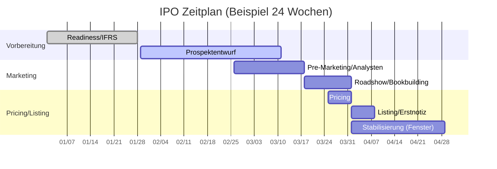

# Equity Capital Markets – IPO (Börsengang)

- Zweck: Eigenkapital für Wachstum, Sichtbarkeit, Investorenbasis verbreitern.
- Output: Zulassung, Emissionserlös, Free Float, stabile Erstnotiz, Research-Coverage.
- Rollen: Emittent, Lead/Co-Lead Manager, Rechtsberater, Wirtschaftsprüfer, Börse/Aufsicht.

## Phasenüberblick

1) Vorbereitung & Börsenreife: Governance/IFRS, Equity Story, Reorganisation, Due Diligence.
2) Prospekt & Zulassung: Erstellung/Prüfung, BaFin/Listing-Antrag, Research-Guidelines.
3) Marketing & Bookbuilding: Analystenpräsentation, Roadshow, Indications of Interest.
4) Pricing & Zuteilung: Emissionspreis/-volumen, Allokation, Greenshoe-Option.
5) Handelsstart & Stabi: Erstnotiz, Stabilisierungsfenster, Liquidität sichern.
6) Post-IPO: Research-Coverage, IR-Kalender, Lock-up-Überwachung.

## Prozessfluss (IPO)

## Zeitplan (Gantt)

## Bookbuilding Sequence

## Rollen & Verantwortlichkeiten (Swimlane)

## Detaillierter Ablauf

1) Readiness & Governance
- Owner: CFO/IR • Support: ECM, Auditor, Legal
- Inputs: IFRS/Reporting, Corporate Governance, Equity Story
- Outputs: Readiness-Report, Projektorganisation (PMO), IR-Setup
- Dauer: 4–8 Wochen • Kontrollen: IFRS-Gap-Analyse, Governance-Check

2) Prospekt & Zulassung
- Owner: Legal/ECM • Support: Auditor, Business Units
- Inputs: Financials, Risikofaktoren, Business-Beschreibung
- Outputs: Wertpapierprospekt/Registrierung, Comfort Letters, Börsenantrag
- Dauer: 6–10 Wochen • Kontrollen: Legal/Accountants’ Review, Consistency Checks

3) Analystenbriefing & Pre-Marketing
- Owner: ECM/Research • Support: Management
- Inputs: Equity Story, KPIs, Guidance-Policy
- Outputs: Analystenpräsentation, Research-Guidelines, Pre-Deal Investor Feedback
- Dauer: 2–3 Wochen • Kontrollen: Research Independence, Wall-Crossing-Protokolle

4) Roadshow & Bookbuilding
- Owner: Syndikat • Support: Sales, Management
- Inputs: Price Range, Orderbook System, Investor Targets
- Outputs: IOIs/Orders, Coverage-Statistik, Indikatives Orderbuch
- Dauer: 1–2 Wochen • Kontrollen: Daily Book Calls, Anker/Cornerstone-Management

5) Pricing & Allocation
- Owner: Syndikat/Emittent • Support: Legal
- Inputs: Orderbuch, Marktbedingungen, Free Float-Ziel
- Outputs: Emissionspreis/-volumen, Allokationsliste, Greenshoe-Plan
- Dauer: 1–2 Tage • Kontrollen: Allocation-Policy, Compliance-Check

6) Listing, Stabilisierung, Post-IPO
- Owner: ECM/S&T • Support: DS/Market Maker, IR
- Inputs: Listing-Dokumente, Stabi-Rahmen, IR-Kalender
- Outputs: Erstnotiz, Stabi-Transaktionen, Research Coverage, Reporting-Rhythmus
- Dauer: 30 Tage Stabi-Fenster • Kontrollen: MAR/Marktmissbrauch, Stabi-Protokolle

## Beispielzeitplan (24 Wochen)
- W1–4: Readiness • W5–10: Prospekt • W9–11: Pre-Marketing • W12–13: Roadshow • W13: Pricing • W14: Listing • W14–18: Stabi.

## Regulatorik (DE/EU – Auswahl)
- ProspektVO (EU) 2017/1129, MAR, WpPG/WpHG, Börsenordnung FWB, Research Independence.

## Risiken & Kontrollen je Phase
- Offenlegungsrisiken: Konsistenzprüfungen, Legal Proofread, Insiderlisten.
- Nachfrage/Preis: Early-Look, Flex-Mechaniken, Szenarien.
- Kursstabilität: Stabi-Optionen, DS-Vereinbarung, Liquiditätsplan.

## Kontrollmatrix (Auszug)

| Phase | Hauptrisiko | Kontrolle | Nachweis |
|---|---|---|---|
| Prospekt | Inkonsistenzen/Disclosure | Legal/Accountants’ Review, Consistency Checks | Protokolle, Mark‑ups |
| Pre‑Marketing | Unfaire Info | Research Independence, Wall‑Crossing | Briefings, Attendance |
| Bookbuilding | Fehlpreis | Daily Book Calls, Szenario‑Preisraster | Call‑Notes, Book‑Snapshots |
| Allocation | Bevorzugung/Conflicts | Allocation Policy, Compliance‑Teilnahme | Pricing Memo, Teilnehmerliste |
| Stabilisierung | Regelverstöße | Stabi‑Protokolle, Reporting | Stabi‑Logs |

## RACI (je Hauptphase)

| Phase | R | A | C | I |
|---|---|---|---|---|
| Prospekt | Legal/ECM | Emittent (CFO) | Auditor/Business Units | Board/IR |
| Pre‑Marketing | ECM/Research | ECM Head | Management | Compliance |
| Roadshow/Book | Syndikat/Sales | Syndikat Lead | Emittent | IR |
| Pricing/Alloc | Syndikat/Emittent | Emittent (CFO/Board) | Legal/Compliance | IR |
| Listing/Stabi | ECM/S&T | ECM Head | DS/Market Maker | Emittent/IR |

## Governance & Policies

- Prospekt‑Disziplin: Versionierung, Änderungslog, Konsistenz‑Checks.
- Wall‑Crossing: Protokolle, Empfängerkreise, Quiet Periods.
- Allocation Policy: Kriterien/Dokumentation, Compliance‑Teilnahme.

## Schlüsselentscheidungen

- Markt-Timing: Fenster, Peer-Performance, Volatilität; Segmentwahl (Prime/General/Scale).
- Preisspanne & Volumen: Primary vs. Secondary, Free Float, Investor-Mix.
- Syndikat & Gebühren: Rollenverteilung, Incentives, Stabilisierung, Lock-ups.
- Governance: Board/Committee-Struktur, Reporting, IR-Setup.

## Artefakte/Dokumente

- Wertpapierprospekt/Registrierungsdokument, Comfort Letters, Legal Opinions.
- Analystenpräsentation, Equity Story Deck, Research-Guidelines/Wall-Crossing-Protokolle.
- Bookbuilding-Logs, Pricing-Memo, Allokationskriterien, Stabi-Protokoll.

## Risiken & Kontrollen

- Disclosure-Risiko: Konsistenzprüfung, Legal/Accountants‘ Review, Insiderlisten.
- Nachfrage-Risiko: Early-Look/Cornerstones, Preis-Sensitivitäten, Upsize/Downsize-Optionen.
- Reputations-/Kursstabilität: Stabi-Mechanismen, Designated Sponsoring, Liquidity Plan.

## KPIs

- Coverage-Qualität, Ankerinvestoren-Quote, Überzeichnung, Allokationszufriedenheit.
- Emissionspreis vs. Spanne, Erstnotiz-Performance, Free Float, Turnover.

## IT-Systeme

- Deal-/Syndikat-Plattform, e-Prospectus, Investor-CRM, Bookbuilding-Tools.
- Research-Publishing, Disclosure-Portale, IR-Website/Calendar.

## Checkliste (Kurz)

- IFRS-ready • Equity Story • Prospektentwurf • Syndikat • Research Briefing • Roadshow • Pricing Memo • Stabi-Plan • IR-Setup.

## Navigation

- [← Corporate Finance](01_Corporate_Finance_MA_Finanzierung.md) | [Übersicht](Kernprozesse_Investmentbank_Mittelstand.md) | [→ DCM](03_DCM_Anleiheemission.md)
- [Corporate Finance](01_Corporate_Finance_MA_Finanzierung.md) | [ECM - IPO](02_ECM_IPO.md) | [DCM](03_DCM_Anleiheemission.md) | [Secondary](04_ECM_Kapitalerhoehung_Secondary.md) | [Sales & Trading](05_Sales_Trading_Designated_Sponsoring.md) | [Research](06_Research.md) | [Risk & Compliance](07_Risk_Compliance.md) | [Operations & IT](08_Operations_IT.md)
- [Templates](templates/) | [README](README.md)
