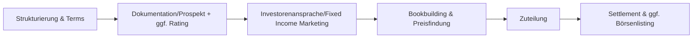
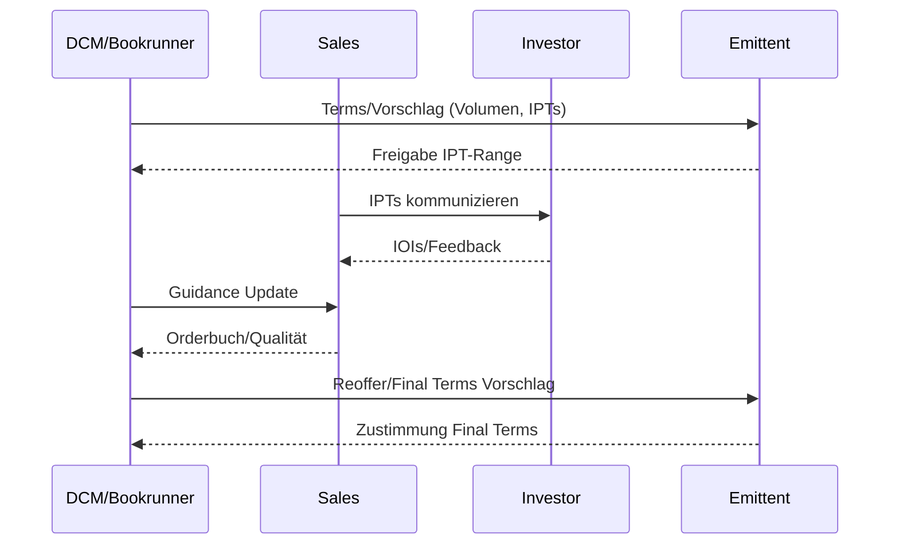
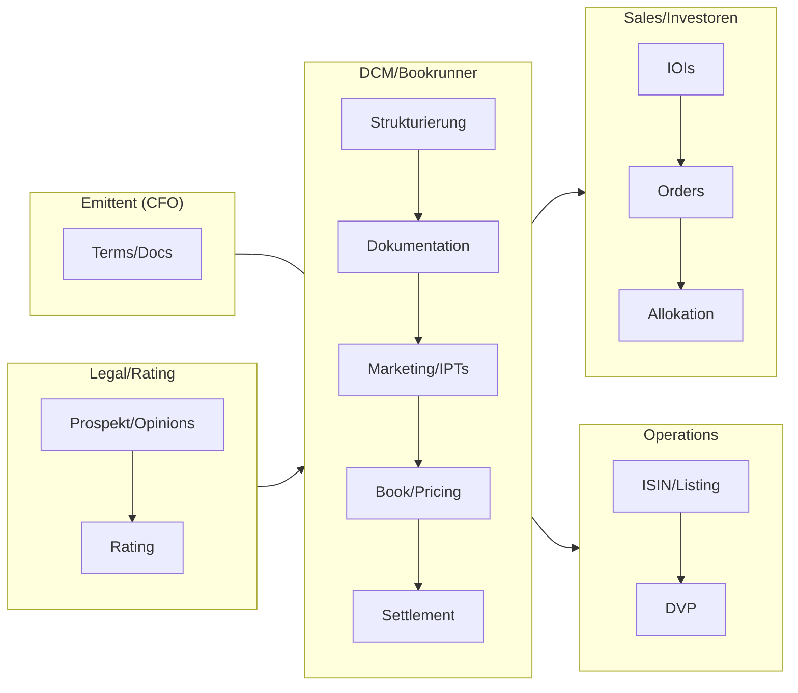

# Debt Capital Markets – Anleiheemission/Schuldschein

- Zweck: Fremdkapital zu passenden Laufzeiten/Konditionen mobilisieren.
- Output: Emittierte Schuldverschreibungen, Platzierungsgrad, ggf. Listing, Covenants etabliert.
- Rollen: Emittent, Arranger/Bookrunner, Ratingagentur, Rechtsberater, Paying Agent.

## Phasenüberblick

1) Strukturierung: Volumen, Laufzeit, Kupon/Preis, Covenants, Sicherheiten.
2) Dokumentation: Offering Circular/Prospekt, Agency Agreement, ggf. Rating-Prozess.
3) Marketing: Fixed Income Sales, Investorenansprache, Indications of Interest.
4) Bookbuilding & Preisfindung: IPTs, Guidance, Reoffer, Final Terms.
5) Zuteilung & Settlement: Allokation, ISIN/Listing, DVP-Settlement.
6) Post-Issuance: Reporting, Covenant-Tests, Investor-Relations.

## Prozessfluss (DCM)

## IPT→Reoffer Sequence

## Governance & Policies

- Zielmarkt/MiFID II: Zielkundenkreis klar definieren und dokumentieren.
- Covenants: Definitionen standardisieren (Maintenance/Incurrence), Waiver‑Prozess.
- Allocation/Documentation: Pricing Memo, Allokationsrationale, Versionierung.

## Kontrollmatrix (Auszug)

| Phase | Hauptrisiko | Kontrolle | Nachweis |
|---|---|---|---|
| Strukturierung | Überdehnung Covenants | Definitionen/Headroom Review | Mark‑Up, IC‑Protokoll |
| Marketing/IPTs | Falsche Zielgruppe | Zielmarkt/MiFID II Check | Targeting‑Liste, MiFID‑Dokumentation |
| Book/Pricing | Fehlpreis | Daily Book Calls, Szenarien | Call‑Notes, Pricing Memo |
| Settlement | Fails/Strafen | Pre‑Matching, Cut‑off‑Kontrollen | Matching‑Logs, CSDR‑Reports |

## Rollen & Verantwortlichkeiten

## Detaillierter Ablauf

1) Terms & Strukturierung
- Owner: DCM • Support: Emittent CFO, Legal, ggf. Ratingagentur
- Inputs: Kapitalbedarf, Zielinvestoren, Peer Curves
- Outputs: Termsheet (Volumen, Laufzeit, Kupon/Spread, Covenants)
- Dauer: 1–2 Wochen • Kontrollen: Covenants-Headroom, Szenarien

2) Rating & Dokumentation
- Owner: Emittent/Legal • Support: DCM, Auditor
- Inputs: Financials, Business, Sicherheiten
- Outputs: OC/Prospekt, Agency/Paying Agreements, (vorläufiges) Rating
- Dauer: 3–6 Wochen • Kontrollen: Legal/Accountants’ Review, Consistency

3) Marketing & IPTs
- Owner: DCM/Sales • Support: Management (Selected Calls)
- Inputs: Investor Presentation, IPT Range
- Outputs: IOIs, Feedback zu Terms/Size, Target-List Feinschliff
- Dauer: 1–2 Wochen • Kontrollen: Kommunikation/Insider, Gleichbehandlung

4) Bookbuilding & Preis
- Owner: DCM/Bookrunner • Support: Sales
- Inputs: Guidance, Orderflow, Marktbedingungen
- Outputs: Final Terms (Spread/Kupon), Size, Allokation
- Dauer: 1–2 Tage • Kontrollen: Price Discovery Calls, Allocation-Policy

5) Settlement & Listing
- Owner: DCM/Operations • Support: Paying Agent, CSD/ICSD
- Inputs: Final Terms, ISIN, Listing-Antrag
- Outputs: DVP-Settlement, Börsenlisting, Final OC
- Dauer: T+2/T+3 • Kontrollen: Matching, Cash/Position Recons

## Regulatorik (DE/EU – Auswahl)
- ProspektVO (EU) 2017/1129, MiFID II (Zielmarkt/Vertrieb), CSDR (Settlement Discipline), MAR.

## Risiken & Kontrollen je Phase
- Zins-/Spread-Sprung: Fenster/Absicherung, flexible IPTs.
- Covenant-Risiko: klare Definitionen, Reporting-Zyklen, Waiver-Prozess.
- Settlement-Fails: frühzeitige Setups, Pre-Matching, Penalty-Monitoring.

## RACI (Kurz)
- Terms: Owner DCM • Consult Emittent/Legal • Inform Board.
- Book: Owner Bookrunner • Support Sales • Inform Emittent.
- Settlement: Owner Ops • Support Paying Agent • Inform DCM.

## Schlüsselentscheidungen

- Festzins vs. Floater, Call/Put-Optionen, Seniorität, Sicherheiten.
- Covenants (Incurrence vs. Maintenance), Financial Definitions, Waiver-Regime.
- Investor-Zielgruppen: Asset Manager, Versicherungen, Banken, Private Placements.

## Artefakte/Dokumente

- Termsheet/Final Terms, Offering Circular, Agency Agreement, Trustee Agreement.
- Rating-Reports, Investor-Presentation, KID/PRIIPs (falls relevant).

## Risiken & Kontrollen

- Repricing-Risiko: Marktfenster, IPTs, Guidance-Management, Flex.
- Covenant-Risiko: Definitionen/Headroom, Compliance-Prozesse, Reporting-Zyklen.
- Settlement-Risiko: Clearstream/Euroclear-Setups, Timelines, Fallback-Prozesse.

## KPIs

- Orderbuchgröße, Überzeichnung, Spread vs. Guidance, Allokationsqualität.
- Settlement-Fehlerquote, Time-to-Market, Investoren-Diversität.

## IT-Systeme

- DCM-Dealtools, Investor-CRM, Bookbuilding, Listing/ISIN-Workflows.

## Checkliste (Kurz)

- Termsheet • Docs/Prospekt • Rating (optional) • Marketing • Bookbuilding • Zuteilung • Settlement • Covenant-Plan.

## Navigation

- [← ECM - IPO](02_ECM_IPO.md) | [Übersicht](Kernprozesse_Investmentbank_Mittelstand.md) | [→ Secondary](04_ECM_Kapitalerhoehung_Secondary.md)
- [Corporate Finance](01_Corporate_Finance_MA_Finanzierung.md) | [ECM - IPO](02_ECM_IPO.md) | [DCM](03_DCM_Anleiheemission.md) | [Secondary](04_ECM_Kapitalerhoehung_Secondary.md) | [Sales & Trading](05_Sales_Trading_Designated_Sponsoring.md) | [Research](06_Research.md) | [Risk & Compliance](07_Risk_Compliance.md) | [Operations & IT](08_Operations_IT.md)
- [Templates](templates/) | [README](README.md)
