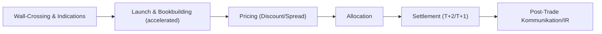
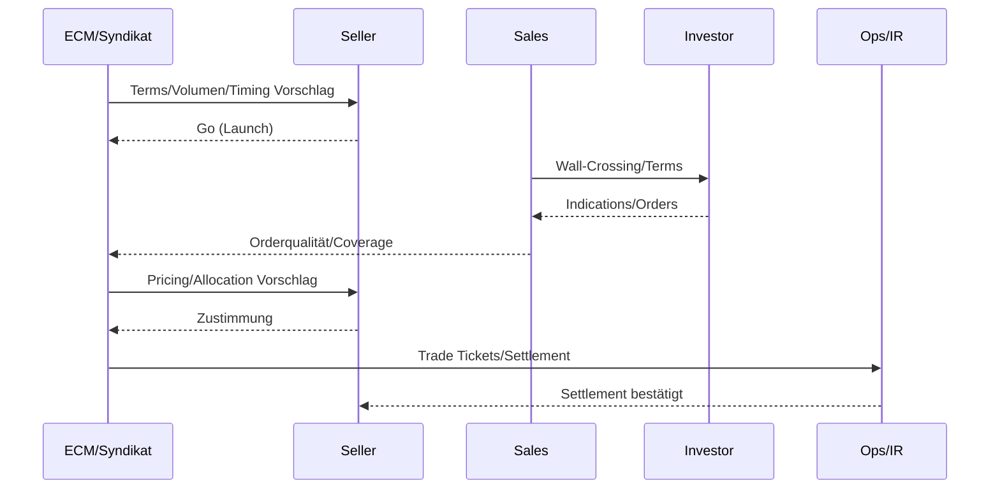
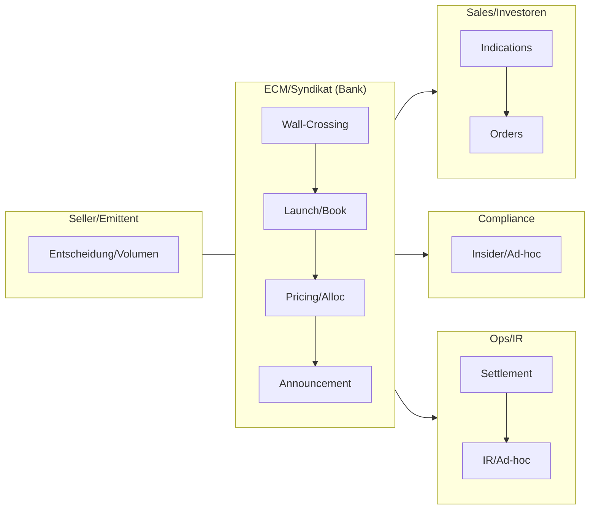

# ECM – Kapitalerhöhungen & Sekundärplatzierungen

- Zweck: Zusätzliches Eigenkapital (Primary) oder Umlaufsteigerung (Secondary) bereitstellen.
- Output: Platziertes Volumen, Bezugsrechtsabwicklung (falls BR-KE), Marktliquidität erhalten.
- Formate: Bezugsrechts-KE, Accelerated Bookbuilding (ABB), Block Trade, Convertible/PIPE.

## Szenarien & Abläufe

- Bezugsrechts-KE: Ankündigung, Bezugsfrist, Rumpfplatzierung, Handel Bezugsrechte.
- ABB/Block Trade: Wall-Crossing, beschleunigtes Bookbuilding über Nacht, Pricing.
- Secondary Placement: Verkauf von Beständen eines Großaktionärs mit Marktpflege.

## Prozessfluss (ABB/Block Trade)

## ABB Sequence (Overnight)

## Kontrollmatrix (Auszug)

| Phase | Hauptrisiko | Kontrolle | Nachweis |
|---|---|---|---|
| Vorbereitung | Leaks/Insider | Enge Kreise, MAR‑Checks | Insiderliste, Protokolle |
| Launch/Book | Fehlpreis/Überhang | Discount‑Raster, Coverage‑Monitoring | Book‑Snapshots, Call‑Notes |
| Pricing/Alloc | Bevorzugung/Conflicts | Allocation Policy, Compliance‑Teilnahme | Pricing Memo |
| Settlement | Fails | Pre‑Matching, Cut‑offs | Matching‑Logs |

## RACI

| Aktivität | R | A | C | I |
|---|---|---|---|---|
| Vorbereitung/Wall‑Crossing | ECM | ECM Head | Legal/Compliance | Seller |
| Launch/Book | Syndikat/Sales | Syndikat Lead | Seller | IR |
| Pricing/Allocation | Syndikat/Seller | Seller (Entscheid) | Legal/Compliance | IR |
| Settlement/IR | Ops/IR | Ops Lead | Syndikat | Seller |

## Governance & Policies

- MAR/Insider: Wall‑Crossing‑Skripte, Ad‑hoc‑Prüfung, Empfängerkreise.
- Allocation: Kriterien/Begründungen dokumentieren, Compliance im Meeting.
- Kommunikation: Kurzfenster, abgestimmte Messaging, Protokolle.
## Rollen & Verantwortlichkeiten (Swimlane)

## Detaillierter Ablauf (ABB)

1) Vorbereitung & Wall-Crossing
- Owner: ECM • Support: Legal, Sales
- Inputs: Seller-Intent, Volumen-Ziel, Lock-ups
- Outputs: Target-Investorlist, Wall-Crossing-Skripte, Insiderliste
- Dauer: 1–3 Tage • Kontrollen: MAR/Insider, Gleichbehandlung

2) Launch & Bookbuilding (beschleunigt)
- Owner: Syndikat • Support: Sales/Trading
- Inputs: Indikative Price Talk, Market Close
- Outputs: Orders, Coverage, Indikatives Pricing
- Dauer: Stunden • Kontrollen: Order-Qualität, Price Sensitivities

3) Pricing & Allocation
- Owner: Syndikat/Seller • Support: Legal
- Inputs: Orderbuch, Discount-Ziel, Investor-Mix
- Outputs: Final Price, Allocation, Announcement
- Dauer: < 1 Tag • Kontrollen: Allocation-Policy, Conflicts-Check

4) Settlement & Kommunikation
- Owner: Ops/ECM • Support: IR, Custodians
- Inputs: Trade Tickets, ISIN/Settlement-Details
- Outputs: DVP-Settlement, Ad-hoc/Meldungen, Post-Trade IR
- Dauer: T+1/T+2 • Kontrollen: Matching, Fails-Management

## Regulatorik (DE/EU – Auswahl)
- MAR (Ad-hoc/Insider), WpHG, Börsenordnung, Short Selling/Market Abuse Guidance.

## Risiken & Kontrollen je Phase
- Leak-Risiko: enge Kreise, Monitoring Newsflow, sofortige Ad-hoc bei Bedarf.
- Kursdruck: Discount-Steuerung, Investorenselektion, Greenshoe/DS-Unterstützung.

## Schlüsselentscheidungen

- Discount vs. Größe, Investorenselektion, Platzierungsrisiko (Firm vs. Best Efforts).
- Kommunikationsfenster, Ad-hoc-Pflichten, Insiderverwaltung.

## Artefakte/Dokumente

- Transaction Announcement, Term Sheet, Wall-Crossing-Skripte, Allocation Policy.

## Risiken & Kontrollen

- Leaks/Front Running: enge Kreise, Zeitfenster minimieren, Compliance-Überwachung.
- Kursdruck: Discount-Steuerung, Investor-Mix, Stabilisierungsmechanismen im Rahmen.

## KPIs

- Überzeichnung, Discount, Turnover am Folgetag, Kursperformance, Investorenzusammensetzung.

> Zurück zur Übersicht: [Kernprozesse_Investmentbank_Mittelstand.md](./Kernprozesse_Investmentbank_Mittelstand.md)
