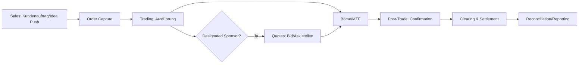
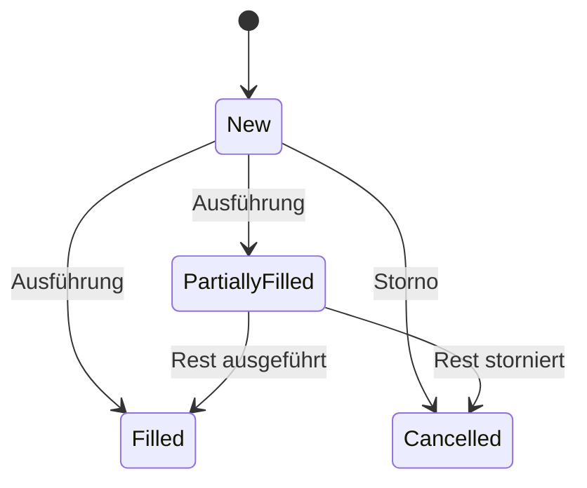
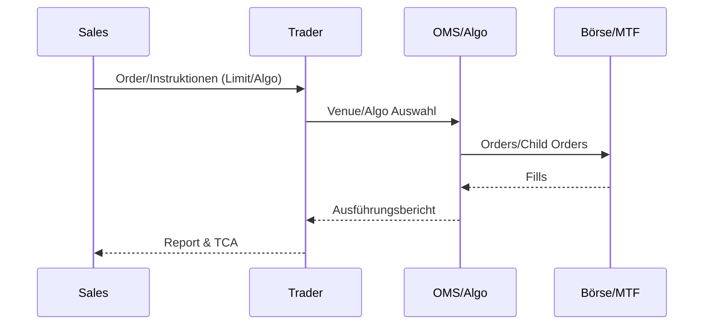
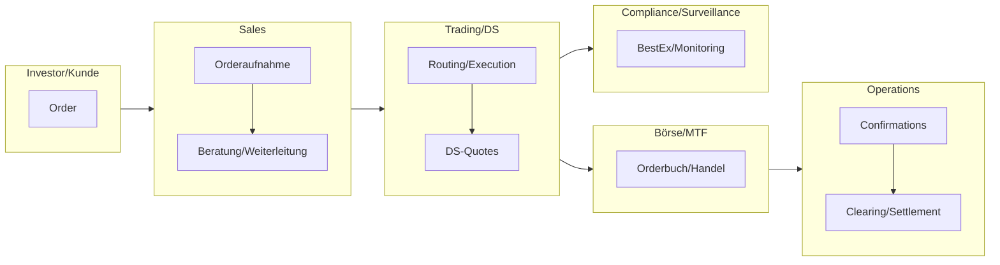

# Sales & Trading inkl. Designated Sponsoring

- Zweck: Liquidität, faire Preisfindung, Ausführung im Kundeninteresse; Platzierungsunterstützung.
- Output: Ausgeführte Orders, enge Spreads, verlässlicher Sekundärmarkt, Client Coverage.
- Rollen: Sales, Trader, Designated Sponsor, Compliance/Surveillance, Operations.

## Kernprozesse

- Sales: Kundenbetreuung, Idea-Generation, Orderaufnahme, Corporate-Access/Events.
- Trading: Ausführung (Börse/MTF/Internalisierung), Risiko- und Limitsteuerung.
- Designated Sponsoring: Quotes stellen, Mindestpräsenz/Size, Qualitätssicherung.
- Post-Trade: Bestätigung, Clearing/Settlement, Reconciliation, Reporting.

## Ausführung & Designated Sponsoring (Flow)

## Orderzustände (State)

## Best Execution – Sequence

## Kontrollmatrix (Auszug)

| Bereich | Hauptrisiko | Kontrolle | Nachweis |
|---|---|---|---|
| Orderaufnahme | Ungeeignete Orders | Appropriateness/KYC‑Check | Check‑Logs |
| Ausführung | Schlechte Best Ex | TCA, Venue‑Selektion, Algo‑Parameter | TCA‑Reports |
| DS‑Betrieb | Presence/Spread‑Verstöße | DS‑Scorecard, Monitoring | DS‑Berichte |
| Post‑Trade | Settlement‑Fails | Pre‑Matching, Cut‑offs | Matching‑/Fail‑Reports |
| Surveillance | Marktmissbrauch | Alerts/Tuning, Eskalationen | Case‑Logs |

## RACI

| Aktivität | R | A | C | I |
|---|---|---|---|---|
| Order Capture | Sales | Sales Lead | Compliance | Trading |
| Execution/Routing | Trader | Trading Head | Sales | Compliance |
| DS‑Betrieb | DS‑Trader | Trading Head | Compliance | Emittent |
| Post‑Trade | Ops | Ops Lead | Trading | Compliance |
| Surveillance | Compliance | Compliance Head | Trading | Management |

## Governance & Policies

- Best‑Execution Policy (RTS 27/28), Venue‑Selektion, jährliche Reviews.
- DS‑Verträge/Parameter, Abwesenheitsregeln, Eskalationswege.
- Kommunikation/Chinesische Mauer, Aufzeichnungs‑/Dokumentationspflichten.
## Rollen & Verantwortlichkeiten (Swimlane)

## Detaillierter Ablauf

1) Order Capture & Validation
- Owner: Sales/Trading • Support: Compliance (appropriateness), Ops
- Inputs: Kundenauftrag, Mandat/Vereinbarungen, Limits
- Outputs: Gültige Order (Order Ticket), Venue-Routing-Entscheidung
- Kontrollen: KYC/Appropriateness, Best-Ex-Policy, Credit/Position Limits

2) Execution & Routing
- Owner: Trader/Algo • Support: OMS/EMS
- Inputs: Marktbedingungen, Liquidity Sources, Algo-Parameter
- Outputs: Ausführungen (Fills), Ausführungsberichte
- Kontrollen: TCA-Benchmarks (VWAP/POV), Slippage-Überwachung

3) Designated Sponsoring Betrieb
- Owner: DS-Trader • Support: DS-Engine
- Inputs: DS-Vertrag (Presence/Spread/Size), Marktdaten
- Outputs: Quotes, Presence/Spread-Compliance, Event-Handling
- Kontrollen: DS-Scorecard, Abwesenheitsregeln, Eskalationsmatrix

4) Post-Trade & Reporting
- Owner: Ops • Support: Trading
- Inputs: Trade Confirmations, Clearing-Parameter
- Outputs: Bestätigungen, Clearing/Settlement, Reconciliation, Regulatorische Reports
- Kontrollen: Matching-Rate, Fail-Rate, MAR/Surveillance Alerts

## Regulatorik (DE/EU – Auswahl)
- MiFID II (Best Execution/RTS 27/28), MAR (Marktmissbrauch), Börsenregeln, CSDR.

## KPIs (mit Zielkorridoren – beispielhaft)
- Quote Presence > 95%, Spread-Compliance > 98%, Slippage < 10 bps vs. VWAP, Fail-Rate < 0.5%.

## Schlüsselentscheidungen

- Ausführungsstrategie: Venue-Auswahl, Algo vs. manuell, VWAP/POV/Limit/Market.
- Risikosteuerung: Positions-/Credit-Limits, Stoppregeln, Eskalationsmatrix.
- DS-Parameter: Mindestquote, Spread-Bänder, Abwesenheitsregeln.

## Risiken & Kontrollen

- Marktmissbrauch/Insider: Wall-Management, Surveillance, Eskalation.
- Ausführungsqualität: Best-Execution-Reports, TCA, Post-Trade-Review.
- Operativ: Fehlbuchungen, Settlement-Fails, Systemausfälle (BCP).

## KPIs

- Fill-Raten, Slippage vs. Benchmark, Quote-Compliance (Presence/Spread/Size), DS-Scorecard.

## IT-Systeme

- OMS/EMS, Börsenanbindungen, TCA/Surveillance, DS-Engines, Middle/Back-Office-Schnittstellen.

## Navigation

- [← Secondary](04_ECM_Kapitalerhoehung_Secondary.md) | [Übersicht](Kernprozesse_Investmentbank_Mittelstand.md) | [→ Research](06_Research.md)
- [Corporate Finance](01_Corporate_Finance_MA_Finanzierung.md) | [ECM - IPO](02_ECM_IPO.md) | [DCM](03_DCM_Anleiheemission.md) | [Secondary](04_ECM_Kapitalerhoehung_Secondary.md) | [Sales & Trading](05_Sales_Trading_Designated_Sponsoring.md) | [Research](06_Research.md) | [Risk & Compliance](07_Risk_Compliance.md) | [Operations & IT](08_Operations_IT.md)
- [Templates](templates/) | [README](README.md)
