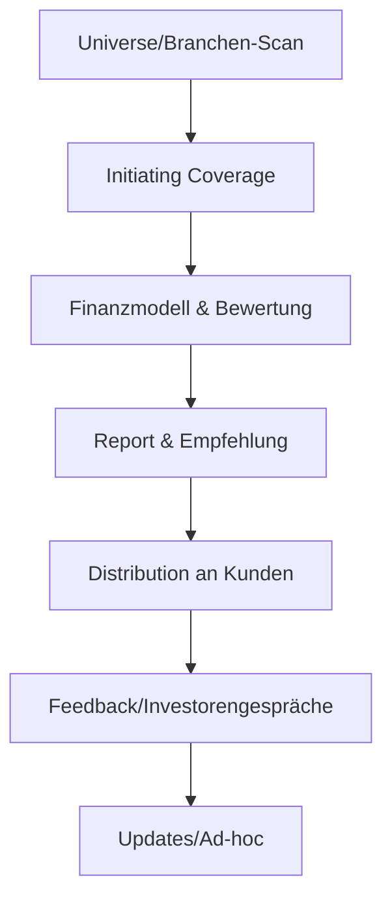
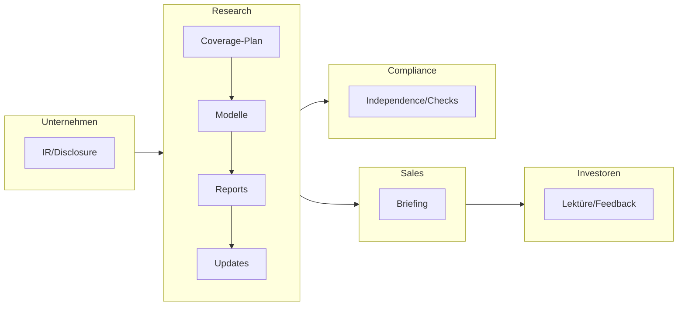
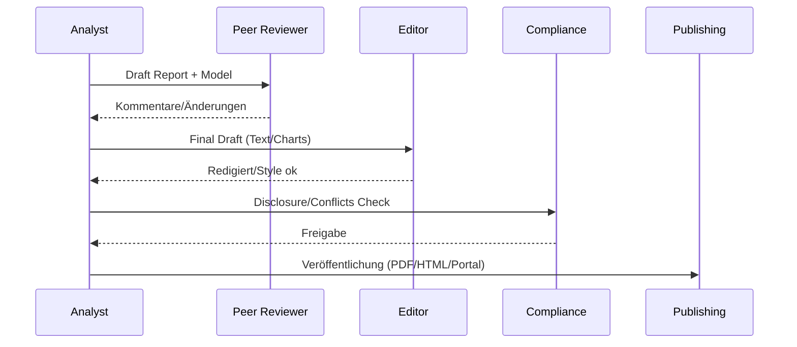
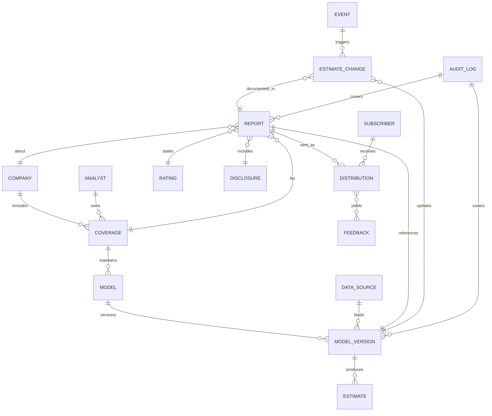
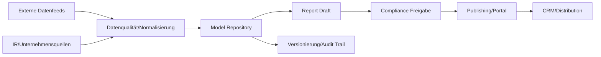

# Research (Aktien- und Wertpapieranalyse)

- Zweck: Fundierte, unabhängige Analysen; Informationsvorsprung; Unterstützung von Sales/Trading/ECM.
- Output: Initiations-/Update-Reports, Modelle, Empfehlungen, Events.
- Scope: Small-/Mid-Cap-Fokus, thematische/branchenweite Coverage.

## Grundsätze & Mandat

- Unabhängigkeit: Strikte Trennung von Research und Investmentbanking; keine inhaltliche Einflussnahme.
- Interessenkonflikte: Chinese Wall, Insiderlisten, Offenlegungspflichten, Blackout/Quiet Periods.
- Vergütung: Unabhängig von spezifischen Transaktionserlösen; klare Policies (MiFID II).
- Abdeckung (Scope): Small-/Mid-Cap, thematisch/branchenbezogen; klare Auswahlkriterien und Exit‑Regeln.

## Kernprozesse

- Coverage-Auswahl: Universum definieren, Priorisierung (Relevanz, Nachfrage, Mandate).
- Informationsgewinnung: Berichte, Calls, Konferenzen, Datenfeeds, Unternehmensgespräche.
- Modellierung & Bewertung: Umsatz-/Ergebnis-Modelle, DCF/Multiples, Szenarien.
- Berichterstellung & Freigaben: Drafting, Peer-Review, Compliance-Check, Publikation.
- Distribution & Feedback: Kundenversand, Sales-Briefing, Events; Anpassungen.

## Research-Zyklus (Flow)

## Rollen & Verantwortlichkeiten (Swimlane)

## Detaillierter Ablauf

1) Coverage-Planung
- Owner: Head of Research • Support: Sector Leads
- Inputs: Kundeninteresse, Corporate-Finance-Pipeline, Liquidität
- Outputs: Coverage-Liste, Priorisierung, Ressourcenplanung
- Kontrollen: Unabhängigkeit, Interessenkonflikte, Chinese Wall

2) Informationsgewinnung & Modellierung
- Owner: Analyst • Support: Data/IR
- Inputs: Berichte, Calls, Datensätze, Management-Meetings
- Outputs: Forecast-Modelle, Bewertungsansätze (DCF/Multiples), Szenarien
- Kontrollen: Datenquellen-Tracking, Peer-Review Modelle

3) Berichtserstellung & Freigaben
- Owner: Analyst • Support: Editor/Compliance
- Inputs: Modelle, Textentwürfe, Charts
- Outputs: Draft Report, Freigaben (Inhalt/Compliance), Final Report (PDF/HTML)
- Kontrollen: Styleguide, Disclosure-Checks, Legal Flags

4) Distribution & Feedback
- Owner: Research Ops/Sales • Support: Analyst
- Inputs: Final Report, Distribution Lists
- Outputs: Versand, Sales-Briefing, Events/Teach-ins
- Kontrollen: Zielgruppen-Selektion, Opt-ins, KPI-Tracking (Open/Click)

5) Updates/Ad-hoc
- Owner: Analyst • Support: Sales
- Inputs: News/Ergebnisse/Guidance
- Outputs: Flash Notes, Estimate-Changes
- Kontrollen: Quiet Periods, Blackout-Regeln

## Regulatorik (DE/EU – Auswahl)
- MAR (Insider/Ad-hoc), Research Independence Policies, MiFID II (Unbundling/Inducements).

## Schlüsselkontrollen

- Chinese Wall/Insider: Research Independence Policy, Blackout/Quiet Periods.
- Qualität: Modell-/Text-Review, Quellen-/Zahlenkonsistenz, Methodiktransparenz.

## IT-Systeme

- Research-Autorenplattform, Datenfeeds (Fundamental/Preis), Publishing/CRM, Compliance-Workflows.

## Methodik & Standards

- Forecast-Horizont: typ. 3–5 Jahre inkl. Brücken (Umsatz→EBIT→NOPAT→FCF).
- Bewertungsverfahren: DCF (WACC, TV mit Gordon/Schnitt), Multiples (PE/EV-EBITDA/EV-Sales), SOTP.
- Zielpreis: abgeleitet aus Base Case; Validierung mit Peer-Multiples; Sensitivitätsanalyse.
- Rating‑System: Kaufen/Halten/Verkaufen; Zeithorizont 12 Monate; Risikokategorien (niedrig/mittel/hoch).
- Schätzungsänderungen: Trigger (Zahlen, Guidance, News, Regulatorik); dokumentierte Change‑Logs.
- Modell‑Standards: Struktur/Sheets, Annahmen‑Block, Versionsführung, Währungs-/Rundungsregeln, Audit‑Trail.

## Publikationsfreigabe (Sequence)

## Artefakt‑Modell (ER)

Kurzeinordnung: Das ER‑Diagramm zeigt nun vollständige Artefakt‑Beziehungen inkl. Versionierung, Distribution und Compliance‑Nachweisen. Es verknüpft Coverage↔Analysten, Model‑Versionen↔Schätzungen, Reports↔Disclosures/Ratings sowie Versand und Feedback – damit Governance, Nachvollziehbarkeit und KPIs sauber aufgesetzt werden können.

Wichtige Punkte:
- Analysten/Co‑Coverage klar modelliert; Ownership sichtbar.
- Versionierung trennt Modell‑Stände von Reports/Schätzungen; Änderungen werden über ESTIMATE_CHANGE nachvollzogen.
- Distribution/Feedback schließen den Loop zur Nutzung; Compliance über DISCLOSURE und AUDIT_LOG verankert.

## Datenfluss & Aufbewahrung (Lineage)

## RACI (Research – je Phase)

| Phase | Responsible (R) | Accountable (A) | Consulted (C) | Informed (I) |
|---|---|---|---|---|
| Coverage‑Planung | Head of Research, Sector Leads | Head of Research | Sales, ECM/CF | Management |
| Informationsgewinnung & Modellierung | Analyst | Sector Lead | IR/Unternehmen, Data | Sales |
| Berichtserstellung & Freigaben | Analyst | Head of Research | Peer Reviewer, Editor, Compliance | Sales, IR |
| Distribution & Feedback | Research Ops, Sales | Head of Research | Analyst | Management |
| Updates/Ad‑hoc | Analyst | Sector Lead | Compliance | Sales |

## Rating‑Rahmen (Definitionen)

- Kaufen: Erwartete Gesamtrendite ≥ X% in 12 Monaten.
- Halten: Gesamtrendite innerhalb von ±Y%.
- Verkaufen: Erwartete Gesamtrendite ≤ −Z%.
- Zeitrahmen: 12 Monate; Zwischenupdates bei Ereignissen.
- Risiko: Niedrig/Mittel/Hoch (Volatilität, Liquidität, Geschäftsmodell, Bilanzstruktur).

## Kennzahlen & Zielkorridore

- Time‑to‑Publish: ≤ 24–48h nach Ereignis (Flash), ≤ 5 AT bei Updates.
- Forecast‑Error (1y/2y): Median/Mean im akzeptierten Band vs. Peer‑Median.
- Recommendation Hit‑Rate (12M): Anteil richtiger Richtungssignale.
- Kundenreichweite/Engagement: Öffnungs-/Klickrate, Event‑Teilnahmen.
- Coverage Breite/Tiefe: #Unternehmen, #Updates pro Jahr, thematische Notes.

## Vorlagen/Artefakte

- Research Report Outline: [templates/Research_Report_Outline.md](templates/Research_Report_Outline.md)
- Rating Framework: [templates/Rating_Framework.md](templates/Rating_Framework.md)
- Estimate‑Change Protocol: [templates/Estimate_Change_Protocol.md](templates/Estimate_Change_Protocol.md)
- Disclosure Checklist: [templates/Disclosure_Checklist.md](templates/Disclosure_Checklist.md)
- Styleguide Summary: [templates/Styleguide_Summary.md](templates/Styleguide_Summary.md)
- Model Standards: [templates/Model_Standards.md](templates/Model_Standards.md)
 

## Navigation

- [← Sales & Trading](05_Sales_Trading_Designated_Sponsoring.md) | [Übersicht](Kernprozesse_Investmentbank_Mittelstand.md) | [→ Risk & Compliance](07_Risk_Compliance.md)
- [Corporate Finance](01_Corporate_Finance_MA_Finanzierung.md) | [ECM - IPO](02_ECM_IPO.md) | [DCM](03_DCM_Anleiheemission.md) | [Secondary](04_ECM_Kapitalerhoehung_Secondary.md) | [Sales & Trading](05_Sales_Trading_Designated_Sponsoring.md) | [Research](06_Research.md) | [Risk & Compliance](07_Risk_Compliance.md) | [Operations & IT](08_Operations_IT.md)
- [Templates](templates/) | [README](README.md)
