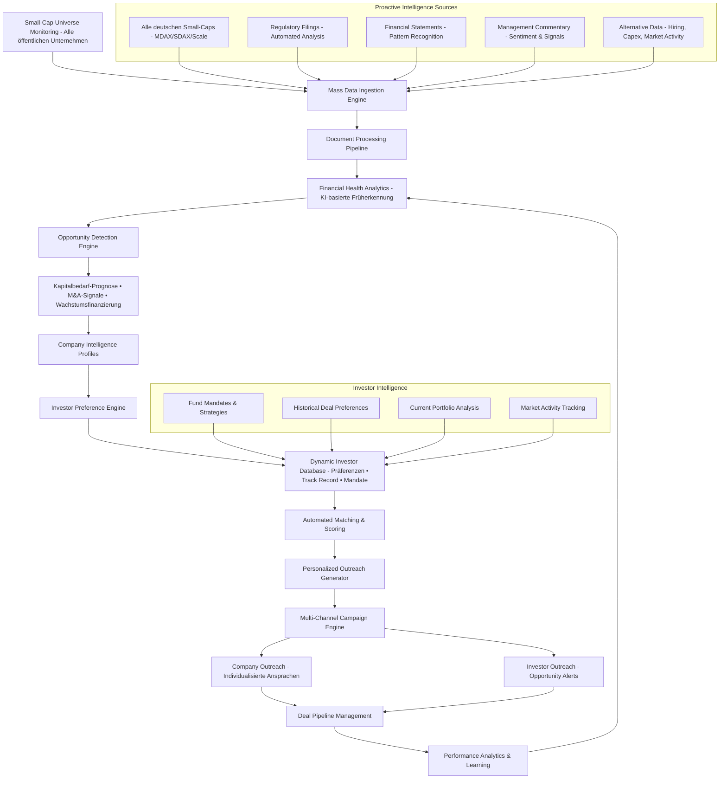

# Market Intelligence & Deal Origination – Proaktive Kapitalmarkt-Opportunities

**Geschäftsmodell**: B2B Investment Banking Services - Deal-Origination durch KI-gestützte Market Intelligence

- **Ziel**: Proaktive Identifikation und Ansprache von Kapitalmarkt-Opportunities
- **Geschäftsmodell**: Deal-Origination, Fee-basierte Investment Banking Services  
- **Zielgruppe**: Unternehmen mit Kapitalbedarf + Investoren
- **Output**: Qualified Leads, Deal Pipeline, M&A Opportunities
- **Revenue Model**: Transaction Fees von erfolgreichen Deals

## Proaktive Market Intelligence & Opportunity Detection (Deutschland v1, EU v2)



## Detaillierte Subprozess-Spezifikationen

### 1. Vollständige Small-Cap-Monitoring (Deutschland-First)
**Ziel**: Kontinuierliche Überwachung ALLER deutschen Small-Caps für proaktive Opportunity Detection
- **Vollabdeckung Deutschland v1**: 
  - **Alle börsennotierten Unternehmen**: MDAX, SDAX, Scale, m:access, General Standard
  - **Marktkapitalisierung**: €10M - €2Bn (keine Einschränkungen)
  - **Sektorübergreifend**: Technology, Healthcare, Industrial, Consumer, Services, Energy
  - **Regulatorischer Status**: Alle BaFin-regulierten Emittenten
  - **Reporting-Standards**: HGB und IFRS-Unternehmen
- **Automated Intelligence Scoring**: 
  - `Financial_Health_Score`: Liquidität, Verschuldung, Cashflow-Trends
  - `Growth_Opportunity_Score`: Umsatzwachstum, Margenentwicklung, Investitionen
  - `Capital_Need_Probability`: Working Capital, Capex-Pläne, Refinanzierungszyklen
  - `M&A_Attractiveness`: Bewertungsmultiples, strategische Assets, Marktposition
- **Continuous Monitoring**: 
  - **Real-time**: DGAP-Meldungen, Kursbewegungen, Volumina
  - **Weekly**: Quartalszahlen-Analyse, Management-Kommentare
  - **Monthly**: Peer-Vergleiche, Branchentrends, Investoren-Aktivität
- **Output**: `complete_small_cap_universe_de` (500+ Unternehmen, kontinuierlich aktualisiert)
- **Owner**: Market Intelligence Team + Data Science

### 2. Mass Data Sourcing Engine (Deutschland-First Strategie)
**Ziel**: Vollautomatische Erfassung deutscher Unternehmensinfo mit EU-Skalierbarkeit
- **Deutschland v1 Connectors**:
  - **Deutsche IR-Crawler**: MDAX/SDAX-IR-Websites, deutsche RSS-Feeds
  - **BaFin/DGAP-Integration**: Ad-hoc-Meldungen, Regulatorische Publikationen
  - **Deutsche Finanz-APIs**: Xetra-Feeds, Tradegate-Daten, L&S Exchange
  - **Deutsche Alt-Data**: Kununu, Xing, deutsche Google Trends, Bundesanzeiger
  - **Deutsche Medien**: Manager Magazin, Handelsblatt, WirtschaftsWoche APIs
- **v2 EU-Expansion Connectors**: 
  - Euronext-Feeds (Paris/Amsterdam/Brussels), Borsa Italiana, SIX Swiss
  - AMF/CONSOB/AFM/FINMA-Feeds, lokale IR-Crawler
  - Lokale Alt-Data (JobTeaser/FR, InfoJobs/IT, Indeed/NL)
- **Deduplizierung**: SHA-256 Content Fingerprinting + Fuzzy Matching (Titel/Datum)
- **Quality Gates**: Source-Trust-Score (0.1-1.0), Content-Completeness-Check  
- **SLAs Deutschland v1**: DGAP-Detection ≤2 Min, Processing Start ≤5 Min
- **Event-Trigger**: `doc.ingested.de`, `xetra.anomaly`, `consensus.revision.de`

### 3. Multi-Format Parser & Normalizer
**Ziel**: Strukturierte Extraktion aus heterogenen Datenformaten
- **Parser-Stack**:
  - **PDF**: Layout-aware (Camelot/Tabula für Tabellen, pdfplumber für Text)
  - **XBRL**: Taxonomy-aware (ESEF/HGB/IFRS Mapping)
  - **HTML**: Readability + Schema.org Extraction
  - **Audio/Video**: Whisper ASR für Conference Calls
- **Entity Resolution**: 
  - Company-Mapping: ISIN/LEI/ticker → Master Entity
  - Person-Mapping: Management → Structured Profiles
  - Geographic: Subsidiary → Parent Company
- **Section Mapping**: MD&A, Outlook, Risk Factors, Financial Statements
- **Output**: `doc_structure` mit semantischen Blöcken

### 4. Opportunity Detection Engine (KI-Kern für Business Development)
**Ziel**: Automatische Erkennung von Kapitalmarkt-Opportunities und Finanzierungsbedarfen
- **Financial Distress Signals**:
  - **Liquiditäts-Indikatoren**: Working Capital Ratios, Cash-Burn-Rate, Kreditlinien-Auslastung
  - **Refinanzierungs-Zyklen**: Anleihen-/Kreditfälligkeiten, Covenant-Risiken
  - **Operational Stress**: Margen-Erosion, Umsatzrückgänge, Restrukturierungs-Erwähnungen
- **Growth Capital Opportunities**:
  - **Expansions-Signale**: Neue Standorte, Akquisitionspläne, R&D-Intensivierung
  - **Capex-Trends**: Investitions-Hochlauf, Modernisierungs-Programme
  - **Market Share Gains**: Umsatzwachstum über Peer-Durchschnitt
- **M&A Attractiveness Scoring**:
  - **Strategic Assets**: Marktführerschaft, IP-Portfolio, regulatorische Zulassungen
  - **Valuation Gaps**: Peer-Multiple-Discount, Sum-of-Parts-Aufschlag
  - **Management Signale**: Strategische Reviews, Spin-off-Diskussionen
- **ESG Transition Needs**:
  - **Nachhaltigkeits-Capex**: Green-Transition-Investments, CSRD-Compliance
  - **Regulatorische Anpassungen**: EU-Taxonomie-Alignment, Scope-3-Reporting
- **Output**: `opportunity_alerts`, `capital_need_forecast`, `ma_target_scores`, `contact_priorities`

### 5. Investor Intelligence & Matching Engine
**Ziel**: Dynamische Investor-Datenbank mit Präferenz-Profiling für automatisierte Matches
- **Investor Profiling**:
  - **Mandate Analysis**: Fondsstrategien, Sektorpräferenzen, Ticket-Größen, geografischer Fokus
  - **Historical Deal Tracking**: Vergangene Investments, Performance, Holding-Perioden
  - **Current Portfolio Analysis**: Aktuelle Positionen, Sektor-Allokation, Liquidität
  - **Investment Thesis Extraction**: NLP-basierte Analyse von Investor-Communications
- **Dynamic Preference Updates**:
  - **Real-time Activity Monitoring**: Neue Investments, Exits, Portfolio-Shifts
  - **Conference & Roadshow Intelligence**: IR-Event-Teilnahmen, Management-Meetings
  - **Market Commentary Analysis**: Investor-Calls, Research-Notes, Public Statements
- **Automated Matching & Scoring**:
  - **Company-Investor-Fit-Score**: Sektor, Size, Growth Stage, ESG-Alignment
  - **Timing-Optimierung**: Investor-Liquidität, Fund-Lifecycle, Market-Conditions
  - **Competitive Intelligence**: Peer-Investments, Mandate-Überschneidungen
- **Personalized Outreach Generation**:
  - **Individualisierte Pitches**: Investor-spezifische Value Propositions
  - **Optimal Timing**: Calendar-Integration, Market-Event-Koordination
  - **Channel Selection**: E-Mail, Telefon, Events, persönliche Kontakte
- **Output**: `investor_profiles`, `match_scores`, `outreach_campaigns`, `pipeline_tracking`

## Core Services & API-Spezifikationen

### Opportunity Detection & Investor Matching Service
```typescript
// Opportunity Detection API
POST /api/v1/opportunities/scan
  - Body: { 
      universe_filter: { sectors[], market_cap_range, regions[] },
      detection_types: ["capital_need", "growth_financing", "m&a_target"],
      urgency_threshold: "medium",
      lookback_period: "6M"
    }
  - Response: { 
      scan_id, 
      detected_opportunities[], 
      processing_status,
      estimated_completion 
    }

GET /api/v1/opportunities/company/{company_id}
  - Response: { 
      current_opportunities[], 
      historical_opportunities[],
      opportunity_timeline,
      confidence_trends 
    }

POST /api/v1/opportunities/{opportunity_id}/validate
  - Body: { analyst_assessment, confidence_override, notes }
  - Response: { updated_opportunity, validation_recorded }

// Investor Matching API  
POST /api/v1/investors/match
  - Body: {
      opportunity_id,
      investor_filters: { types[], ticket_sizes[], sectors[] },
      match_threshold: 0.7,
      include_reasoning: true
    }
  - Response: {
      matches[],
      match_scores,
      rationales[],
      recommended_approaches[]
    }

GET /api/v1/investors/{investor_id}/profile
  - Response: {
      mandate_details,
      investment_history[],
      current_portfolio,
      preference_evolution,
      contact_preferences
    }

POST /api/v1/outreach/campaigns/create
  - Body: {
      match_ids[],
      campaign_type: "opportunity_intro",
      personalization_level: "high",
      scheduling_preferences,
      approval_workflow: true
    }
  - Response: {
      campaign_id,
      generated_content[],
      review_queue_position,
      estimated_launch_date
    }

GET /api/v1/outreach/campaigns/{campaign_id}/performance
  - Response: {
      delivery_metrics,
      response_rates,
      engagement_quality,
      conversion_tracking,
      roi_indicators
    }
```

## MVP-Scope für Deal Origination

### Core-Features für Initial Release (Deutschland-Fokus)
1. **Complete Market Surveillance (500+ deutsche Small-Caps)**
   - Vollabdeckung aller börsennotierten deutschen Unternehmen
   - MDAX/SDAX/Scale/m:access/General Standard Integration
   - DGAP/BaFin-Feed Integration für Real-time Regulatory Updates
   - Bundesanzeiger-Anbindung für Historic Financials
   - IR-Website-Monitoring aller gelisteten Unternehmen

2. **Opportunity Detection Engine (Primärer Geschäftswert)**
   - Financial Distress Signal Detection (Liquiditäts-/Refinanzierungsbedarfe)
   - Growth Capital Opportunity Recognition (Expansion, Capex, M&A-Pläne)
   - M&A Target Attractiveness Scoring (Bewertungs-Gaps, Strategic Assets)
   - ESG Transition Capital Needs (Green Investment Requirements)
   - Automated Alert-Generation mit Confidence-Scoring

3. **Investor Intelligence Database**
   - Vollständige deutsche Investor-Landschaft (PE, VC, Strategic, Family Offices)
   - Dynamic Preference Profiling (Sektoren, Ticket-Größen, Investment-Thesis)
   - Historical Deal-Tracking und Portfolio-Analysis
   - Real-time Activity-Monitoring (Neue Investments, Exits)
   - Conference/Event-Intelligence für Relationship-Mapping

4. **Automated Matching & Outreach Engine**
   - Company-Investor-Fit-Scoring basierend auf Präferenzen und Opportunities
   - Personalized Message Generation für Company-Outreach
   - Investor-Alert-System für neue Opportunities mit Match-Rationale  
   - Multi-Channel-Campaign-Management (E-Mail, Telefon, Events)
   - Response-Tracking und Conversion-Analytics

5. **Deal Pipeline Management**
   - Lead-Scoring und Qualification-Automation
   - Meeting-Scheduling und Follow-up-Automation
   - Pipeline-Visualisierung mit Conversion-Funnel
   - Performance-Analytics für Outreach-Kampagnen
   - CRM-Integration für Relationship-Management

6. **Market Intelligence Dashboard**
   - Real-time Opportunity-Detection-Feed
   - Company-Financial-Health-Monitoring (Heat Maps, Alerts)
   - Investor-Activity-Tracking (Neue Mandate, Portfolio-Shifts)
   - Market-Trend-Analysis (Sektor-spezifische Capital-Needs)

## Business Value (Deutschland v1 - Proaktive Market Intelligence)

```yaml
BusinessMetrics:
  market_surveillance: "Vollständige Überwachung aller deutschen Small-Caps"
  opportunity_detection: "Automatische Erkennung von Kapitalmarkt-Opportunities"
  proactive_origination: "Individualisierte Unternehmens-Ansprachen basierend auf erkannten Bedarfen"
  investor_matching: "Automatisierte Investor-Company-Matches mit Präferenz-Profiling"
  pipeline_generation: "Systematische Deal-Pipeline-Entwicklung durch KI-gestützte Lead-Generierung"
  relationship_intelligence: "Dynamische Investor-Datenbank mit Aktivitäts-Tracking"
  personalized_outreach: "Skalierte, individualisierte Kommunikation für Companies & Investors"
  market_timing: "Optimale Timing-Erkennung für Kapitalmarkt-Aktivitäten"
```

## Geografische Expansionsstrategie: Deutschland → EU

### Phase 1: Deutschland-Fokus (v1)
**Rationale**: Lokale Expertise maximieren, regulatorische Komplexität minimieren
- **Markt-Fokus**: Deutschland (MDAX, SDAX, Scale, m:access)
- **Sprache**: Primär Deutsch, sekundär Englisch
- **Regulierung**: BaFin, HGB/IFRS, DGAP-Integration
- **Datenquellen**: Deutsche IR-Websites, Xetra, deutsche Medien
- **Zielgruppe**: Deutsche institutionelle Investoren, Family Offices
- **Ziele**: Abdeckung deutscher Small/Mid-Caps, SDAX-Fokus

### Phase 2: EU-Expansion (v2)
**Rationale**: Bewährte Technologie auf ähnliche EU-Märkte skalieren

**EU-Erweiterungs-Roadmap**:
1. **Frankreich**: Euronext Paris Small/Mid-Caps, AMF-Integration
2. **Italien**: Borsa Italiana STAR/AIM, CONSOB-Feeds
3. **Niederlande**: Euronext Amsterdam, AFM-Regulierung
4. **Österreich**: Wiener Börse, FMA-Compliance
5. **Schweiz**: SIX Swiss Exchange, FINMA-Integration

**Technische EU-Skalierung**:
- Multi-Language NLP (DE → FR, IT, NL, EN)
- Cross-Border Peer-Group-Bildung
- Währungskonvertierung und PPP-Adjustments
- EU-weite ESG/CSRD-Integration
- Harmonisierte MiFID II-Compliance

Diese Deutschland-First-Strategie minimiert initiale Komplexität und ermöglicht eine fokussierte Entwicklung, bevor die bewährte Lösung europaweit skaliert wird.

## Navigation

- [← Research Übersicht](06_Research.md) | [→ Retail Research Service](06b_Research_Retail_Service.md)
- [Corporate Finance](01_Corporate_Finance_MA_Finanzierung.md) | [ECM - IPO](02_ECM_IPO.md) | [DCM](03_DCM_Anleiheemission.md) | [Secondary](04_ECM_Kapitalerhoehung_Secondary.md) | [Sales & Trading](05_Sales_Trading_Designated_Sponsoring.md) | [Research](06_Research.md) | [Risk & Compliance](07_Risk_Compliance.md) | [Operations & IT](08_Operations_IT.md)
- [Templates](templates/) | [README](README.md)

> Proaktive Market Intelligence für systematische Deal-Origination im deutschen Small-Cap-Markt