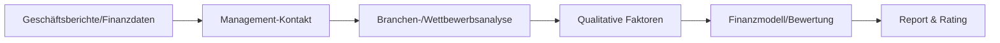
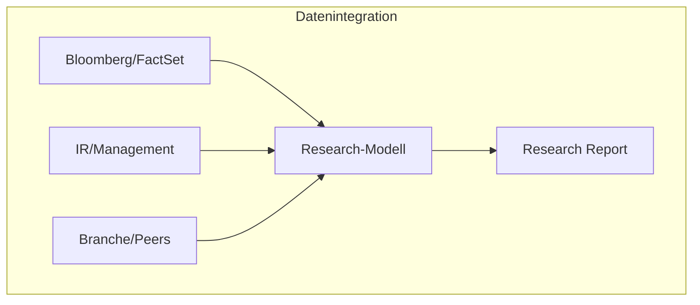
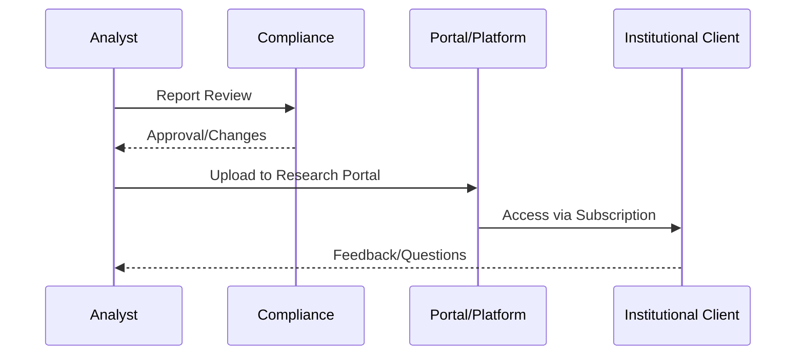

# Public Equities Research – Small- und Mid-Caps

- Zweck: Fundamentalanalyse deutscher Small-/Mid-Caps für institutionelle Investoren.
- Output: Research-Reports, Ratings, Kursziele, Investorenempfehlungen.
- Fokus: Bottom-up-Analyse, Bewertungsmodelle, Management-Kontakt, Branchenvergleiche.

## Analyseprozesse und Methoden

Deutsche Small- und Mid-Cap-Analysten setzen auf gründliche Fundamentalanalyse mit Bottom-up-Ansatz: Detaillierte Einzelfirmenanalyse vor Branchenbetrachtung.

### Bewertungsmethoden
- **DCF-Analyse**: Discounted-Cashflow für langfristige Bewertung
- **Multiplikatorenvergleiche**: P/E, EV/EBITDA vs. Peer-Gruppe
- **Sum-of-the-Parts**: Für diversifizierte Geschäftsmodelle
- **Szenarioanalysen**: Bei volatilen Geschäftsmodellen

### Research-Prozess

## Detaillierte Analyseschritte

1) **Finanzdatenauswertung**
- Owner: Senior Analyst • Support: Associate
- Inputs: Jahresabschlüsse (HGB/IFRS), Quartalsmitteilungen, Guidance
- Outputs: Historische Kennzahlenanalyse, Trendidentifikation
- Besonderheit: Oft weniger Konsensus-Schätzungen verfügbar als bei Large Caps

2) **Management-Kontakt**
- Owner: Analyst • Support: Sales/Corporate Access
- Inputs: Analystenkonferenzen, Earnings Calls, 1:1 Gespräche
- Outputs: Strategie-Insights, Markteinschätzungen, Guidance-Interpretation
- Kritisch: Bei Small Caps oft einzige Informationsquelle für aktuelle Entwicklungen

3) **Branchen-/Wettbewerbsanalyse** 
- Owner: Analyst • Support: Research Associates
- Inputs: Marktdaten, Peer-Vergleiche, Branchenstudien
- Outputs: Relative Marktposition, Competitive Advantage Assessment
- Herausforderung: Nischenmärkte und "Hidden Champions" erfordern Spezialkenntnisse

4) **Qualitative Bewertung**
- Owner: Senior Analyst • Support: Sektor-Team
- Inputs: Management-Quality, Eigentümerstruktur, ESG-Faktoren
- Outputs: Qualitative Risiko-/Chancenbewertung
- Besonderheit: Familienunternehmen erfordern Analyse von Nachfolgeplanung

## Datenquellen und Tools

### Primäre Plattformen
- **Bloomberg Terminal**: Marktdaten, News, Consensus-Schätzungen, Kommunikation
- **FactSet**: Finanzdaten, Analytics, Peer-Screening
- **Refinitiv Eikon**: Zeitreihen, ökonomische Daten, Reuters News
- **S&P Capital IQ**: Screenings, M&A-Daten, standardisierte Kennzahlen

### Ergänzende Quellen
- **IR-Websites**: Präsentationen, Berichte, Pressemitteilungen
- **Branchenverbände**: Marktdaten, Trends, Regulierungshinweise
- **Lokale Medien**: Managementinterviews, Unternehmensstrategien
- **Bundesanzeiger**: Historische Finanzdaten, Gesellschafterstrukturen

## Report-Erstellung und Distribution

### Erstellungsprozess
1) **Analyse & Entwurf**: Analyst erstellt Initial Coverage oder Update
2) **Interne Review**: Senior-Analyst/Sektorleiter prüft Inhalt und Modell
3) **Compliance-Check**: Disclaimer, Interessenkonflikte, MAR-Konformität
4) **Publikation**: Freigabe und Distribution über definierte Kanäle

### Distribution unter MiFID II

### Vertriebskanäle
- **Research-Portale**: Warburg Research, Metzler, M.M.Warburg (~200 deutsche Unternehmen)
- **Aggregations-Plattformen**: Bloomberg, FactSet, Refinitiv
- **Spezialisierte Services**: ResearchHub (mwb research), Scale Research Initiative

## Rolle im Kapitalmarktzyklus

### IPO-Phase
- **Pre-IPO**: Analysten-Präsentation (unter NDA), Equity Story verstehen
- **Quiet Period**: Keine öffentlichen Empfehlungen während Marketing
- **Initiating Coverage**: Erste öffentliche Analyse nach ~10-40 Tagen
- **Post-IPO**: Roadshows, Investorenkonferenzen

### Sekundärmarkt
- **Kontinuierliches Coverage**: Quartalskommentare, Updates bei News
- **Corporate Access**: Investorentreffen, Werksbesuche organisieren
- **Konferenzen**: Metzler Small Cap Days, Warburg Konferenzen
- **Liquiditätsunterstützung**: Transparenz reduziert Informationsasymmetrien

### M&A/Kapitalmaßnahmen
- **Neutralitätsgebot**: "Under Review" während Transaktionen
- **Wall-Crossing**: Strikte Informationsbarrieren bei Deal-Beteiligung
- **Bewertungsbeitrag**: Faire Preisfindung durch unabhängige Analyse

## Regulatorische Rahmenbedingungen

### MiFID II Impact (seit 2018)
- **Entbündelung**: Research separate Bezahlung, nicht über Handelskommission
- **Budgetdruck**: Asset Manager reduzieren Research-Ausgaben
- **Coverage-Rückgang**: ~15% weniger Small/Mid-Cap-Reports
- **Neue Modelle**: Issuer-paid Research, unabhängige Boutiquen

### MAR-Compliance
- **Interessenkonflikte**: Vollständige Offenlegung von Bank-Positionen
- **Objektive Empfehlungen**: Sachgerecht, nicht irreführend
- **Dokumentation**: Lückenlose Nachverfolgung aller Ratings
- **Ad-hoc-Koordination**: Abstimmung mit Unternehmens-Publizität

## Herausforderungen Small-/Mid-Cap-Research

### Informationsverfügbarkeit
- **Begrenzte Abdeckung**: Weniger Analystenmeinungen verfügbar
- **Geringere IR-Ressourcen**: Nicht alle Firmen haben professionelle IR
- **Historisch kürzere Zeitreihen**: Jüngere Börsenhistorie
- **Liquiditätsvolatilität**: Schwankende Handelsumsätze

### Ressourcenallokation
- **Größeres Coverage-Universum**: Mehr Titel je Analyst
- **Kostendruck**: Effizienz vs. Analysetiefe
- **Spezialisierung**: Nischenmärkte erfordern Expertise
- **Management-Zugang**: Persönliche Kontakte entscheidend

### Lösungsansätze
- **Technologie-Einsatz**: KI-gestützte Datenaufbereitung
- **Kooperationen**: Börsensegment-Partnerschaften (Scale)
- **Neue Finanzierungsmodelle**: Research-as-a-Service
- **Fokussierung**: Qualität vor Quantität

## KPIs und Erfolgsmessung

### Quantitative Metriken
- **Forecast Accuracy**: Prognosegenauigkeit vs. Ist-Zahlen
- **Stock Performance**: Rating-Performance vs. Benchmark
- **Client Engagement**: Downloads, Meeting-Requests
- **Market Impact**: Kursreaktion auf Reports

### Qualitative Bewertung
- **Investoren-Feedback**: Umfragen, Broker-Rankings
- **Management-Beziehungen**: Zugang und Vertrauen
- **Peer-Anerkennung**: Branchenrankings (Institutional Investor)
- **Deal-Involvement**: Mandats-Unterstützung durch Research-Reputation

## IT-Systeme und Infrastruktur

### Research-Management-Systeme
- **Autodesk/Publisher**: Report-Erstellung und -Formatierung  
- **Workflow-Tools**: Review-Prozesse, Compliance-Tracking
- **CRM-Integration**: Client-Relationship-Management
- **Model-Libraries**: Standardisierte Bewertungsmodelle

### Collaboration-Tools
- **Expert Networks**: Branchenspezialisten-Zugang
- **Data Visualization**: Charts, Dashboards für Präsentationen
- **Translation Services**: Mehrsprachige Report-Versionen
- **Video-Conferencing**: Management-Calls, Investor-Meetings

## Navigation

- [← Research Übersicht](06_Research.md) | [→ Private Research](06b_Research_Private_Companies.md)
- [Corporate Finance](01_Corporate_Finance_MA_Finanzierung.md) | [ECM - IPO](02_ECM_IPO.md) | [DCM](03_DCM_Anleiheemission.md) | [Secondary](04_ECM_Kapitalerhoehung_Secondary.md) | [Sales & Trading](05_Sales_Trading_Designated_Sponsoring.md) | [Research](06_Research.md) | [Risk & Compliance](07_Risk_Compliance.md) | [Operations & IT](08_Operations_IT.md)
- [Templates](templates/) | [README](README.md)

> Detailanalyse der Public Equities Research-Funktion für deutsche Small- und Mid-Caps