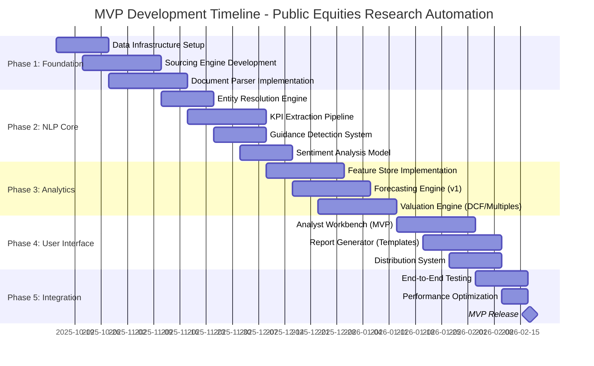
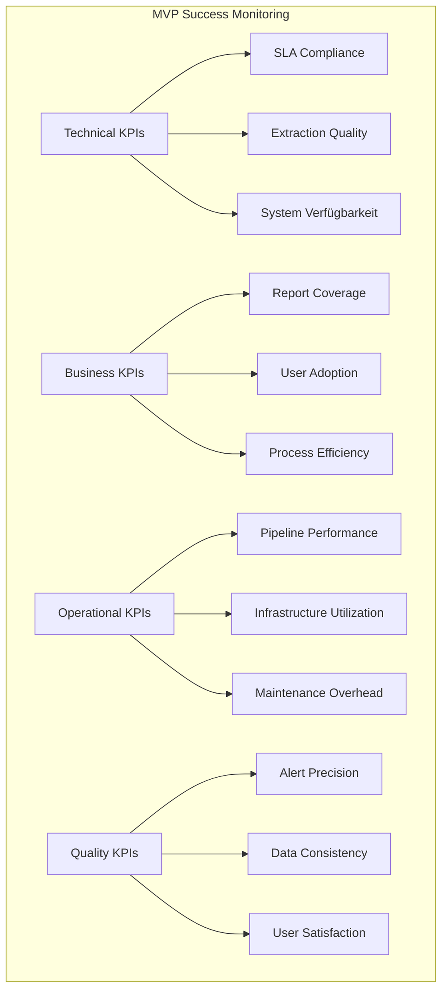
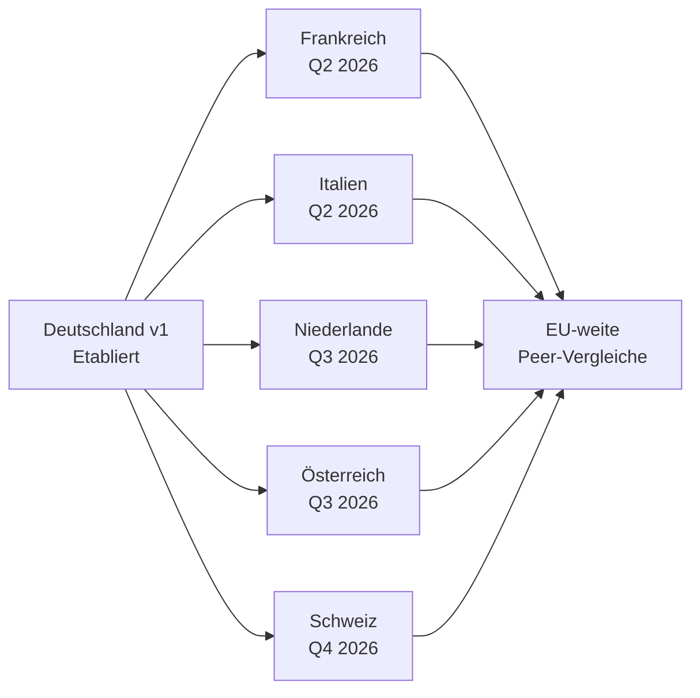

# Public Equities Research – Small- und Mid-Caps

- Zweck: Fundamentalanalyse deutscher Small-/Mid-Caps für institutionelle Investoren.
- Output: Research-Reports, Ratings, Kursziele, Investorenempfehlungen.
- Fokus: Bottom-up-Analyse, Bewertungsmodelle, Management-Kontakt, Branchenvergleiche.

## End-to-End Prozessarchitektur (Automatisierte Research-Pipeline)

### Vollautomatisierte Prozesskette für Small & Mid Caps (Deutschland v1, EU v2)


### Detaillierte Subprozess-Spezifikationen

#### 1. Coverage Policy & Universe (Deutschland-Fokus v1)
**Ziel**: Klare Definition der deutschen Small-/Mid-Caps mit automatisierter Priorisierung
- **Inputs Deutschland v1**: 
  - Marktkapitalisierung (€50M - €2Bn)
  - Börsen-Segmente: MDAX, SDAX, Scale, m:access
  - Free Float (>25%), Handelsliquidität (Ø tägl. Volumen)
  - Sektorverteilung (Technology, Healthcare, Industrial, Consumer)
  - Investorennachfrage deutscher Institutioneller
  - BaFin-Regulierungsstatus, HGB/IFRS-Reporting
- **Automatisierung**: 
  - Monatlicher Priority-Score: `(DE_Liquidity × 0.3) + (DE_Investor_Interest × 0.4) + (German_News_Frequency × 0.2) + (DGAP_Event_Density × 0.1)`
  - Coverage-Lifecycle: `Prospect → Initiate → Maintain → Suspend`
  - **v2 EU-Expansion**: Erweitert um französische, italienische, niederländische Markets
- **Output**: `coverage_universe_de` (50+ deutsche Firmen, P1-P3 Priorität)
- **Owner**: Head of German Research + Research Operations

#### 2. Sourcing Engine (Deutschland-First Strategie)
**Ziel**: Vollautomatische Erfassung deutscher Unternehmensinfo mit EU-Skalierbarkeit
- **Deutschland v1 Connectors**:
  - **Deutsche IR-Crawler**: MDAX/SDAX-IR-Websites, deutsche RSS-Feeds
  - **BaFin/DGAP-Integration**: Ad-hoc-Meldungen, Regulatorische Publikationen
  - **Deutsche Finanz-APIs**: Xetra-Feeds, Tradegate-Daten, L&S Exchange
  - **Deutsche Alt-Data**: Kununu, Xing, deutsche Google Trends, Bundesanzeiger
  - **Deutsche Medien**: Manager Magazin, Handelsblatt, WirtschaftsWoche APIs
- **v2 EU-Expansion Connectors**: 
  - Euronext-Feeds (Paris/Amsterdam/Brussels), Borsa Italiana, SIX Swiss
  - AMF/CONSOB/AFM/FINMA-Feeds, lokale IR-Crawler
  - Lokale Alt-Data (JobTeaser/FR, InfoJobs/IT, Indeed/NL)
- **Deduplizierung**: SHA-256 Content Fingerprinting + Fuzzy Matching (Titel/Datum)
- **Quality Gates**: Source-Trust-Score (0.1-1.0), Content-Completeness-Check  
- **SLAs Deutschland v1**: DGAP-Detection ≤2 Min, Processing Start ≤5 Min
- **Event-Trigger**: `doc.ingested.de`, `xetra.anomaly`, `consensus.revision.de`

#### 3. Multi-Format Parser & Normalizer
**Ziel**: Strukturierte Extraktion aus heterogenen Datenformaten
- **Parser-Stack**:
  - **PDF**: Layout-aware (Camelot/Tabula für Tabellen, pdfplumber für Text)
  - **XBRL**: Taxonomy-aware (ESEF/HGB/IFRS Mapping)
  - **HTML**: Readability + Schema.org Extraction
  - **Audio/Video**: Whisper ASR für Conference Calls
- **Entity Resolution**: 
  - Company-Mapping: ISIN/LEI/ticker → Master Entity
  - Person-Mapping: Management → Structured Profiles
  - Geographic: Subsidiary → Parent Company
- **Section Mapping**: MD&A, Outlook, Risk Factors, Financial Statements
- **Output**: `doc_structure` mit semantischen Blöcken

#### 4. Advanced NLP Pipeline (KI-Kern)
**Ziel**: Automatische Extraktion von Investment-relevanten Insights
- **Module**:
  - **Named Entity Recognition**: Custom FinBERT für Deutsche Texte
  - **KPI-Extraktion**: ML-Table-Detector + Rule-based Validation
    - Standardisierte Metriken: Revenue, EBITDA, Net Income, Margins
    - Temporal Mapping: Q1/Q2/Q3/Q4, FY-1/FY/FY+1
    - Currency/Unit Normalization: TEUR → EUR, Mio → Actual Values
  - **Guidance-Tracker**: 
    - Future-tense Detection via Dependency Parsing
    - Target Range Extraction: "erwarten 15-18% Wachstum" → [0.15, 0.18]
    - Confidence Scoring via Hedge Word Analysis
  - **Sentiment Analysis**: 
    - Section-level (Overall, Outlook, Risk)
    - Management Q&A Tonality (Defensive/Confident/Uncertain)
    - Year-over-Year Sentiment Delta
- **Quality Control**: Confidence Thresholds für Human Review
- **Output**: `kpi_fact`, `guidance_item`, `sentiment_score`, `change_detection`

#### 5. Feature Store (Unified Data Layer)
**Ziel**: Single Source of Truth für alle analytischen Features
- **Schema Design**:
```sql
-- KPI Zeitreihen
kpi_timeseries (
    company_id UUID,
    metric_id ENUM(revenue, ebitda, eps, margins),
    period DATE,
    value DECIMAL(15,2),
    source_confidence FLOAT,
    data_quality_score FLOAT,
    created_at TIMESTAMP,
    version INTEGER
)

-- Guidance Tracking
guidance (
    company_id UUID,
    metric_id ENUM,
    valid_from DATE,
    valid_to DATE,
    target_low DECIMAL,
    target_high DECIMAL,
    guidance_type ENUM(maintained, raised, lowered, withdrawn),
    text_reference TEXT,
    confidence_score FLOAT
)

-- Market Data Integration
market_data (
    security_id UUID,
    date DATE,
    price_close DECIMAL,
    volume BIGINT,
    beta_1y FLOAT,
    volatility_30d FLOAT,
    rsi_14d FLOAT
)
```
- **Versioning**: SCD Type 2 (Slowly Changing Dimensions)
- **API Layer**: GraphQL für flexible Abfragen, gRPC für High-Performance
- **Caching**: Redis für Low-Latency Serving

#### 6. Hybrid Forecasting Engine
**Ziel**: Kombination klassischer und ML-basierter Prognosemethoden
- **Model Stack**:
  - **Baseline**: Seasonal ARIMA für Mean-Reversion
  - **ML Panel**: LightGBM auf Cross-sectional Features
    - Features: Historical Growth, Guidance Changes, Peer Performance, Macro Indicators
    - Target: Next Quarter EPS/Revenue (Point + Prediction Intervals)
  - **Deep Learning**: Optional LSTM für Sequential Dependencies
- **Model Blending**: Stacked Ensemble mit Time-Split Cross-Validation
- **Explainability**: SHAP Values für Top-3 Feature Attribution
- **Human Override**: Analyst Adjustments mit Reasoning Capture
- **Performance Tracking**: Rolling MAE/MAPE vs. Consensus Benchmark

#### 7. Multi-Method Valuation Engine
**Ziel**: Systematische Fair-Value-Berechnung mit Szenario-Analysis
- **DCF Implementation**:
  - Free Cash Flow Projektion aus Forecasting Engine
  - WACC Berechnung: Risk-free Rate + Beta × Market Premium
  - Terminal Value: Gordon Growth + Exit Multiple Method
  - Monte Carlo für Sensitivitätsanalyse
- **Peer Multiples**:
  - Dynamic Peer Selection: Sector + Size + Profitability Filters
  - Multiple Regression für Size/Growth/Profitability Adjustments
  - Forward P/E, EV/EBITDA, EV/Sales mit Outlier Robustification
- **Sum-of-the-Parts**: Für diversifizierte Geschäftsmodelle
- **Scenario Framework**: Base/Bear/Bull mit Probability Weighting
- **Output**: Fair Value Distribution (P25/P50/P75) mit Drivers

#### 8. Analyst Workbench (Human-in-the-Loop Interface)
**Ziel**: Effiziente Review und Override-Funktionalität
- **Dashboard Features**:
  - **Diff-Viewer**: Guidance Changes Side-by-Side
  - **KPI Audit Trail**: Source-to-Report Traceability
  - **SHAP Explainer**: ML Decision Transparency
  - **Peer Comparison**: Interactive Scatter Plots
  - **Scenario Sliders**: Real-time Valuation Updates
- **Task Management**: 
  - Priority Inbox für Low-Confidence Extractions
  - Anomaly Alerts (Large Moves, Consensus Gaps)
  - Review Queue mit SLA Tracking
- **Knowledge Capture**:
  - Investment Thesis Templates
  - Risk Assessment Framework
  - Catalyst Tracking
  - Meeting Notes Integration

#### 9. Compliance & Risk Engine
**Ziel**: Automatisierte MiFID II/MAR Compliance-Checks
- **Validation Rules**:
  - Entitlement Matrix: Client Segment → Research Access
  - Conflict of Interest Detection: Position vs. Rating
  - Chinese Wall Enforcement: Deal Team vs. Research
- **Disclosure Generation**: 
  - Automated Disclaimer Insertion
  - Position Reporting
  - Rating Distribution Statistics
- **Audit Trail**: Immutable Log aller Rating Changes mit Begründung

#### 10. Multi-Channel Report Generator
**Ziel**: Consistent, High-Quality Report Production
- **Template Engine**: 
  - Modular Content Blocks (Summary, Valuation, Risks, Disclosure)
  - Dynamic Chart Generation (Matplotlib/Plotly Integration)
  - Corporate Design Enforcement
- **Narrative AI**: 
  - LLM-gestützte Texterstellung mit Fact-Grounding
  - Strict Citation Mode: Jede Zahl aus Feature Store
  - Multi-language Support (DE/EN)
- **Output Formats**: 
  - PDF für Distribution
  - HTML für Web Portal
  - API für Third-party Integration
- **SLA**: Flash Update ≤30 Min nach Earnings

#### 11. Omnichannel Distribution
**Ziel**: Zielgerichtete Research-Auslieferung
- **Distribution Channels**:
  - Research Portal mit RBAC
  - Bloomberg/FactSet Integration
  - Email mit Personalization
  - Mobile App Push Notifications
- **Client Segmentation**: 
  - Professional vs. Retail Content
  - Sector Preferences
  - Research Type Preferences
- **Engagement Tracking**: 
  - Read Time Analytics
  - Download Metrics
  - Meeting Request Triggers

#### 12. Performance Analytics & Continuous Learning
**Ziel**: Systematic Model Improvement und Quality Assurance
- **Forecast Accuracy**: 
  - Out-of-Sample MAE vs. Actuals
  - Beat Rate vs. Consensus
  - Directional Accuracy
- **Model Monitoring**: 
  - Data Drift Detection
  - Prediction Drift Alerts
  - Feature Importance Stability
- **Business Metrics**:
  - Coverage-to-Revenue Attribution
  - Client Satisfaction Scores
  - Market Impact Analysis

### Datenmodell & Entity-Relationship Architecture


### Event-Driven Architecture & Topic Model


### Ereignis-Schemas (Apache Avro/JSON Schema)

```json
{
  "doc.ingested": {
    "doc_id": "uuid",
    "company_id": "uuid", 
    "doc_type": "enum[earnings, adhoc, presentation, filing]",
    "title": "string",
    "published_at": "timestamp",
    "source_url": "string",
    "content_hash": "string",
    "processing_priority": "enum[high, normal, low]"
  },
  
  "kpi.extracted": {
    "fact_id": "uuid",
    "company_id": "uuid",
    "doc_id": "uuid",
    "metric_type": "enum[revenue, ebitda, net_income, eps]",
    "period": "string",
    "value": "decimal",
    "currency": "string",
    "confidence": "float[0,1]",
    "extraction_method": "string"
  },
  
  "forecast.updated": {
    "forecast_id": "uuid",
    "company_id": "uuid",
    "metric_type": "enum",
    "horizon": "string",
    "point_estimate": "decimal",
    "confidence_interval": {"low": "decimal", "high": "decimal"},
    "model_version": "string",
    "trigger_event": "string",
    "features_snapshot": "object"
  },
  
  "report.published": {
    "report_id": "uuid",
    "company_id": "uuid",
    "report_type": "enum[initiation, update, flash, note]",
    "rating": "enum[buy, hold, sell]",
    "price_target": "decimal",
    "pdf_url": "string",
    "html_content": "string",
    "analyst_id": "uuid",
    "distribution_channels": "array[string]"
  }
}
```

### Core Services & API-Spezifikationen

#### 1. Sourcing Service (Datenerfassung)
```typescript
// REST API Endpoints
POST /api/v1/sources/webhook
  - Body: { source_type, company_id, document_url, priority }
  - Response: { job_id, estimated_processing_time }
  - Headers: X-Source-API-Key, X-Signature (HMAC)

GET /api/v1/sources/status/{job_id}
  - Response: { status, progress, errors, doc_id }

POST /api/v1/sources/crawl/schedule
  - Body: { company_ids[], schedule_cron, source_types[] }
  - Response: { schedule_id, next_run }

// Event Emitters
EMIT doc.ingested { doc_id, company_id, source_type, priority, metadata }
```

#### 2. Document Processing Service
```typescript
POST /api/v1/documents/parse
  - Body: { doc_id, parser_type, options }
  - Response: { parsing_job_id, estimated_time }

GET /api/v1/documents/{doc_id}/structure
  - Response: { sections[], tables[], entities[], confidence }

POST /api/v1/documents/batch-process
  - Body: { doc_ids[], pipeline_config }
  - Response: { batch_id, job_ids[] }

// Internal gRPC Service
service DocumentProcessor {
  rpc ParseDocument(ParseRequest) returns (ParseResponse);
  rpc ExtractEntities(EntityRequest) returns (EntityResponse);
  rpc ValidateExtraction(ValidationRequest) returns (ValidationResponse);
}
```

#### 3. NLP & Analytics Service
```typescript
POST /api/v1/nlp/extract/kpis
  - Body: { doc_id, company_id, extraction_rules }
  - Response: { extraction_id, kpi_facts[], confidence_scores }

POST /api/v1/nlp/extract/guidance  
  - Body: { doc_id, context_window, language }
  - Response: { guidance_items[], temporal_mapping[], confidence }

POST /api/v1/nlp/sentiment/analyze
  - Body: { text, section_type, company_context }
  - Response: { overall_score, section_scores[], key_phrases[] }

GET /api/v1/nlp/models/performance
  - Response: { model_metrics, drift_alerts, retraining_schedule }

// Validation Schemas (JSON Schema)
KpiExtractionRequest: {
  "type": "object",
  "properties": {
    "doc_id": {"type": "string", "format": "uuid"},
    "extraction_rules": {
      "type": "array",
      "items": {
        "metric_type": {"enum": ["revenue", "ebitda", "eps"]},
        "time_periods": {"type": "array"},
        "validation_threshold": {"type": "number", "minimum": 0, "maximum": 1}
      }
    }
  },
  "required": ["doc_id", "extraction_rules"]
}
```

#### 4. Feature Store Service
```typescript
// Time Series API
GET /api/v1/features/timeseries/{company_id}
  - Query: metrics[], start_date, end_date, frequency
  - Response: { company_id, metrics: {metric_name: timeseries[]} }

POST /api/v1/features/facts/bulk-upsert
  - Body: { facts[] } // Array von KPI Facts mit Versioning
  - Response: { inserted_count, updated_count, errors[] }

GET /api/v1/features/latest/{company_id}
  - Response: { snapshot_date, kpis{}, guidance{}, sentiment{}, market_data{} }

// GraphQL Schema für flexible Abfragen
type Query {
  company(id: ID!): Company
  kpiTimeseries(
    companyId: ID!
    metrics: [MetricType!]!
    startDate: Date!
    endDate: Date!
  ): [TimeSeriesPoint!]!
  guidanceHistory(companyId: ID!, metricType: MetricType): [Guidance!]!
}

type Company {
  id: ID!
  name: String!
  isin: String!
  kpis(period: Period): [KpiFact!]!
  forecasts(horizon: ForecastHorizon): [Forecast!]!
  valuation(method: ValuationMethod): Valuation
}

// gRPC High-Performance Interface
service FeatureStore {
  rpc GetCompanyFeatures(CompanyFeaturesRequest) returns (CompanyFeaturesResponse);
  rpc StreamKpiUpdates(StreamRequest) returns (stream KpiUpdate);
  rpc BatchComputeFeatures(BatchRequest) returns (BatchResponse);
}
```

#### 5. Forecasting Service
```typescript
POST /api/v1/forecasts/generate
  - Body: { 
      company_id, 
      metrics[], 
      horizons[], 
      model_config: { ensemble_weights, feature_selection }
    }
  - Response: { forecast_job_id, estimated_completion }

GET /api/v1/forecasts/{company_id}
  - Query: metrics[], horizons[], include_explanation
  - Response: { 
      forecasts[], 
      model_metadata, 
      feature_importance[], 
      confidence_intervals 
    }

POST /api/v1/forecasts/override
  - Body: { forecast_id, new_estimate, override_reason, analyst_id }
  - Response: { updated_forecast, audit_record }
  - Authentication: Analyst-level permissions required

GET /api/v1/forecasts/performance/backtest
  - Query: start_date, end_date, metrics[], models[]
  - Response: { 
      mae_by_horizon, 
      accuracy_vs_consensus, 
      model_rankings,
      improvement_suggestions
    }

// WebSocket für Real-time Updates
WS /api/v1/forecasts/stream
  - Subscribe: { company_ids[], metrics[] }
  - Events: forecast.updated, model.retrained, performance.alert
```

#### 6. Valuation Service  
```typescript
POST /api/v1/valuations/dcf/compute
  - Body: {
      company_id,
      forecast_stream_id,
      dcf_config: { 
        wacc_method, 
        terminal_growth_rate, 
        scenarios: [base, bear, bull] 
      }
    }
  - Response: { valuation_id, fair_values_by_scenario, sensitivity_analysis }

POST /api/v1/valuations/multiples/compute
  - Body: {
      company_id,
      peer_group_config: { selection_criteria, size_adjustments },
      multiples: ["p_e", "ev_ebitda", "ev_sales"]
    }
  - Response: { 
      peer_group_id, 
      multiple_valuations[], 
      peer_statistics,
      outlier_analysis 
    }

GET /api/v1/valuations/{company_id}/history
  - Query: start_date, end_date, methods[]
  - Response: { 
      valuation_timeline[], 
      price_performance_vs_targets,
      analyst_track_record
    }

POST /api/v1/valuations/scenario-analysis
  - Body: { 
      company_id, 
      base_case_id, 
      scenario_variables: { revenue_growth_range, margin_scenarios }
    }
  - Response: { 
      scenario_matrix, 
      value_at_risk, 
      upside_potential,
      key_value_drivers 
    }
```

#### 7. Report Generation Service
```typescript  
POST /api/v1/reports/generate
  - Body: {
      company_id,
      report_type: "initiation" | "update" | "flash",
      template_config,
      content_blocks: ["summary", "valuation", "risks", "appendix"],
      output_formats: ["pdf", "html", "api"]
    }
  - Response: { 
      report_id, 
      generation_job_id,
      estimated_completion,
      preview_url 
    }

GET /api/v1/reports/{report_id}
  - Response: { 
      report_metadata, 
      content_sections[], 
      pdf_url, 
      html_content,
      distribution_status 
    }

POST /api/v1/reports/review/submit
  - Body: { 
      report_id, 
      reviewer_id, 
      review_status: "approved" | "changes_requested",
      comments[], 
      compliance_checklist 
    }
  - Response: { review_id, next_workflow_step, notifications_sent[] }

// Template Management
GET /api/v1/reports/templates
  - Response: { templates[] } // Available report templates

POST /api/v1/reports/templates/customize
  - Body: { base_template_id, customizations, brand_config }
  - Response: { custom_template_id }
```

#### 8. Distribution & Client Service
```typescript
POST /api/v1/distribution/deliver
  - Body: {
      report_id,
      distribution_rules: {
        client_segments[],
        channels: ["portal", "email", "api", "bloomberg"],
        scheduling: { immediate: boolean, scheduled_time }
      }
    }
  - Response: { 
      distribution_job_id, 
      recipient_count, 
      delivery_tracking_id 
    }

GET /api/v1/clients/{client_id}/entitlements
  - Response: { 
      active_subscriptions[], 
      access_permissions,
      usage_quotas,
      preferences 
    }

POST /api/v1/analytics/engagement/track
  - Body: { 
      client_id, 
      report_id, 
      event_type: "view" | "download" | "share" | "meeting_request",
      metadata: { duration, device_type, referrer }
    }
  - Response: { tracking_id, aggregation_applied }

GET /api/v1/analytics/engagement/summary
  - Query: date_range, company_ids[], client_segments[]
  - Response: { 
      engagement_metrics, 
      popular_reports[], 
      client_satisfaction_scores,
      revenue_attribution 
    }
```

#### 9. Compliance & Risk Service
```typescript
POST /api/v1/compliance/check/pre-publication
  - Body: { 
      report_id, 
      analyst_id, 
      check_types: ["conflicts", "disclosures", "mifid_ii", "mar"]
    }
  - Response: { 
      compliance_status: "pass" | "warnings" | "violations",
      required_disclosures[],
      risk_flags[],
      approval_workflow_required 
    }

GET /api/v1/compliance/audit/trail/{report_id}
  - Response: { 
      creation_timeline[], 
      review_history[], 
      distribution_log[],
      access_log[] 
    }

POST /api/v1/compliance/disclosure/generate
  - Body: { 
      report_id, 
      disclosure_types[],
      client_segment 
    }
  - Response: { 
      disclosure_text, 
      legal_review_required,
      template_version 
    }

// Chinese Wall Management
POST /api/v1/compliance/wall/check-access
  - Body: { analyst_id, company_id, access_type }
  - Response: { 
      access_permitted, 
      restriction_reason,
      alternative_arrangements 
    }
```

### API-weite Standards & Validation

#### Authentifizierung & Authorization
```typescript
// JWT Token-based Auth
Headers: {
  "Authorization": "Bearer <jwt_token>",
  "X-API-Version": "v1",
  "X-Client-ID": "<client_uuid>",
  "X-Request-ID": "<unique_request_id>" // For tracing
}

// Role-based Access Control
Roles: {
  "analyst": ["read", "forecast.override", "report.create"],
  "senior_analyst": ["read", "write", "report.approve", "model.configure"],
  "compliance": ["read", "compliance.approve", "audit.access"],
  "client": ["read.entitled_reports", "engagement.track"],
  "admin": ["*"]
}
```

#### Standardisierte Response-Struktur
```typescript
interface ApiResponse<T> {
  success: boolean;
  data?: T;
  error?: {
    code: string;
    message: string;
    details?: object;
  };
  metadata: {
    timestamp: string;
    request_id: string;
    processing_time_ms: number;
    rate_limit?: {
      remaining: number;
      reset_at: string;
    };
  };
}
```

#### Rate Limiting & Quotas
```typescript
Rate Limits (per API key per minute):
- /api/v1/forecasts/*: 100 requests
- /api/v1/reports/generate: 10 requests  
- /api/v1/nlp/*: 500 requests
- /api/v1/features/*: 1000 requests

Quota Limits (per client per month):
- Report generations: Based on subscription tier
- Forecast computations: Based on subscription tier
- API calls: Based on subscription tier
```

#### Error Handling & Circuit Breaking
```typescript
// Standardisierte Error Codes
ErrorCodes: {
  "VALIDATION_ERROR": 400,
  "UNAUTHORIZED": 401,
  "FORBIDDEN": 403,  
  "NOT_FOUND": 404,
  "RATE_LIMITED": 429,
  "PROCESSING_ERROR": 500,
  "SERVICE_UNAVAILABLE": 503,
  "TIMEOUT": 504
}

// Circuit Breaker Pattern für externe Services
CircuitBreakerConfig: {
  "bloomberg_api": { failure_threshold: 5, timeout: 30s, recovery_time: 60s },
  "nlp_service": { failure_threshold: 10, timeout: 10s, recovery_time: 30s }
}
```

## Earnings-Day: 30-Minuten Flash-Update Sequenz

### Kritischer Pfad für Earnings-Release Processing


### SLA-Aufschlüsselung für 30-Minuten-Ziel

| Prozessschritt | Target Time | Buffer | Kritische Erfolgsfaktoren |
|----------------|-------------|--------|---------------------------|
| **Detection** | ≤2 min | 30s | RSS-Polling-Frequenz, Hash-basierte Dedup |
| **Parsing** | ≤2 min | 30s | PDF-Layout-Engine Performance, Parallel Processing |
| **NLP-Extraktion** | ≤1 min | 30s | GPU-Inferenz, Batch-Processing von Sections |
| **Forecasting** | ≤1 min | 30s | Feature Store Latency, Model Optimization |
| **Valuation** | ≤30s | 15s | Cached Peer Relationships, DCF Template |
| **Review** | ≤5 min | Variable | Confidence-Score Threshold, Analyst Availability |
| **Report-Gen** | ≤8 min | 2 min | LLM-Token-Limits, PDF-Rendering-Speed |
| **Distribution** | ≤3 min | 1 min | API-Rate-Limits, Email-Queue-Performance |
| **Total** | **≤22 min** | **8 min** | **End-to-End Pipeline Optimization** |

### Automatisierungsgrad nach Confidence-Level


### Quality Gates & Failsafe-Mechanismen

#### 1. Input-Validation
```typescript
ValidationChecks: {
  "document_completeness": {
    required_sections: ["financial_statements", "management_commentary"],
    min_page_count: 5,
    max_processing_age: "2h"
  },
  "kpi_sanity_checks": {
    yoy_change_bounds: [-80%, +200%],  // Extreme change detection
    sequential_consistency: true,       // Q vs. Q-1 logical progression  
    consensus_deviation_alert: 2.0,    // Standard deviations
  }
}
```

#### 2. Confidence-Score Berechnung
```python
def calculate_confidence(extraction_result):
    scores = {
        'text_extraction_quality': pdf_ocr_confidence,
        'kpi_extraction_match': regex_match_score * ml_confidence,
        'entity_resolution': company_match_confidence,
        'temporal_consistency': period_mapping_accuracy,
        'peer_comparison': peer_deviation_normality
    }
    
    # Weighted average mit Penalty für Outliers
    confidence = (
        scores['text_extraction_quality'] * 0.15 +
        scores['kpi_extraction_match'] * 0.35 +
        scores['entity_resolution'] * 0.20 +
        scores['temporal_consistency'] * 0.20 +
        scores['peer_comparison'] * 0.10
    )
    
    # Confidence-Penalty bei Anomalien
    if any_anomaly_detected:
        confidence *= 0.7
        
    return min(confidence, 0.99)  # Cap bei 99% für Human-Oversight
```

#### 3. Escalation-Matrix
```yaml
EscalationRules:
  immediate_human_review:
    - kpi_confidence < 0.75
    - sentiment_shift > 0.4  
    - guidance_direction_change: true
    - large_market_move: true  # >5% intraday
    
  senior_analyst_approval:
    - significant_forecast_deviation_from_consensus: true
    - material_valuation_change: true
    - rating_change_implied: true
    
  compliance_review:
    - inside_information_detected: true
    - conflict_of_interest_flagged: true
    - chinese_wall_breach_risk: true
```

### Performance-Monitoring Dashboard

#### Performance-Monitoring für Operations Team
```yaml
Pipeline_Monitoring:
  processing_times:
    document_detection: "Zeitnahes Erkennen neuer Dokumente"
    nlp_processing: "Effiziente Textanalyse und KPI-Extraktion"
    report_generation: "Automatisierte Report-Erstellung"
    end_to_end: "Vollständige Pipeline-Durchlaufzeit"
  
  quality_indicators:
    extraction_accuracy: "Präzision der KPI-Extraktion"
    forecast_quality: "Qualität der Prognosen"
    alert_relevance: "Relevanz der generierten Alerts"
    system_reliability: "Stabilität der Gesamtarchitektur"
  
  operational_metrics:
    reports_processed: "Anzahl verarbeiteter Dokumente"
    system_utilization: "Auslastung der Infrastruktur"  
    error_rates: "Fehlerquoten und Ausfälle"
    user_activity: "Nutzung durch Analysten und Clients"
```

#### Continuous Improvement Feedback Loop


## MVP-Roadmap & Implementierungsstrategie

### Phasenplan für 16-Wochen-MVP (Q4 2025 - Q1 2026)



### MVP-Scope Definition (Minimum Viable Product)

#### Core-Features für Initial Release (Deutschland-Fokus)
1. **Automated Sourcing (50 deutsche Small-Mid-Caps)**
   - IR-Website-Crawler für Major MDAX/SDAX/Scale-Unternehmen
   - RSS/Atom-Feed Integration für Ad-hoc-Meldungen
   - DGAP/BaFin-Feed Integration
   - Deduplizierung via Content-Hashing
   - Prioritäts-basierte Processing-Queue

2. **Document Processing Pipeline**
   - PDF-Parser (Tabula + pdfplumber Stack)
   - Basic XBRL-Support für ESEF-konforme Berichte
   - Entity Resolution für Company/Security-Mapping
   - Section Classification (Financial Statements, MD&A, Outlook)

3. **NLP-Analytics (Primär Deutsch, Sekundär Englisch)**
   - KPI-Extraktion: Umsatz, EBITDA, Jahresüberschuss, EPS
   - Guidance-Detection mit deutscher Zeitreferenzen (Q+1, GJ+1)
   - Sentiment-Analysis für deutsche Finanzsprache
   - Change-Detection vs. Vorperiode (YoY, QoQ)
   - HGB/IFRS-Konformität für deutsche Rechnungslegung

4. **Hybrid Forecasting Engine**
   - ARIMA-Baseline für Mean-Reversion Trends
   - LightGBM-Panel-Model für Cross-sectional Insights
   - SHAP-basierte Explainability für Top-3 Faktoren
   - Human-Override-Interface mit Reasoning

5. **Multi-Method Valuation**
   - DCF-Engine mit WACC-Berechnung
   - Peer-Multiple-Valuation (P/E, EV/EBITDA, EV/Sales)
   - Szenario-Analyse (Base/Bear/Bull)
   - Sensitivity-Testing für Key-Variablen

6. **Flash Report Generator**
   - Template-basierte PDF/HTML-Generierung
   - Automated Chart Creation (Time Series, Peer Comparison)
   - Compliance-Integration (MiFID II Disclosures)
   - Corporate Design Enforcement

7. **Basic Distribution**
   - Web-Portal mit RBAC (Role-based Access Control)
   - Email-Benachrichtigungen bei neuen Reports
   - Engagement-Tracking (Views, Downloads)
   - Client-Feedback-Collection

### Akzeptanzkriterien (Messbare Erfolgsmetriken)

#### 1. Performance & Latenz
```yaml
SLA_Targets:
  document_detection: "Wenige Minuten nach Veröffentlichung"
  end_to_end_processing: "Ca. 30 Minuten für Earnings Flash Updates"
  system_availability: "Hohe Verfügbarkeit während Handelszeiten"
  concurrent_processing: "Parallele Dokumentenverarbeitung"
  
Quality_Gates:
  kpi_extraction_accuracy: "Vergleichbar mit manueller Extraktion"
  forecast_quality: "Competitive zu bestehenden Methoden"
  sentiment_detection: "Zuverlässige Trend-Erkennung"
  alert_precision: "Minimierung von False Positives"
```

#### 2. Business Value (Deutschland v1)
```yaml
BusinessMetrics:
  coverage_scope: "Deutsche Small/Mid-Caps (MDAX/SDAX/Scale)"
  report_generation: "Regelmäßige Flash Updates bei Earnings"
  analyst_efficiency: "Zeitersparnis bei Routine-Aufgaben"
  client_value: "Schnellere Information bei relevanten Events"
  market_coverage: "Sukzessive Abdeckung deutscher Small-Caps"
  process_automation: "Reduktion manueller Datenextraktion"
```

#### 3. Technical Excellence
```yaml
Architecture_Quality:
  code_quality: "Hohe Testabdeckung und Code-Standards"
  api_performance: "Responsive API-Layer für Feature Store"
  data_quality: "Konsistente und vollständige Datenextraktion"
  model_monitoring: "Überwachung von ML-Model-Performance"
  security_compliance: "GDPR + MiFID II Konformität"
  
Scalability_Design:
  user_capacity: "Skalierbar für Analyst- und Client-Zugriffe"
  data_processing: "Effiziente Verarbeitung von Dokumenten-Streams"
  storage_architecture: "Optimierte Datenhaltung und -archivierung"
  cost_efficiency: "Kosteneffiziente Cloud-Infrastruktur"
```

### Go-Live Readiness Checklist

#### Technical Readiness
- [ ] **Infrastructure**: Cloud deployment (AWS/GCP) mit Auto-Scaling
- [ ] **Database**: Feature Store mit SCD-2 Versioning
- [ ] **API Gateway**: Rate Limiting + Authentication funktional
- [ ] **Monitoring**: Application + Business Metrics Dashboard
- [ ] **Backup/Recovery**: RTO ≤ 4h, RPO ≤ 1h
- [ ] **Security**: Penetration Testing abgeschlossen
- [ ] **Performance**: Load Testing für 10x expected Volume

#### Business Readiness  
- [ ] **User Training**: Analyst Onboarding-Program (4h Workshop)
- [ ] **Documentation**: API-Docs + User-Manuals vollständig
- [ ] **Support**: 1st-Level-Support Team trainiert
- [ ] **Client Communication**: Rollout-Strategy kommuniziert
- [ ] **Legal Review**: Terms of Service + Privacy Policy approved
- [ ] **Compliance**: BaFin-Compliance-Officer Sign-off
- [ ] **Pilot Testing**: 4-Week-Pilot mit 5 internen Analysten

### Phase-2-Erweiterungen: EU-Expansion (Q2-Q3 2026)

#### Advanced Features Roadmap - Europaweite Skalierung
1. **Multi-Country & Multi-Language Support**
   - **Frankreich**: Euronext Paris Small/Mid-Caps, AMF-Feeds, französische NLP
   - **Italien**: Borsa Italiana STAR/AIM, CONSOB-Integration, italienische Texte
   - **Niederlande/Belgien**: Euronext Amsterdam/Brussels, AFM/FSMA-Feeds
   - **Österreich/Schweiz**: Wiener Börse/SIX, FMA/FINMA-Compliance
   - Cross-Border Peer-Comparisons mit Währungskonvertierung
   - EU-weite Regulatory Harmonisierung (ESMA, MiFID II)

2. **EU-weite Advanced Analytics**
   - **ESG-Integration**: EU-Taxonomie-konforme ESG-Scores, CSRD-Reporting
   - **Alternative Data**: Multi-Country Web-Scraping, EU-Job-Markets, lokale News-Feeds
   - **Cross-Border Network Effects**: Supply-Chain-Verflechtungen, Handelsbeziehungen
   - **Real-time Integration**: Alle EU-Börsen, lokale Indizes (CAC, FTSE MIB, AEX)
   - **Währungsmanagement**: EUR/CHF/GBP-Normalisierung, PPP-Adjustments

3. **Enhanced Automation**
   - Voice-to-Text für Conference-Call-Transkripte  
   - Automated Peer-Group-Discovery via Clustering
   - Dynamic Report-Template-Optimization
   - A/B-Testing für Report-Layouts

4. **Enterprise Integration**
   - Bloomberg Terminal Plugin
   - FactSet App Integration
   - Salesforce CRM-Kopplung für Lead-Tracking
   - Microsoft Teams-Bot für Alert-Distribution

### Risikomanagement & Contingency-Planning

#### Identifizierte Risiken
```yaml
Technical_Risks:
  - risk: "NLP-Model-Performance insufficient for German texts"
    mitigation: "Pre-trained German FinBERT + Rule-based Fallbacks"
    probability: "Medium"
    impact: "High"
    
  - risk: "PDF-Parsing fails for complex layouts"  
    mitigation: "Multiple parser fallbacks + OCR integration"
    probability: "Medium"
    impact: "Medium"
    
Business_Risks:
  - risk: "Low analyst adoption due to trust concerns"
    mitigation: "Explainable AI + Human-override capability"
    probability: "Low"
    impact: "High"
    
  - risk: "Regulatory compliance issues"
    mitigation: "Legal review + compliance-by-design"
    probability: "Low"
    impact: "Critical"

External_Dependencies:
  - risk: "Bloomberg/FactSet API changes"
    mitigation: "Abstraction layer + multi-vendor approach"
    probability: "Medium" 
    impact: "Medium"
```

#### Success Metrics & KPIs Dashboard



## Geografische Expansionsstrategie: Deutschland → EU

### Phase 1: Deutschland-Fokus (v1, Q4 2025 - Q1 2026)
**Rationale**: Lokale Expertise maximieren, regulatorische Komplexität minimieren
- **Markt-Fokus**: Deutschland (MDAX, SDAX, Scale, m:access)
- **Sprache**: Primär Deutsch, sekundär Englisch
- **Regulierung**: BaFin, HGB/IFRS, DGAP-Integration
- **Datenquellen**: Deutsche IR-Websites, Xetra, deutsche Medien
- **Zielgruppe**: Deutsche institutionelle Investoren, Family Offices
- **Ziele**: Abdeckung deutscher Small/Mid-Caps, SDAX-Fokus

### Phase 2: EU-Expansion (v2, Q2 2026 - Q4 2026)
**Rationale**: Bewährte Technologie auf ähnliche EU-Märkte skalieren


**EU-Erweiterungs-Roadmap**:
1. **Frankreich** (Q2 2026): Euronext Paris Small/Mid-Caps, AMF-Integration
2. **Italien** (Q2 2026): Borsa Italiana STAR/AIM, CONSOB-Feeds
3. **Niederlande** (Q3 2026): Euronext Amsterdam, AFM-Regulierung
4. **Österreich** (Q3 2026): Wiener Börse, FMA-Compliance
5. **Schweiz** (Q4 2026): SIX Swiss Exchange, FINMA-Integration

**Technische EU-Skalierung**:
- Multi-Language NLP (DE → FR, IT, NL, EN)
- Cross-Border Peer-Group-Bildung
- Währungskonvertierung und PPP-Adjustments
- EU-weite ESG/CSRD-Integration
- Harmonisierte MiFID II-Compliance

Diese Deutschland-First-Strategie minimiert initiale Komplexität und ermöglicht eine fokussierte Entwicklung, bevor die bewährte Lösung europaweit skaliert wird.

## Analyseprozesse und Methoden

Deutsche Small- und Mid-Cap-Analysten setzen auf gründliche Fundamentalanalyse mit Bottom-up-Ansatz: Detaillierte Einzelfirmenanalyse vor Branchenbetrachtung.

### Bewertungsmethoden
- **DCF-Analyse**: Discounted-Cashflow für langfristige Bewertung
- **Multiplikatorenvergleiche**: P/E, EV/EBITDA vs. Peer-Gruppe
- **Sum-of-the-Parts**: Für diversifizierte Geschäftsmodelle
- **Szenarioanalysen**: Bei volatilen Geschäftsmodellen

### Research-Prozess


## Detaillierte Analyseschritte

1) **Finanzdatenauswertung**
- Owner: Senior Analyst • Support: Associate
- Inputs: Jahresabschlüsse (HGB/IFRS), Quartalsmitteilungen, Guidance
- Outputs: Historische Kennzahlenanalyse, Trendidentifikation
- Besonderheit: Oft weniger Konsensus-Schätzungen verfügbar als bei Large Caps

2) **Management-Kontakt**
- Owner: Analyst • Support: Sales/Corporate Access
- Inputs: Analystenkonferenzen, Earnings Calls, 1:1 Gespräche
- Outputs: Strategie-Insights, Markteinschätzungen, Guidance-Interpretation
- Kritisch: Bei Small Caps oft einzige Informationsquelle für aktuelle Entwicklungen

3) **Branchen-/Wettbewerbsanalyse** 
- Owner: Analyst • Support: Research Associates
- Inputs: Marktdaten, Peer-Vergleiche, Branchenstudien
- Outputs: Relative Marktposition, Competitive Advantage Assessment
- Herausforderung: Nischenmärkte und "Hidden Champions" erfordern Spezialkenntnisse

4) **Qualitative Bewertung**
- Owner: Senior Analyst • Support: Sektor-Team
- Inputs: Management-Quality, Eigentümerstruktur, ESG-Faktoren
- Outputs: Qualitative Risiko-/Chancenbewertung
- Besonderheit: Familienunternehmen erfordern Analyse von Nachfolgeplanung

## Datenquellen und Tools

### Primäre Plattformen
- **Bloomberg Terminal**: Marktdaten, News, Consensus-Schätzungen, Kommunikation
- **FactSet**: Finanzdaten, Analytics, Peer-Screening
- **Refinitiv Eikon**: Zeitreihen, ökonomische Daten, Reuters News
- **S&P Capital IQ**: Screenings, M&A-Daten, standardisierte Kennzahlen

### Ergänzende Quellen
- **IR-Websites**: Präsentationen, Berichte, Pressemitteilungen
- **Branchenverbände**: Marktdaten, Trends, Regulierungshinweise
- **Lokale Medien**: Managementinterviews, Unternehmensstrategien
- **Bundesanzeiger**: Historische Finanzdaten, Gesellschafterstrukturen


## Report-Erstellung und Distribution

### Erstellungsprozess
1) **Analyse & Entwurf**: Analyst erstellt Initial Coverage oder Update
2) **Interne Review**: Senior-Analyst/Sektorleiter prüft Inhalt und Modell
3) **Compliance-Check**: Disclaimer, Interessenkonflikte, MAR-Konformität
4) **Publikation**: Freigabe und Distribution über definierte Kanäle

### Distribution unter MiFID II


### Vertriebskanäle
- **Research-Portale**: Warburg Research, Metzler, M.M.Warburg (~200 deutsche Unternehmen)
- **Aggregations-Plattformen**: Bloomberg, FactSet, Refinitiv
- **Spezialisierte Services**: ResearchHub (mwb research), Scale Research Initiative

## Rolle im Kapitalmarktzyklus

### IPO-Phase
- **Pre-IPO**: Analysten-Präsentation (unter NDA), Equity Story verstehen
- **Quiet Period**: Keine öffentlichen Empfehlungen während Marketing
- **Initiating Coverage**: Erste öffentliche Analyse nach ~10-40 Tagen
- **Post-IPO**: Roadshows, Investorenkonferenzen

### Sekundärmarkt
- **Kontinuierliches Coverage**: Quartalskommentare, Updates bei News
- **Corporate Access**: Investorentreffen, Werksbesuche organisieren
- **Konferenzen**: Metzler Small Cap Days, Warburg Konferenzen
- **Liquiditätsunterstützung**: Transparenz reduziert Informationsasymmetrien

### M&A/Kapitalmaßnahmen
- **Neutralitätsgebot**: "Under Review" während Transaktionen
- **Wall-Crossing**: Strikte Informationsbarrieren bei Deal-Beteiligung
- **Bewertungsbeitrag**: Faire Preisfindung durch unabhängige Analyse

## Regulatorische Rahmenbedingungen

### MiFID II Impact (seit 2018)
- **Entbündelung**: Research separate Bezahlung, nicht über Handelskommission
- **Budgetdruck**: Asset Manager reduzieren Research-Ausgaben
- **Coverage-Rückgang**: ~15% weniger Small/Mid-Cap-Reports
- **Neue Modelle**: Issuer-paid Research, unabhängige Boutiquen

### MAR-Compliance
- **Interessenkonflikte**: Vollständige Offenlegung von Bank-Positionen
- **Objektive Empfehlungen**: Sachgerecht, nicht irreführend
- **Dokumentation**: Lückenlose Nachverfolgung aller Ratings
- **Ad-hoc-Koordination**: Abstimmung mit Unternehmens-Publizität

## Herausforderungen Small-/Mid-Cap-Research

### Informationsverfügbarkeit
- **Begrenzte Abdeckung**: Weniger Analystenmeinungen verfügbar
- **Geringere IR-Ressourcen**: Nicht alle Firmen haben professionelle IR
- **Historisch kürzere Zeitreihen**: Jüngere Börsenhistorie
- **Liquiditätsvolatilität**: Schwankende Handelsumsätze

### Ressourcenallokation
- **Größeres Coverage-Universum**: Mehr Titel je Analyst
- **Kostendruck**: Effizienz vs. Analysetiefe
- **Spezialisierung**: Nischenmärkte erfordern Expertise
- **Management-Zugang**: Persönliche Kontakte entscheidend

### Lösungsansätze
- **Technologie-Einsatz**: KI-gestützte Datenaufbereitung
- **Kooperationen**: Börsensegment-Partnerschaften (Scale)
- **Neue Finanzierungsmodelle**: Research-as-a-Service
- **Fokussierung**: Qualität vor Quantität

## KPIs und Erfolgsmessung

### Quantitative Metriken
- **Forecast Accuracy**: Prognosegenauigkeit vs. Ist-Zahlen
- **Stock Performance**: Rating-Performance vs. Benchmark
- **Client Engagement**: Downloads, Meeting-Requests
- **Market Impact**: Kursreaktion auf Reports

### Qualitative Bewertung
- **Investoren-Feedback**: Umfragen, Broker-Rankings
- **Management-Beziehungen**: Zugang und Vertrauen
- **Peer-Anerkennung**: Branchenrankings (Institutional Investor)
- **Deal-Involvement**: Mandats-Unterstützung durch Research-Reputation

## IT-Systeme und Infrastruktur

### Research-Management-Systeme
- **Autodesk/Publisher**: Report-Erstellung und -Formatierung  
- **Workflow-Tools**: Review-Prozesse, Compliance-Tracking
- **CRM-Integration**: Client-Relationship-Management
- **Model-Libraries**: Standardisierte Bewertungsmodelle

### Collaboration-Tools
- **Expert Networks**: Branchenspezialisten-Zugang
- **Data Visualization**: Charts, Dashboards für Präsentationen
- **Translation Services**: Mehrsprachige Report-Versionen
- **Video-Conferencing**: Management-Calls, Investor-Meetings

## Navigation

- [← Research Übersicht](06_Research.md) | [→ Private Research](06b_Research_Private_Companies.md)
- [Corporate Finance](01_Corporate_Finance_MA_Finanzierung.md) | [ECM - IPO](02_ECM_IPO.md) | [DCM](03_DCM_Anleiheemission.md) | [Secondary](04_ECM_Kapitalerhoehung_Secondary.md) | [Sales & Trading](05_Sales_Trading_Designated_Sponsoring.md) | [Research](06_Research.md) | [Risk & Compliance](07_Risk_Compliance.md) | [Operations & IT](08_Operations_IT.md)
- [Templates](templates/) | [README](README.md)

> Detailanalyse der Public Equities Research-Funktion für deutsche Small- und Mid-Caps