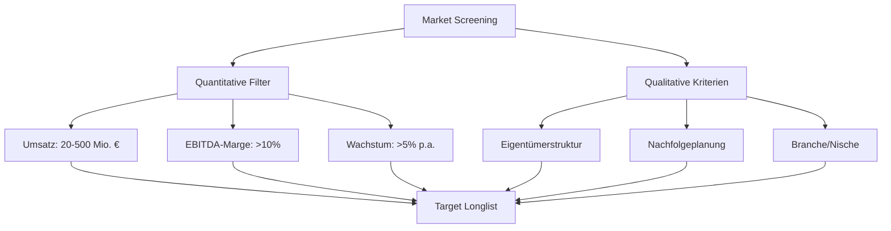
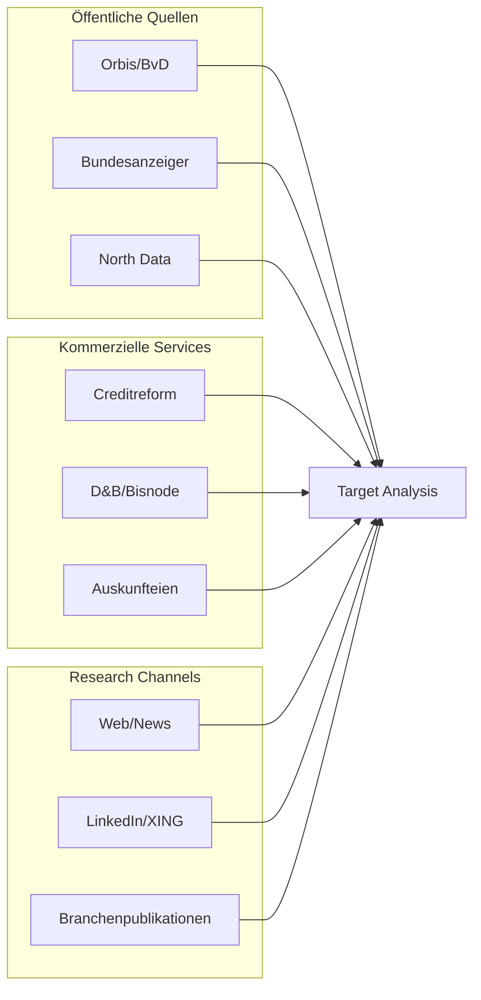
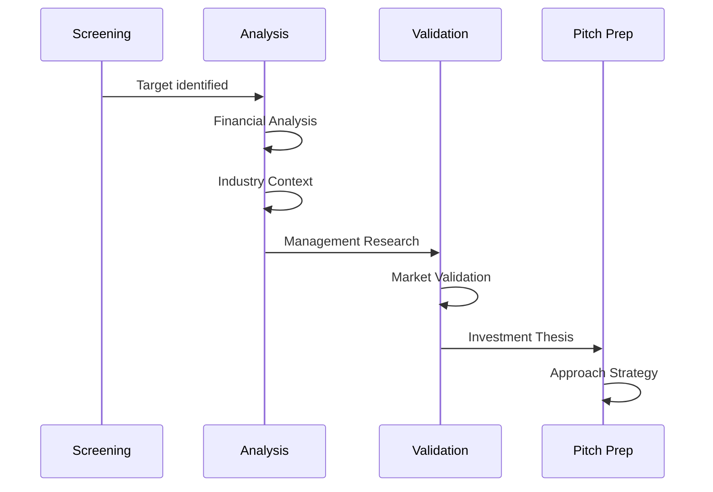
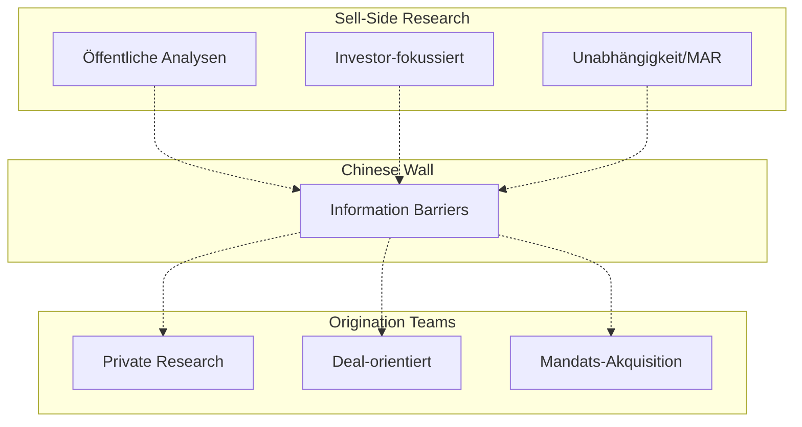
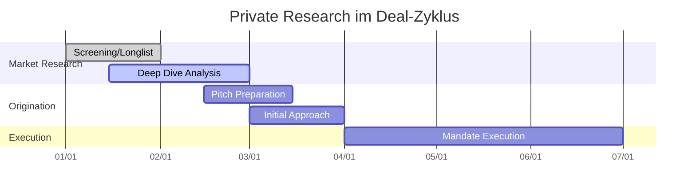
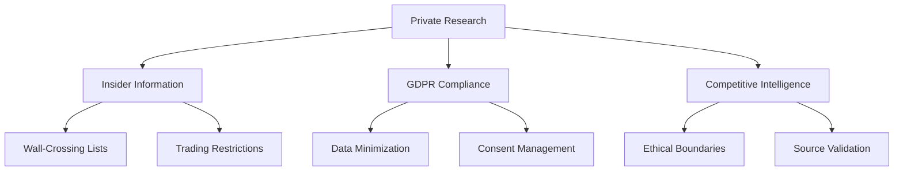
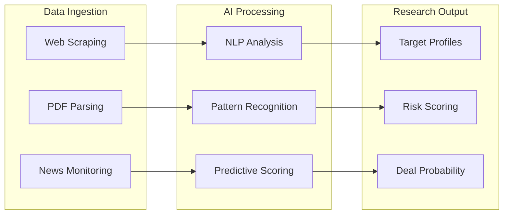

# Private Company Research – Pre-IPO, M&A, PE-Kandidaten

- Zweck: Identifikation und Analyse nicht-börsennotierter Mittelständler für Transaktionen.
- Output: Target-Listen, Unternehmensbewertungen, Deal-Opportunities, Pitch-Materialien.
- Anwendung: Sell-side/Buy-side M&A, Pre-IPO-Vorbereitung, PE-Origination.

## Identifikation und Screening von Zielunternehmen

Das systematische Aufspüren attraktiver nicht-börsennotierter Unternehmen beginnt mit strukturiertem Market Screening.

### Screening-Kriterien

### Owner Tracking & Qualitative Faktoren
- **Generationswechsel**: Inhaber 60+, keine Nachfolger identifiziert
- **PE-Exits**: Existing PE-Beteiligungen mit typischen Halteperioden
- **Expansionsbedarf**: Internationale Wachstumspläne, Kapitalintensität
- **Marktkonsolidierung**: Branchenbewegungen, Wettbewerber-Aktivitäten
- **Regulatorischer Druck**: Compliance-Kosten, ESG-Anforderungen

## Informationsquellen und Analysemethoden

### Primäre Datenquellen

### Detaillierte Datenquellen

1) **Orbis (Bureau van Dijk)**
- Owner: M&A-Team • Support: Research Associates
- Inputs: Screening-Kriterien, Peer-Definitionen
- Outputs: Firmenlisten, Finanzkennzahlen, Gesellschafterstrukturen
- Features: M&A-History, Transaktions-Screening, Export-Funktionen

2) **North Data & Bundesanzeiger**
- Owner: Analyst • Support: Legal (bei komplexen Strukturen)  
- Inputs: Firmenname/Register-Nr., Zeitraum-Definitionen
- Outputs: Strukturierte Jahresabschlüsse, Gesellschafter-Historie, Organpersonen
- Vorteil: KI-geparste Pflichtveröffentlichungen, deutlich effizienter als manuell

3) **Creditreform & Auskunfteien**
- Owner: M&A-Team • Support: Credit-Abteilung
- Inputs: Firmen-Identifikation, Bonitäts-Anfrage
- Outputs: Detaillierte Finanzdaten, Crefo-Score, Zahlungsverhalten
- Besonderheit: Oft vollständigere Daten als Bundesanzeiger (verkürzte Bilanzen)

## Analyseprozess Private Companies

### Research-Workflow

### Analyseschritte im Detail

1) **Finanzanalyse & Bewertung**
- **Historische Performance**: 3-5 Jahre Trend-Analyse aus Bundesanzeiger/Orbis
- **Peer-Benchmarking**: Multiplikatoren vs. börsennotierte Vergleichsunternehmen
- **Profitabilitäts-Assessment**: EBITDA-Entwicklung, Working Capital, Capex-Zyklen
- **Verschuldungsgrad**: Net Debt/EBITDA, Covenant-Headroom, Refinanzierungsbedarf

2) **Strategische Einordnung**
- **Marktposition**: Marktführer/Challenger in Nische, Competitive Moats
- **Wachstumstreiber**: Neue Märkte, Produktinnovationen, M&A-Pipeline
- **Risikofaktoren**: Kundenkonzentration, Lieferantenabhängigkeiten, Regulierung
- **Synergieanalyse**: Strategic/Financial Buyer-Potenzial

3) **Management & Governance**
- **Eigentümerstruktur**: Familien-/Managementanteile, Beiräte, PE-Beteiligungen
- **Managementqualität**: Track Record, Industry Experience, Nachfolgeplanung
- **Governance-Level**: Professionalität, Reporting-Standards, Compliance-Setup
- **Cultural Fit**: Bei Strategic Buyers, Integration-Komplexität

## Rollenverteilung: Research vs. Origination

### Organisatorische Trennung

### Verantwortlichkeiten & Abgrenzung

| Bereich | Sell-Side Research | Origination Research |
|---------|-------------------|---------------------|
| **Zielgruppe** | Institutionelle Investoren | Interne Deal Teams |
| **Output** | Öffentliche Reports, Ratings | Target Lists, Pitch Books |
| **Regulierung** | MAR, MiFID II | Insider-Trading-Regeln |
| **Bewertung** | Investoren-Feedback | Deal Success, Mandates |
| **Informationsfluss** | Public Information | Public + Internal Insights |

### Synergien & Compliance
- **Sektor-Expertise**: Research-Insights fließen in Origination-Strategien
- **Branding**: Research-Reputation unterstützt Origination-Credibility  
- **Wall-Crossing**: Strikte Trennung bei konkreten Deal-Situationen
- **Quiet Periods**: Research-Coverage pausiert während eigener Transaktionen

## Einbettung in M&A- und PE-Prozesse

### Deal Sourcing & Origination

### Research-Integration nach Deal-Phasen

1) **Proactive Sourcing**
- **Target Identification**: Systematic screening basierend auf Client-Kriterien
- **Market Mapping**: Vollständige Branchensicht für strategische Buyers
- **Opportunity Assessment**: ROI-Schätzung für verschiedene Deal-Strukturen
- **Timing Analysis**: Optimal entry points basierend auf Business Cycles

2) **Pitch-Vorbereitung**
- **Equity Story Development**: Unique Value Proposition des Targets
- **Valuation Benchmarking**: Indikative Pricing basierend auf Comps/Precedents
- **Synergy Analysis**: Quantifizierung strategischer Benefits
- **Process Strategy**: Optimal auction design oder bilateral approach

3) **Due Diligence & Execution**
- **Pre-DD Insights**: Research-Findings fokussieren DD-Scope
- **Market DD**: Ergänzung zu Management-Presentations durch unabhängige Sicht
- **Benchmarking**: Kontinuierlicher Peer-/Precedent-Vergleich
- **Buyer/Investor Identification**: Research-basierte Outreach-Strategien

## Herausforderungen und Compliance

### Informationslimitationen
- **Datenqualität**: Veraltete/unvollständige Pflichtpublizitäten
- **Reporting-Standards**: Unterschiedliche HGB-vs.-IFRS-Darstellungen
- **Transparenz-Mangel**: Keine Segmentberichterstattung bei diversifizierten Unternehmen
- **Management-Access**: Verschlossenheit vieler Familienunternehmer

### Regulatorische Aspekte

### Compliance-Framework
- **Insider-Listen**: Ab erstem vertraulichen Unternehmensgespräch
- **Information Barriers**: Trennung zu Sell-Side Research/Trading
- **Datenschutz**: GDPR-konforme Speicherung von Eigentümer-/Managementdaten
- **Ethical Sourcing**: Keine unzulässigen Informations-Channels

### Qualitätssicherung
- **Multi-Source Validation**: Kreuzvergleich verschiedener Datenquellen
- **Peer Reviews**: Senior-Validation vor Client-Präsentationen
- **Model Governance**: Standardisierte Bewertungsmethoden
- **Documentation Standards**: Vollständige Research-Dokumentation

## KI und Automatisierung im Private Research

### Technologie-Anwendungen

### Konkrete KI-Einsatzfelder

1) **Automatisiertes Screening**
- **Cyndx/Grata**: ML-basierte Unternehmens-Discovery
- **Alternative Data**: Web-Traffic, Job-Postings, Patent-Filings
- **Signal Detection**: Wachstums-/Verkaufs-Indikatoren in News/Social Media
- **Competitive Intelligence**: Automated competitor monitoring

2) **Datenverarbeitung & Profiling**
- **North Data API**: Automated financial data extraction
- **NLP on News**: Sentiment analysis on management/industry news
- **LinkedIn Intelligence**: Management changes, hiring patterns
- **Document Processing**: Automated parsing of Bundesanzeiger filings

3) **Predictive Analytics**
- **Exit Probability Models**: Historical pattern recognition
- **Valuation Models**: ML-enhanced peer analysis
- **Market Timing**: Optimal approach timing prediction
- **Success Scoring**: Deal completion probability assessment

### Implementation Considerations
- **Data Privacy**: On-premise KI-Lösungen für sensitive Daten
- **Accuracy Validation**: Human oversight für KI-generierte Insights  
- **Cost-Benefit**: ROI-positive KI-Implementierung vor allem bei Scale
- **Competitive Advantage**: Proprietary models als Differentiator

## Navigation

- [← Public Research](06a_Research_Public_Equities.md) | [→ KI im Research](06c_Research_KI_Technology.md)
- [Corporate Finance](01_Corporate_Finance_MA_Finanzierung.md) | [ECM - IPO](02_ECM_IPO.md) | [DCM](03_DCM_Anleiheemission.md) | [Secondary](04_ECM_Kapitalerhoehung_Secondary.md) | [Sales & Trading](05_Sales_Trading_Designated_Sponsoring.md) | [Research](06_Research.md) | [Risk & Compliance](07_Risk_Compliance.md) | [Operations & IT](08_Operations_IT.md)  
- [Templates](templates/) | [README](README.md)

> Detailanalyse der Private Company Research-Funktion für M&A, Pre-IPO und PE-Origination