# Private Company Research – Pre-IPO, M&A, PE-Kandidaten

- Zweck: Identifikation und Analyse nicht-börsennotierter deutscher Mittelständler für Transaktionen.
- Output: Target-Listen, Unternehmensbewertungen, Deal-Opportunities, Pitch-Materialien.
- Anwendung: Sell-side/Buy-side M&A, Pre-IPO-Vorbereitung, PE-Origination, Familienunternehmen-Nachfolge.

## Identifikation und Screening von Zielunternehmen

Neben dem öffentlichen Aktienresearch betreiben Investmentbanken intensives Research zu nicht-börsennotierten mittelständischen Unternehmen, insbesondere im Rahmen von M&A-Transaktionen, Pre-IPO-Vorbereitungen oder Private-Equity-Investments. Das Ziel ist die frühzeitige Identifikation attraktiver Zielunternehmen (Targets) für Sell-side-Mandate oder Buy-side-Akquisitionen.

### Screening-Methodik und Filter

Der Prozess beginnt mit systematischem Market Screening basierend auf definierten Kriterien:

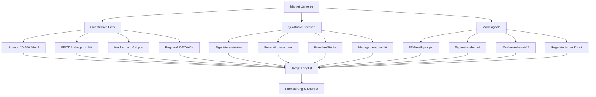

### Quantitative Screening-Kriterien

1) **Größen-Segmentierung**
- **Small Mid-Market**: €20-100 Mio. Umsatz, oft noch Inhaber-geführt
- **Mid-Market**: €100-500 Mio. Umsatz, professionelle Strukturen
- **Upper Mid-Market**: €500 Mio.-2 Mrd. Umsatz, institutionelle Investoren
- **Special Situations**: Distressed, Carve-outs, Family Offices

2) **Profitabilitäts-Filter**
- **EBITDA-Marge**: Mindestens zweistellig als Gesundheits-Indikator
- **ROE/ROIC**: Überdurchschnittliche Kapitalrenditen
- **Free Cash Flow**: Positive und wachsende Cash-Generierung
- **Working Capital**: Effiziente Betriebsmittelsteuerung

3) **Wachstums-Indikatoren**
- **Organisches Wachstum**: Umsatzwachstum >Markt/GDP
- **Internationalisierung**: Export-Quote, Auslandsstandorte
- **Marktanteilsgewinne**: Relative Performance vs. Wettbewerber
- **Produktinnovation**: R&D-Ausgaben, Patentanmeldungen

### Qualitative Screening-Faktoren

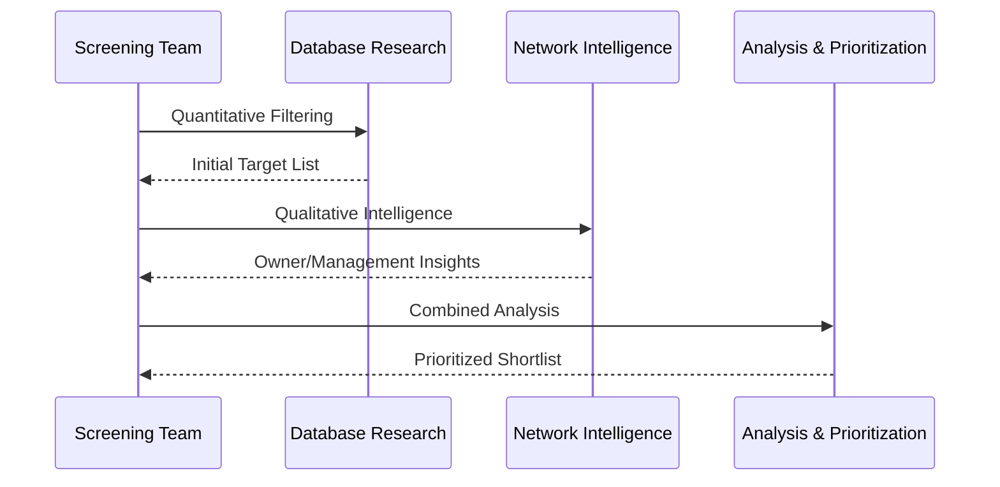

### Owner Tracking & Succession Planning

Ein kritischer Erfolgsfaktor im deutschen Mittelstand ist das „Owner Tracking" – die systematische Nachverfolgung von Eigentümerstrukturen und Nachfolgeplanung:

| Kriterium | Indikator | Research-Quelle |
|-----------|-----------|-----------------|
| **Inhaber-Alter** | 60+ Jahre ohne Nachfolger | Handelsregister, Pressemitteilungen |
| **Familiäre Situation** | Kinder außerhalb Geschäft | LinkedIn, lokale Presse |
| **Gesundheitszustand** | Öffentliche Aussagen zu Rückzug | Management-Interviews |
| **PE-Beteiligungen** | Minderheitsgesellschafter mit Exit-Horizont | Orbis, Dealreporter |
| **Professionalisierung** | Fremdes Management implementiert | Stellenausschreibungen |

### Marktsignal-Analyse

1) **Transaktions-Trigger**
- **Competitor Sales**: Branchenbewegungen schaffen Verkaufsdruck
- **Regulatory Changes**: ESG, Compliance-Kosten
- **Market Consolidation**: Economies of Scale erforderlich
- **Technology Disruption**: Digitalisierungsdruck

2) **Expansions-Indikatoren**
- **Export-Wachstum**: Internationale Markterschließung
- **Capacity Constraints**: Investitionsbedarf erkennbar
- **Strategic Partnerships**: Joint Ventures als Vorstufe
- **Management Hiring**: Key Positions für Wachstum

## Methoden und Informationsquellen für private Unternehmen

Da nicht-börsennotierte Firmen keine Ad-hoc-Publizität oder IR haben, ist das Research auf alternative Informationsquellen angewiesen. Diese bilden ein komplexes Puzzle, das systematisch zusammengesetzt werden muss.

### Primäre Datenquellen

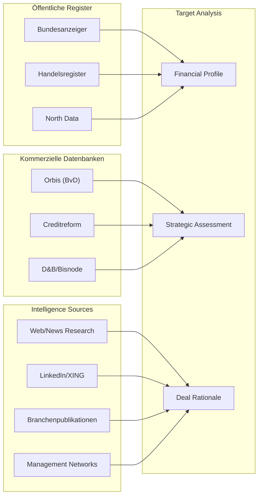

### Detaillierte Quellenanalyse

1) **Orbis / Bureau van Dijk**
- **Abdeckung**: Millionen europäischer Unternehmen inkl. deutscher GmbHs
- **Datenqualität**: Strukturierte Finanzkennzahlen, soweit publiziert
- **Filtering-Funktionen**: Multi-Kriterien-Screening (Region, Branche, Größe, Performance)
- **M&A-Modul**: Historische Transaktionen, Deal-Gerüchte, Ownership Changes
- **Export-Features**: Excel-Integration für weitere Analyse
- **Limitationen**: Abhängig von Pflichtveröffentlichungen, oft 12-18 Monate Verzögerung

2) **North Data - KI-Enhanced German Registers**
- **Innovation**: Big-Data/KI-Parsing von Bundesanzeiger-Publikationen
- **Strukturierte Darstellung**: Mehrerische Finanzdaten auf einen Blick
- **Gesellschafter-Tracking**: Ownership-Changes und Beteiligungsstrukturen
- **Screening-Power**: Filter nach Kennzahlen, Ereignissen, Wachstum
- **Premium-Features**: Alerts bei Änderungen, Bulk-Export
- **Beispiel-Use Case**: Alle Bayern-Maschinenbau-Firmen €50-250M Umsatz mit >15% EBITDA-Wachstum

3) **Creditreform & Wirtschaftsauskunfteien**
- **Bonitätsbewertung**: Crefo-Score als Ausfallrisiko-Indikator
- **Detaillierte Finanzen**: Oft vollständigere Daten als Bundesanzeiger
- **Zahlungsverhalten**: Historie von Mahnungen, Zahlungszielen
- **Branchenbenchmarks**: Peer-Vergleiche und Sector-Performance
- **Management-Information**: Geschäftsführer-Historie, Qualifikationen
- **Sicherheit**: Due-Diligence-Support für erste Risikoeinschätzung

### Qualitative Research-Methoden

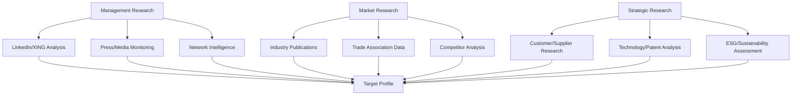

### Web- und Netzwerk-Intelligence

1) **Digital Footprint Analysis**
- **Corporate Website**: Produktportfolio, Referenzkunden, News/PR
- **Social Media**: LinkedIn-Mitarbeiterzahlen, Hiring-Patterns
- **Job Postings**: Expansion-Signale durch Stellenausschreibungen
- **Management Profiles**: Bildungsweg, Previous Experience, Board-Positionen

2) **Medien- und Presse-Monitoring**
- **Lokale Zeitungen**: Expansion, Investitionen, Management-Statements
- **Fachpresse**: "Top-Listen", Awards, Branchenrankings
- **Google Alerts**: Kontinuierliche Überwachung von Firmen-Mentions
- **Nachrichtenarchive**: Historische Entwicklung, M&A-Historie

3) **Branchenexpertise und Netzwerke**
- **Supplier/Customer Intelligence**: Geschäftsbeziehungen und Dependencies
- **Consultant Networks**: Former McKinsey/BCG mit Brancheninsights
- **Investment Community**: PE-Funds, Family Offices mit Sector-Focus
- **Trade Associations**: Verbandsstatistiken, Peer-Benchmarks

## Research-Puzzlespiel: Datenintegration und -lücken

Das Private Research gleicht einem komplexen Puzzlespiel, bei dem aus öffentlich verfügbaren Fragmenten ein vollständiges Unternehmensbild zusammengesetzt werden muss.

### Typische Informationslücken

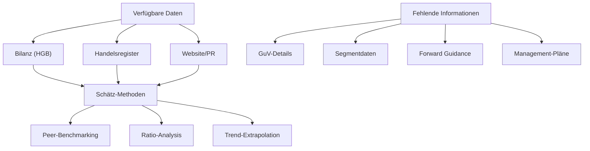

### Analytische Herausforderungen

1) **Datenverzögerung und -lücken**
- **Publikations-Timing**: GmbHs publizieren oft 12+ Monate nach Jahresende
- **Verkürzte Bilanzen**: Kleinere Firmen müssen keine GuV veröffentlichen
- **Segmentberichterstattung**: Keine Aufgliederung bei diversifizierten Geschäften
- **Forward-Looking Info**: Keine Guidance oder Prognosen verfügbar

2) **Schätzungsverfahren und Approximationen**
- **Revenue Multiples**: Ableitung aus börsennotierten Peers
- **Margin-Benchmarks**: Branchendurchschnitte für fehlende Profitabilitätsdaten
- **Growth-Proxies**: Mitarbeiterwachstum, Capacity-Expansion als Indikatoren
- **Working Capital**: Standardisierte Annahmen basierend auf Industrie-Normen

3) **Qualitative Assessment-Methoden**
- **Management-Qualität**: Track Record, Industry Experience, Succession Planning
- **Competitive Position**: Market Share Approximation, Customer Loyalty
- **Strategic Assets**: IP/Patents, Customer Contracts, Distribution Networks
- **Cultural Factors**: Family Values, Sustainability Commitment, Local Presence

## Rollenverteilung: Research vs. Origination

In Investmentbanken existiert eine klare organisatorische und regulatorische Trennung zwischen Sell-Side Research und Origination-Teams, die durch Chinese Walls verstärkt wird.

### Organisationsstruktur und Mandate

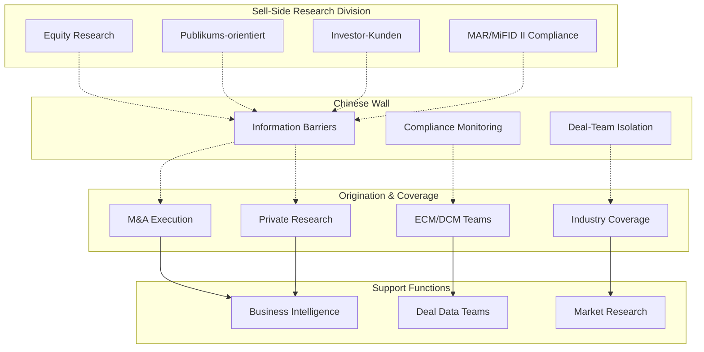

### Sell-Side Research Characteristics

| Aspekt | Sell-Side Research | Origination Research |
|--------|-------------------|---------------------|
| **Zielgruppe** | Institutionelle Investoren | Interne Deal-Teams/Kunden |
| **Output** | Öffentliche Reports, Ratings | Target-Lists, Pitch-Books |
| **Regulierung** | MAR, MiFID II, Research Independence | Insider-Trading, Chinese Walls |
| **Performance-Messung** | Investor-Feedback, Accuracy | Deal-Flow, Mandats-Erfolg |
| **Information-Access** | Public Information only | Public + Internal Intelligence |
| **Compensation** | Research-Revenue, Rankings | Deal-Fees, Origination Success |

### Chinese Wall Implementation

1) **Informations-Barrieren**
- **Deal-Team Isolation**: Research-Analysten erhalten keine Deal-Information
- **Trading Restrictions**: Personal Trading Limits bei Coverage-Companies
- **Wall-Crossing Protocols**: Dokumentierte Insider-Information Transfers
- **Communication Monitoring**: E-Mail/Chat-Überwachung zwischen Bereichen

2) **Compliance-Verfahren**
- **Training Requirements**: Jährliche Compliance-Schulungen für alle Mitarbeiter
- **Documentation Standards**: Vollständige Dokumentation aller Research-Quellen
- **Review Processes**: Multi-Level-Approval für Research-Publications
- **Audit Trails**: Lückenlose Nachverfolgung von Informationsflüssen

### Synergien und Zusammenarbeit

Trotz strikter Trennung existieren regulatorisch erlaubte Synergien:

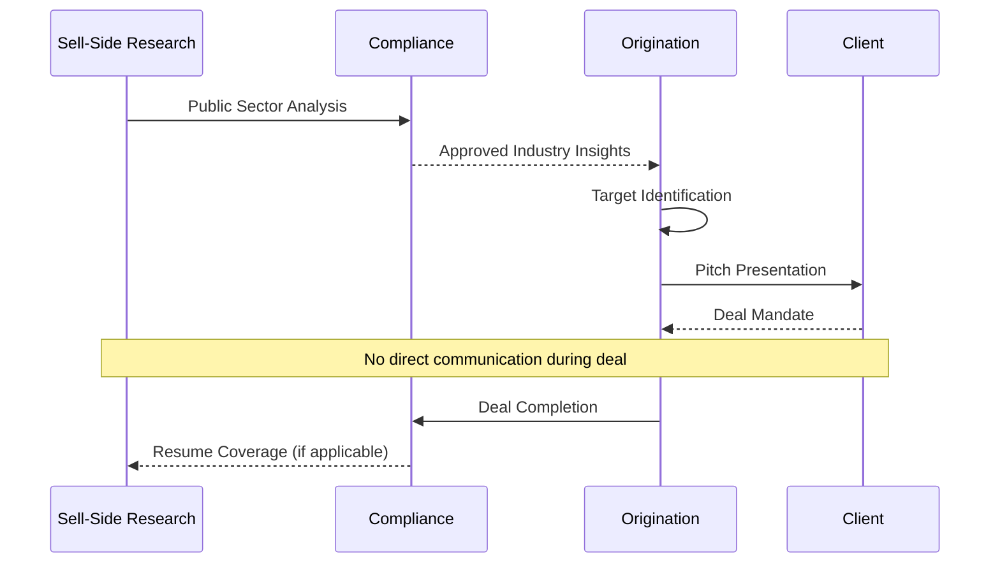

1) **Zulässige Informationsflüsse**
- **Sektor-Expertise**: Public Research-Insights für Origination-Strategien
- **Market Intelligence**: Branchendaten und Trends (non-confidential)
- **Historical Analysis**: Precedent-Transactions und Valuation-Benchmarks
- **Client Introductions**: Research-Reputation als Origination-Support

2) **Interessenkonflikt-Management**
- **Coverage Pauses**: Research-Coverage stoppt bei Deal-Involvement
- **Rating Holds**: "Under Review" Status während Transaktionen
- **Disclosure Requirements**: Vollständige Offenlegung von Bank-Interests
- **Independence Monitoring**: Regelmäßige Compliance-Audits

## Einbettung in M&A- und PE-Prozesse

Private Research ist integraler Bestandteil des gesamten Transaktionszyklus und unterstützt jeden Prozessschritt von der initialen Origination bis zum Post-Deal-Monitoring.

### Deal-Lebenszyklus Integration

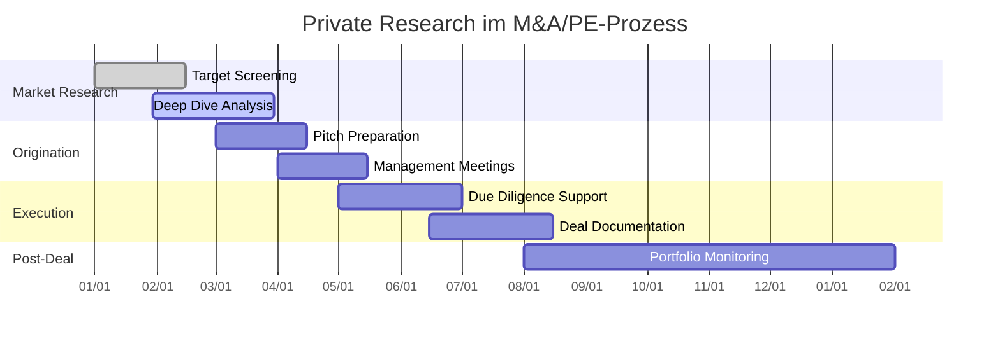

### 1. Proactive Deal Sourcing

**Systematische Target-Identifikation**
- **Universe Mapping**: Vollständige Branchenabdeckung mit Research-Database
- **Pipeline Development**: 18-24 Monate Vorlauf für komplexe Transaktionen
- **Relationship Building**: Kontinuierlicher Dialog mit Zielunternehmen
- **Market Timing**: Optimal Entry-Points basierend auf Markt-/Unternehmenszyklen

**PE-Client Origination**
- **Fund Strategy Alignment**: Research-Pipeline abgestimmt auf PE-Investment-Criteria
- **Proprietary Deal Flow**: Exklusiver Zugang zu "Hidden Champions" 
- **Sector Expertise**: Deep Industry Knowledge als Competitive Advantage
- **Management Meetings**: Research-supported Präsentationen an PE-Investment-Committees

### 2. Pitch-Phase und Erstkontakt

**Research-basierte Pitch-Entwicklung**
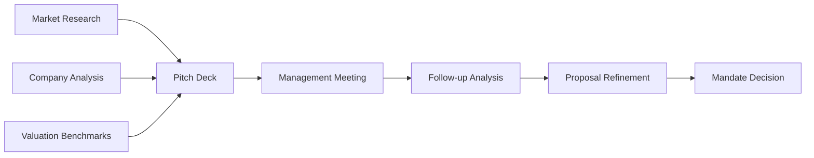

**Pitch-Komponenten**
- **Company Assessment**: USPs, Competitive Position, Financial Performance
- **Market Context**: Industry Trends, Growth Drivers, Consolidation Thesis
- **Valuation Framework**: Preliminary Pricing basierend auf Comps/Precedents
- **Transaction Rationale**: Strategic/Financial Buyer Logic, Synergy Potential
- **Execution Strategy**: Process Design, Timeline, Investor/Buyer Targeting

**Credibility Building**
- **Industry Knowledge**: Demonstrierte Sector-Expertise und Track Record
- **Market Intelligence**: Proprietary Insights zu Buyer-Universe und Pricing
- **Reference Clients**: Success Stories aus ähnlichen Transaktionen
- **Resource Commitment**: Dedicated Team-Allokation und Senior-Involvement

### 3. Due Diligence und Deal-Execution

**Pre-DD Intelligence Integration**
- **Focus Areas**: Research-identifizierte Key Issues für DD-Scope
- **Benchmark Provision**: Peer-Vergleiche für DD-Team und Käufer
- **Red Flag Anticipation**: Potenzielle Problembereiche aus Vor-Research
- **Data Room Optimization**: Strukturierung basierend auf Buyer-Informationsbedarf

**Information Memorandum Support**
- **Market Sections**: Industry Analysis und Competitive Landscape
- **Strategic Positioning**: Value Proposition und Investment Highlights
- **Financial Context**: Normalisierte Darstellung und Peer-Benchmarking
- **Growth Story**: Expansion Opportunities und Value Creation Plan

**Buyer/Investor Identification**
- **Strategic Buyers**: Synergy Analysis und Acquisition-Capacity Assessment
- **Financial Buyers**: PE-Fund Screening basierend auf Investment-Criteria
- **International Outreach**: Global Buyer-Universe bei Cross-border-Deals
- **Optimization Process**: Auction-Design für maximale Valuation

### 4. Post-Transaction Integration

**Knowledge Retention**
- **Deal Database**: Systematische Erfassung von Transaction-Learnings
- **Market Intelligence Update**: Integration neuer Pricing/Structure-Benchmarks
- **Relationship Maintenance**: Continued Dialogue mit Buyers/Management-Teams
- **Pipeline Refresh**: Impact-Analysis auf weitere Portfolio-Companies

**Future Opportunity Tracking**
- **Exit Monitoring**: PE-Portfolio-Company Exit-Timeline Tracking
- **Re-IPO Candidates**: Börsengang-Potenzial bei erfolgreichen PE-Exits  
- **Add-on Acquisition**: Follow-on M&A Opportunities bei Strategic Buyers
- **Management Buyouts**: Track Record für zukünftige MBO-Mandates

## Herausforderungen und Compliance-Aspekte

Private Research im deutschen Mittelstand bringt spezifische Herausforderungen mit sich, die sowohl operative als auch regulatorische Dimensionen umfassen.

### Informations-Limitationen

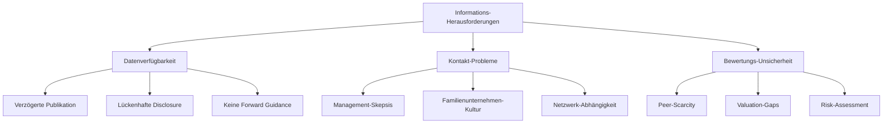

### 1. Datenqualität und -aktualität

**Strukturelle Informationsdefizite**
- **Publication Lag**: 12-18 Monate zwischen Geschäftsjahr und Bundesanzeiger-Publikation
- **Limited Disclosure**: GmbHs müssen keine GuV oder Segmentdaten veröffentlichen
- **Accounting Standards**: HGB vs. IFRS erschwert internationale Vergleichbarkeit
- **No Guidance**: Fehlende Forward-Looking Statements oder Management-Prognosen

**Approximations-Strategien**
- **Peer-Benchmarking**: Listed Company Multiples als Proxy für Private Valuations
- **Ratio-Analysis**: Industry-Standard-Margins für P&L-Estimation
- **Growth-Proxies**: Employee-Count, Capacity-Investment als Leading Indicators
- **Working Capital**: Sector-Average Working Capital Ratios als Normalisierung

### 2. Relationship Management Challenges

**Mittelständische Unternehmenskultur**
- **Trust Building**: Persönliche Beziehungen entscheidender als Institutionen
- **Long-term Perspective**: Generationen-Denken vs. kurzfristige Kapitalmarkt-Logik
- **Control Concerns**: Angst vor Verlust der Unternehmensautonomie
- **Regional Focus**: Lokale Verwurzelung vs. internationale Kapitalmarkt-Integration

**Approach-Strategien**
- **Soft Introduction**: Netzwerk-basierte Kontaktanbahnung statt Cold Calling
- **Value-first Approach**: Beratungscharakter vor Verkaufs-/Akquisitions-Fokus
- **Cultural Sensitivity**: Verständnis für Familienunternehmen-Spezifika
- **Success Stories**: Referenzen aus ähnlichen Familienunternehmen-Transaktionen

### Regulatorische und Compliance-Anforderungen

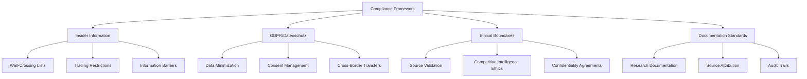

### Insider Information Management

1) **Definitionen und Schwellenwerte**
- **Material Non-Public Information**: Jede Information mit potenziellem Kurs-/Bewertungseffekt
- **Inside Information**: Spezifische, nicht-öffentliche, kurs-relevante Fakten
- **Wall-Crossing Threshold**: Ab erstem vertraulichen Management-Gespräch
- **Quarantine Protocols**: Isolation betroffener Mitarbeiter von anderen Geschäftsbereichen

2) **Operative Umsetzung**
- **Insiderlisten-Management**: Elektronische Listen mit automatischen Updates
- **Communication Restrictions**: E-Mail-Monitoring und Chat-Beschränkungen  
- **Trading Prohibitions**: Personal-Trading-Verbote für gelistete Competitors
- **Information Screening**: Automated Systems für sensible Informations-Transfers

### GDPR und Datenschutz-Compliance

1) **Datenerhebung und -verarbeitung**
- **Legitimate Interest**: Research-Zweck als rechtfertigende Basis
- **Data Minimization**: Nur notwendige Daten für spezifische Research-Ziele
- **Retention Policies**: Definierte Aufbewahrungszeiten für verschiedene Datentypen
- **Cross-Border Transfers**: Adequate Protection für internationale Daten-Transfers

2) **Betroffenenrechte und Governance**
- **Privacy Impact Assessments**: Systematische Bewertung von Datenschutz-Risiken
- **Data Subject Requests**: Verfahren für Auskunft, Berichtigung, Löschung
- **Breach Notification**: 72h-Meldefristen bei Datenschutz-Verletzungen
- **Third-Party Data**: Compliance bei Daten-Sharing mit externen Service-Providern

### Objektivität vs. Commercial Interest

**Interessenkonflikt-Management**
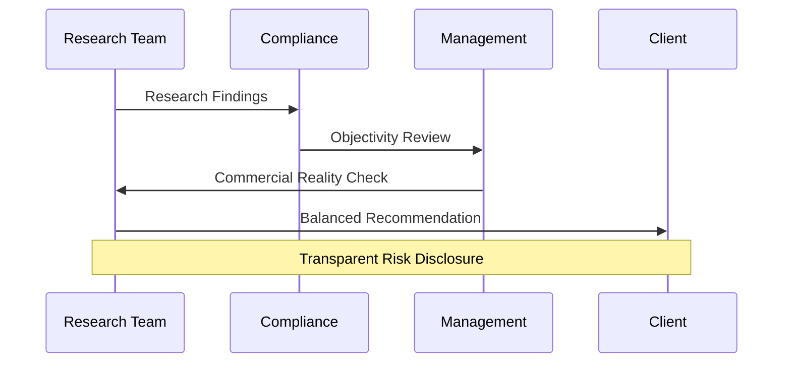

1) **Research Integrity**
- **Balanced Analysis**: Positive und negative Aspekte gleichermaßen bewerten
- **Risk Disclosure**: Vollständige Darstellung von Deal-Risiken und Challenges
- **Scenario Analysis**: Multiple Outcomes und Sensitivitäts-Betrachtungen
- **Independent Validation**: External Expert Views für komplexe Bewertungen

2) **Commercial Pressure Management**
- **Multi-Level Review**: Senior-Oversight für kommerzielle Bias-Vermeidung
- **Long-term Reputation**: Nachhaltige Client-Relationships vor kurzfristigen Fees
- **Professional Standards**: CFA/CIIA-konforme Analyse-Standards
- **Documentation**: Vollständige Begründung für alle Research-Conclusions

### Technologie und Automatisierung

**KI-Enhanced Research Capabilities**
- **Automated Screening**: Machine Learning für Pattern Recognition in Finanzdaten
- **Natural Language Processing**: News/Document-Analysis für Sentiment und Events
- **Predictive Analytics**: Statistical Models für Deal-Probability-Scoring
- **Alternative Data**: Satellite Data, Web-Traffic, Patent Filings als Leading Indicators

**Data Security und AI Governance**
- **On-Premise Solutions**: Sensible Daten nicht in Public Cloud-AI-Services
- **Model Validation**: Human Oversight für AI-Generated Insights und Recommendations
- **Bias Detection**: Systematic Review von ML-Model-Outputs auf hidden Biases
- **Audit Trails**: Vollständige Dokumentation von AI-Assisted Analysis-Steps

## Navigation

- [← Public Research](06a_Research_Public_Equities.md) | [→ KI im Research](06c_Research_KI_Technology.md)
- [Corporate Finance](01_Corporate_Finance_MA_Finanzierung.md) | [ECM - IPO](02_ECM_IPO.md) | [DCM](03_DCM_Anleiheemission.md) | [Secondary](04_ECM_Kapitalerhoehung_Secondary.md) | [Sales & Trading](05_Sales_Trading_Designated_Sponsoring.md) | [Research](06_Research.md) | [Risk & Compliance](07_Risk_Compliance.md) | [Operations & IT](08_Operations_IT.md)  
- [Templates](templates/) | [README](README.md)

> Comprehensive Private Company Research für M&A, Pre-IPO und PE-Origination im deutschen Mittelstand