# KI und Technologie im Research

- Zweck: Automatisierung, Effizienzsteigerung und erweiterte Analytik im Research-Prozess.
- Output: Automated insights, erweiterte Datenanalyse, personalisierte Reports.
- Technologien: Machine Learning, NLP, Alternative Data, Predictive Analytics.

Die Equity Research-Branche durchläuft eine fundamentale technologische Transformation durch Künstliche Intelligenz, die besonders bei Private Companies und Small Caps neue Möglichkeiten eröffnet.

## KI-Enhanced Research: Problemlösung im Workflow

Das traditionelle Research steht vor strukturellen Herausforderungen, die KI gezielt adressiert - von der Coverage-Lücke bis zur Effizienz-Krise.

### Problem-Solution Framework

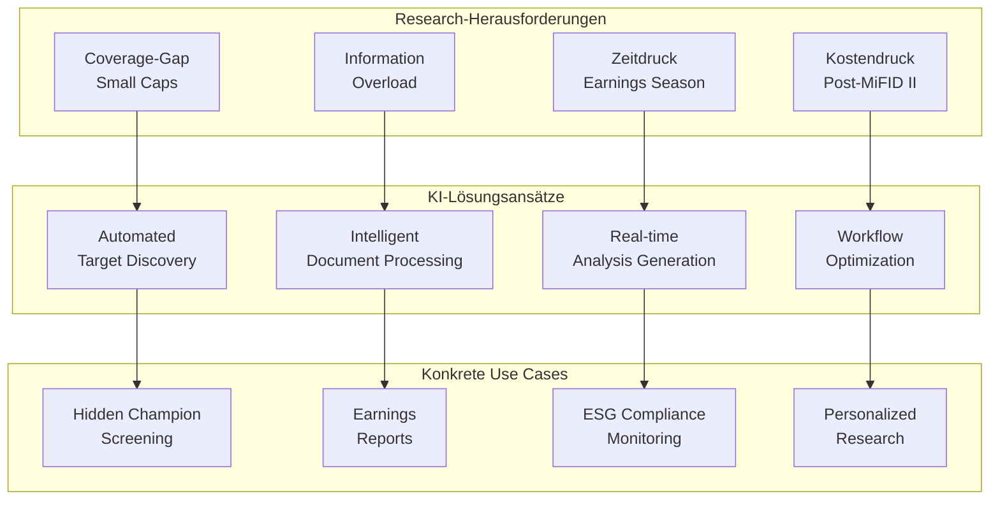

### 1. Coverage-Gap Problem → Automated Target Discovery

**Das Problem**: Post-MiFID II Rückgang Small-Cap Coverage, Informationsasymmetrie bei deutschen Mittelständlern

**KI-Lösung**: Intelligent Screening & Discovery
- **"Hidden Champion" Detection**: ML-Patterns erkennen erfolgreiche Nischen-Player
- **Alternative Data Mining**: Web-Traffic, Hiring-Trends, Patent-Aktivität für Private Companies
- **Real-time Market Surveillance**: Kontinuierliche Opportunity-Discovery
- **Success Pattern Learning**: Automatische Filter-Optimierung basierend auf Deal-History

**Konkreter Use Case: Maschinenbau-Screening**
```
Input: "Alle Bayern-Unternehmen, Maschinenbau, €50-250M Umsatz"
KI-Enhancement: + Patent-Aktivität + Export-Wachstum + Mitarbeiter-LinkedIn-Trends
Output: 15 "Hidden Champions" mit Investment-Readiness-Score
Zeit: Deutlich verkürzt gegenüber manueller Analyse
```

### 2. Information Overload → Intelligent Document Processing

**Das Problem**: Analysten ertrinken in Dokumenten - Geschäftsberichte, News, Calls, Ad-hoc Meldungen

**KI-Lösung**: NLP-Enhanced Information Extraction
- **Document Summarization**: Kernaussagen aus umfangreichen Reports extrahieren
- **Change Detection**: "Was ist neu vs. Vorquartal?" automatisch identifiziert
- **Sentiment Tracking**: Management-Ton quantifiziert über Zeit-Horizonte
- **Key Metrics Extraction**: Automatische KPI-Tabellen aus unstrukturierten Texten

**Konkreter Use Case: Quarterly Earnings Analysis**
```
Traditionell: Mehrstündige Analyst-Zeit für Call-Transcript + Report
Mit KI: Automatisierte Analyse mit vollständigem Earnings-Review
Qualität: Alle relevanten Punkte, keine Oversight, Quellenverweise
Skalierung: Deutlich mehr Companies parallel bearbeitbar
```

### 3. Zeitdruck Earnings Season → Real-time Analysis Generation

**Das Problem**: Earnings Season = 6 Wochen Chaos, 200+ Companies reporten gleichzeitig

**KI-Lösung**: Automated Report Generation & Real-time Processing
- **Live Earnings Analysis**: Während Conference Call bereits Highlights generieren
- **Instant Peer Comparison**: Sofortige Einordnung vs. Sector/Competitors
- **Automated First Drafts**: Umfassende Reports in kurzer Zeit generieren
- **Multi-language Output**: Deutsch/Englisch parallel für internationale Kunden

**Konkreter Use Case: DAX Earnings Coverage**
```
Challenge: 40 DAX Unternehmen berichten in 3 Wochen
KI-Solution: Parallel Processing aller Calls + Reports
Output: Same-day Commentary für alle 40 Companies
Analyst Role: Strategy/Interpretation statt Data-Gathering
```

### 4. Kostendruck → Workflow-Automatisierung

**Das Problem**: Research-Teams kleiner seit MiFID II, gleicher Coverage-Anspruch

**KI-Lösung**: End-to-End Workflow Enhancement
- **Research Pipeline**: Von Target-ID bis Report-Distribution automatisiert
- **Quality Assurance**: Automated Fact-Checking und Consistency-Validation
- **Client Personalization**: Individual Research-Feeds based auf Portfolio
- **Performance Analytics**: ML-Enhanced Research-Impact-Messung

**Praxis-Erfahrungen**:
- **Marvin Labs**: Kostenreduktion bei Junior Analysts und Research-Kosten
- **Coverage Expansion**: Deutlich mehr Unternehmen bei gleicher Team-Größe  
- **Time-to-Market**: Beschleunigte Reports bei höherer Consistency
- **Client Satisfaction**: Personalized Content steigert Engagement

## Technologie-Stack im Research

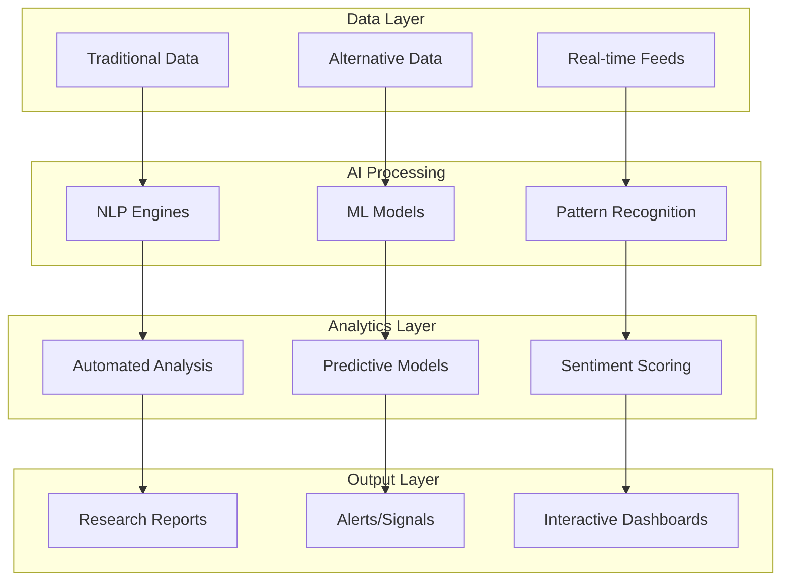

## Automatisierte Datenaufbereitung

### NLP-basierte Textanalyse
- **Earnings Call Analysis**: Live-Transkription mit Sentiment-Markierung
- **Document Mining**: Key Information Extraction aus 10-Ks, Prospekten
- **News Processing**: Relevanz-Ranking und Impact-Assessment
- **Social Media Monitoring**: Sentiment-Tracking und Trend-Identification

### Konkrete Tools und Anbieter

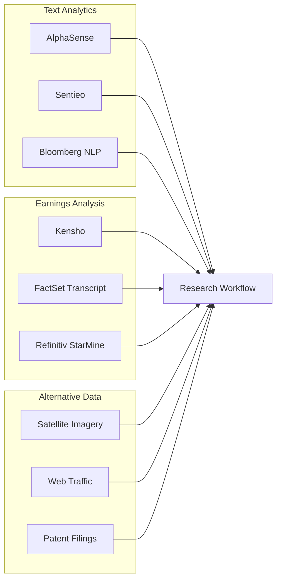

### Implementierung und Vorteile

1) **AlphaSense & Sentieo**
- **Funktionalität**: Sekunden-Suche in Millionen Dokumenten
- **NLP-Features**: Synonym-Erkennung, Kontext-Analysis, Trend-Tracking
- **Integration**: Nahtlose Einbindung in Research-Workflows
- **Nutzen**: Deutliche Zeitersparnis bei Recherche-Aufgaben

2) **Automated Earnings Analysis**  
- **Kensho-Integration**: Historische Event-Impact-Analysen
- **Real-time Processing**: Live-Sentiment während Calls
- **Key Quote Extraction**: Automatische Management-Statement-Highlights
- **Competitive Intelligence**: Cross-Company-Themen-Tracking

## Marvin Labs – KI Research Revolution

### Technology Platform Overview
- **Founded**: 2023, London-based FinTech
- **Product**: AI-powered Investment Analysis Copilot
- **Target**: Buy-Side und Sell-Side Research Efficiency
- **Technology**: Advanced NLP, Large Language Models (LLMs)

### Core AI Capabilities

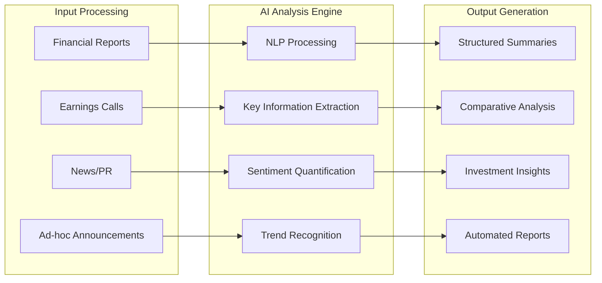

#### Advanced Features Portfolio

1) **Knowledge-Aware Summaries**
- **Context Integration**: Bestehendes Analyst-Expertise einbeziehen
- **Non-Generic Outputs**: Spezifische, relevante Erkenntnisse
- **Historical Context**: Trends über Zeit-Dimensionen hinweg
- **Comparative Elements**: Automatic Peer Benchmarking

2) **Guidance Tracking & Document Highlights**
- **Management Guidance**: Automatisches Forward-Looking Statement Tracking
- **Document Change Detection**: Kritische Änderungen vs. Previous Reports
- **Sentiment Scoring**: Numerische Stimmungsquantifizierung für Zeitreihen
- **Real-time Processing**: Schnelle Earnings Review Generation

3) **Interactive Chat Interface**
- **Natural Language Queries**: "Wie entwickelte sich Bruttomarge und warum?"
- **Source Attribution**: Direkter Verweis auf Original-Dokumente
- **Contextual Understanding**: KI versteht Finanz-Fachsprache
- **Validation Features**: Überprüfbare, nicht halluzinierte Antworten

### Technology Validation & Quality Control

**AI Accuracy Framework**
- **Source Verification**: Alle Aussagen mit Primärquellen verknüpft
- **Comparative Analysis**: Querverweise zwischen Report-Generationen
- **No Hallucination**: Trained für überprüfbare, faktische Statements
- **Continuous Learning**: User Feedback Integration für Model Improvement

**German Market Application**
- **Language Processing**: Multi-language Support (DE/EN)
- **Bundesanzeiger Integration**: Potential für Private Company Analysis
- **Family Office Use Cases**: Cost-effective Private Equity Research
- **Barrier Reduction**: Sprachbarrieren bei internationalen Reports

## Analytische Modelle und Vorhersagen

### Machine Learning Applications

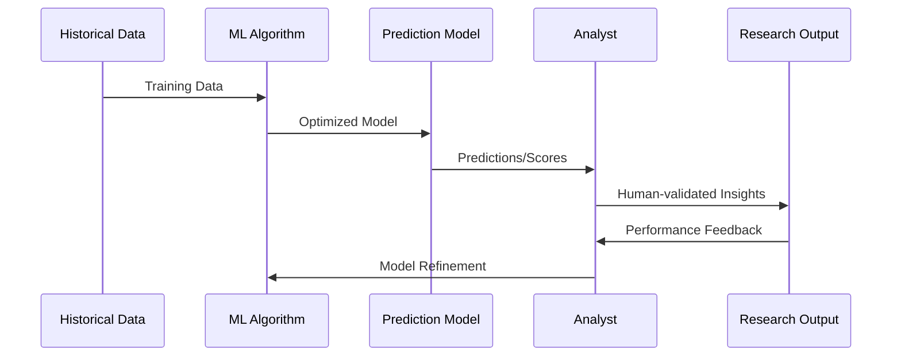

### Predictive Analytics Anwendungen

1) **Earnings Forecasting**
- **Model Type**: Ensemble Methods (Random Forest + Neural Networks)
- **Input Variables**: Fundamental data, macro indicators, sentiment
- **Output**: EPS/Revenue predictions mit Confidence Intervals
- **Performance**: Verbesserte Accuracy gegenüber traditionellen Methoden

2) **Stock Price Movement Prediction**
- **Event-driven Models**: Kensho-style historical pattern analysis
- **Technical Indicators**: ML-enhanced momentum/reversal signals  
- **Sentiment Integration**: Social media + news sentiment scoring
- **Risk Management**: VaR-Models mit ML-enhanced tail-risk estimates

3) **Sector Rotation Models**
- **Macro Integration**: Economic indicators + policy changes
- **Flow Analysis**: Fund flow patterns + institutional positioning
- **Relative Value**: Cross-sector momentum + mean reversion
- **Timing Signals**: Optimal sector allocation recommendations

### Alternative Data Integration

| Datentyp | Anwendung | Beispiel-Insights |
|----------|-----------|-------------------|
| **Satellite Imagery** | Retail/Industrial Activity | Parkplatz-Auslastung → Revenue-Proxy |
| **Web Traffic** | Digital Business Models | Page Views → User Growth |
| **Patent Filings** | Innovation Assessment | R&D Pipeline → Future Growth |
| **Supply Chain Data** | Operating Leverage | Shipping volumes → Demand trends |
| **Social Sentiment** | Brand/Product Reception | Twitter mentions → Sales correlation |

### Graph Analytics & Alternative Data Integration

#### Network Analysis Applications

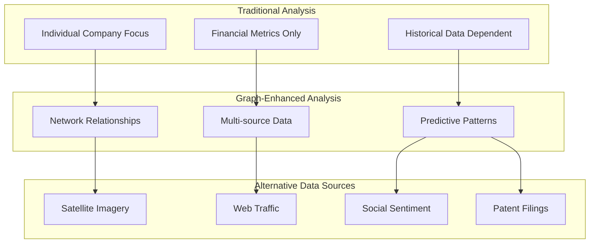

1) **Relationship Mapping**
- **Supply Chain Analysis**: Automated Vendor/Customer Network Discovery  
- **Investment Networks**: PE/VC Connection Pattern Recognition
- **Management Connectivity**: Board/Executive Cross-Company Analysis
- **Strategic Partnership Detection**: Joint Venture und Alliance Patterns

2) **Risk Propagation Modeling** 
- **Contagion Analysis**: Supply Chain Disruption Impact Simulation
- **Systemic Risk**: Network-based Portfolio Risk Assessment
- **Hidden Correlations**: Non-obvious Company Interdependencies
- **Fraud Detection**: Suspicious Entity Relationship Patterns

## Report-Erstellung und Personalisierung

### Natural Language Generation (NLG)

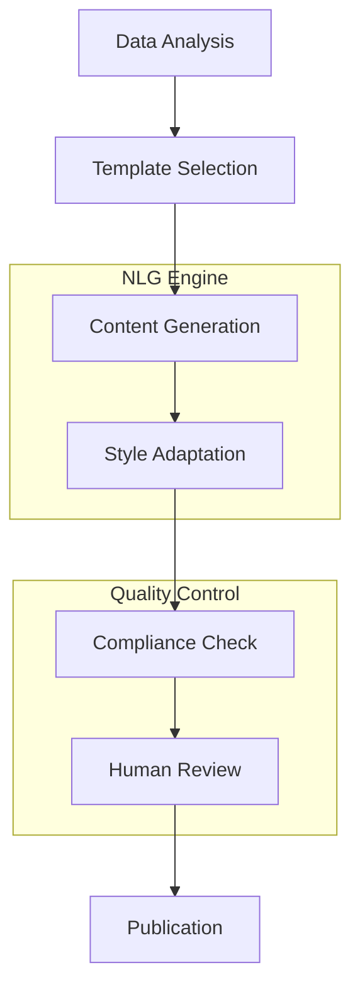

### Automated Content Creation

1) **Standardisierte Sections**
- **Company Descriptions**: Auto-generiert aus Filings + Website
- **Financial Summaries**: Template-basiert mit aktuellen Zahlen
- **Peer Comparisons**: Automatische Multiples-Tabellen
- **Risk Factors**: ML-extrahiert aus verschiedenen Dokumenten

2) **Personalisierte Reports**
- **ESG-Focus**: Erweiterte Nachhaltigkeits-Analysen für ESG-Investoren
- **Value-Metrics**: Detailed Bilanz-Analysen für Value-Investoren  
- **Growth-Stories**: Forward-looking statements für Growth-Investoren
- **Technical Analysis**: Chart-Integration für quantitative Clients

3) **Multi-Language Support**
- **Automated Translation**: Research-Reports in mehreren Sprachen
- **Cultural Adaptation**: Regional Investment-Style-Anpassungen
- **Regulatory Compliance**: Lokale Disclaimer-Anpassungen

## KI-Enhanced Sales & Distribution

### Personalization Revolution

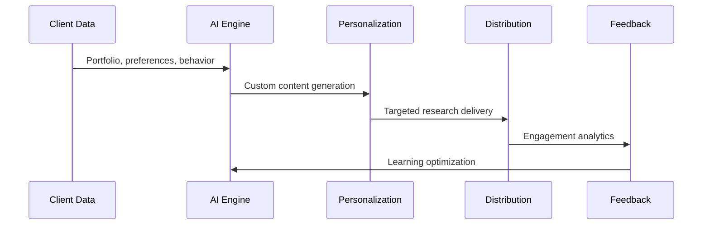

1) **Intelligent Content Customization**
- **Portfolio-Based Research**: Holdings-specific Analysis Generation
- **Interest Prediction**: ML-Enhanced Research-Relevance Scoring
- **Communication Timing**: Optimal Send-Time Prediction
- **Format Optimization**: Client-Preference-based Content Adaptation

2) **Sales Process Automation**
- **Lead Scoring**: ML-Enhanced Prospect Identification
- **Cross-selling Intelligence**: Predictive Analytics für Product-Fit
- **Meeting Optimization**: AI-Generated Meeting Summaries/Follow-ups
- **Relationship Mapping**: Network-Analysis für Business Development

## Technologie-Implementation

### Platform Architecture

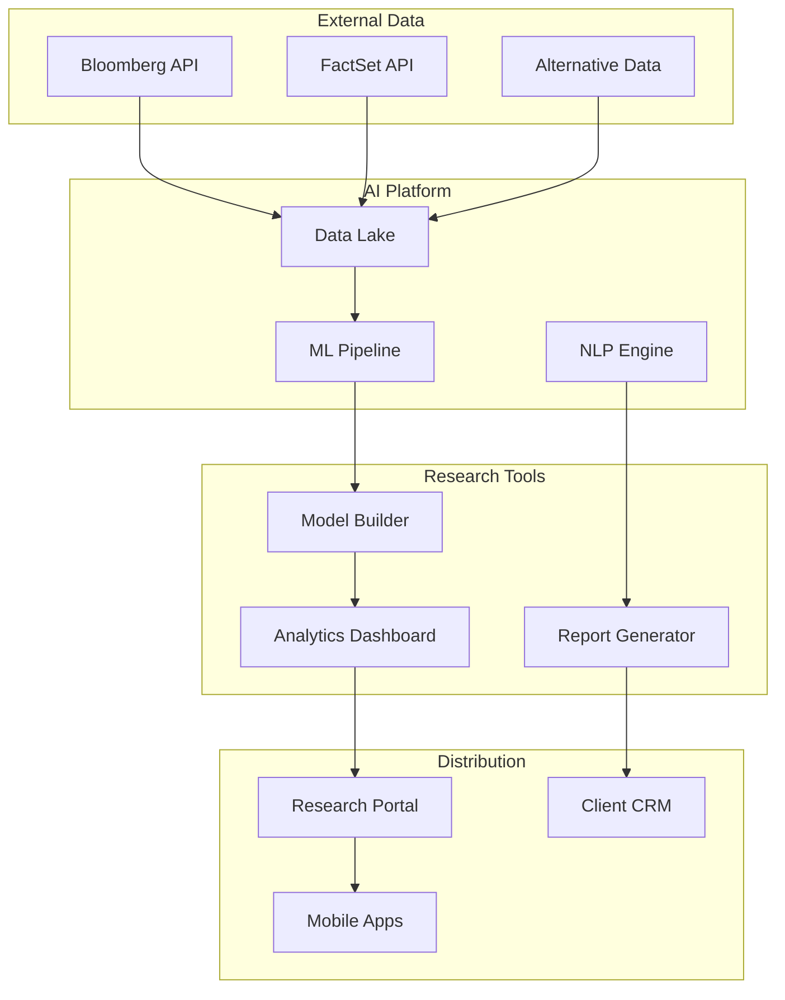

### Technology Stack Components

1) **Cloud Infrastructure**
- **AWS/Azure**: Scalable computing für ML-Workloads
- **Databricks**: Collaborative Analytics Platform
- **Snowflake**: Modern Data Warehouse für Research Data
- **Security**: SOC2/GDPR-compliant Data Processing

2) **AI/ML Frameworks**
- **Python Stack**: Pandas, Scikit-learn, TensorFlow
- **R Integration**: Specialized financial modeling packages
- **API Ecosystem**: Bloomberg/FactSet/Alternative Data Integration
- **Version Control**: MLOps mit Model-Lifecycle-Management

3) **Research Applications**
- **Jupyter Notebooks**: Interactive Analysis Environment  
- **Tableau/PowerBI**: Advanced Data Visualization
- **Custom Dashboards**: Client-specific Research Interfaces
- **Mobile Solutions**: Research-on-the-go für Client Meetings

## Regulatorische KI-Anwendungen

### MiFID II Compliance Enhancement

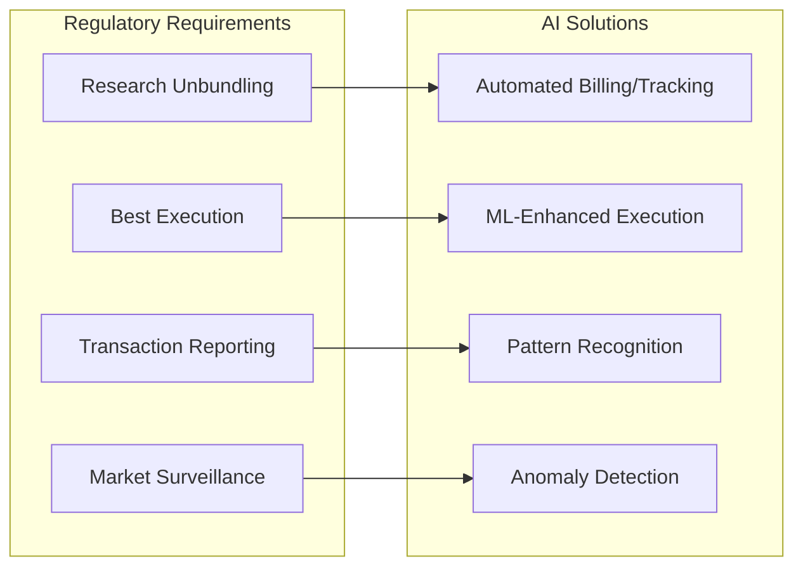

1) **Best Execution Optimization**
- **TORA Pre-Trade Analytics**: ML-basierte Slippage-Prognose
- **Historical Pattern Analysis**: Broker-Performance Machine Learning
- **Real-time Optimization**: Dynamic Execution-Venue Selection
- **Post-Trade Surveillance**: Automated Best-Ex Compliance Monitoring

2) **Research Distribution Management**  
- **Usage Tracking**: AI-Enhanced Research-Consumption Analytics
- **Pricing Optimization**: ML-basierte Research-Value Quantifikation
- **Client Segmentation**: Predictive Analytics für Research-Interest
- **Quality Assessment**: Automated Research-Report Scoring

### Market Surveillance & Compliance

**Trade Monitoring Enhancement**
- **Market Manipulation Detection**: AI-Enhanced Layering/Spoofing Recognition
- **Systematic Risk Assessment**: Network-Analysis für Systemic Risk
- **Regulatory Reporting**: Automated Transaction Reporting Systems
- **Compliance Documentation**: NLP-Enhanced Regulatory Filing Review

## Grenzen und menschliche Expertise

### KI-Limitationen im Research

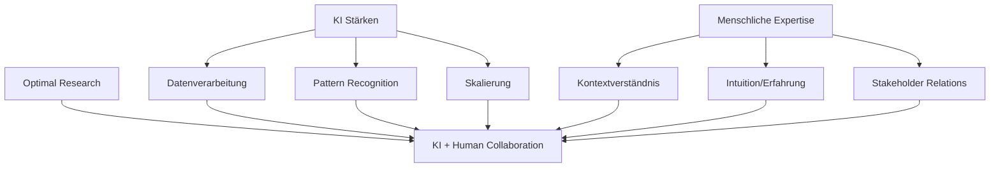

### Unverzichtbare Human Elements

1) **Qualitative Bewertung**
- **Management Assessment**: Vertrauen, Kompetenz, Vision können KI nicht bewerten
- **Strategic Insights**: Disruptive Trends erfordern menschliche Intuition
- **Market Sentiment**: Subtile Markt-Psychology jenseits quantifizierbarer Daten
- **Regulatory Changes**: Policy-Impact-Einschätzung erfordert Erfahrung

2) **Client Relationship Management**  
- **Trust Building**: Persönliche Beziehungen entscheidend für Research-Credibility
- **Custom Insights**: Individuelle Client-Bedürfnisse erfordern menschliche Sensibilität
- **Complex Narratives**: Storytelling für Investment-Thesen
- **Crisis Communication**: Sensitive Situationen brauchen menschlichen Ansatz

3) **Ethical & Compliance Oversight**
- **Bias Detection**: KI-Modelle können versteckte Biases enthalten  
- **Regulatory Compliance**: MAR/MiFID II erfordern menschliches Urteil
- **Conflict Management**: Chinese Walls und Interessenkonflikte
- **Professional Standards**: CFA/CIIA-Standards verlangen menschliche Verantwortung

## Zukunftsausblick und Trends

### Emerging Technologies

1) **Large Language Models (LLMs)**
- **GPT-Integration**: Enhanced NLP für Financial Text Analysis
- **Multimodal AI**: Verarbeitung von Text, Charts, Videos gleichzeitig
- **Reasoning Capabilities**: Logische Schlussfolgerungen aus Datenkombinationen
- **Real-time Learning**: Kontinuierliche Model-Updates ohne Retraining

2) **Advanced Analytics**
- **Quantum Computing**: Komplexe Portfolio-Optimierung und Risk-Modeling
- **Graph Analytics**: Network-Effects in Supply Chains und Market Relationships
- **Time Series Forecasting**: Transformer-Models für Financial Predictions
- **Causal Inference**: ML-Methods für causality vs. correlation

3) **Interactive AI**
- **Conversational Research**: Chat-based Research-Assistant
- **Voice Analytics**: Spoken Earnings Calls → Real-time Sentiment
- **Augmented Reality**: 3D Data Visualization für Complex Models
- **Automated Fact-Checking**: Real-time Validation von Management Statements

### Strategic Implications

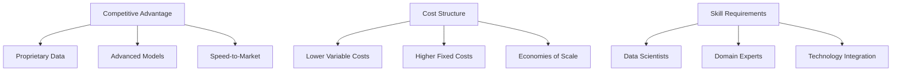

### Deutsche Markt-Spezifika

**Regulatory Environment**
- **GDPR Compliance**: Strenge Datenschutz-Anforderungen für AI-Training Data
- **BaFin Oversight**: Aufsichtliche Guidance für AI in Financial Services
- **EU AI Act**: Kommende Regulierung für High-Risk AI Applications
- **Market Structure**: Mittelstands-fokussierte AI-Lösungen erforderlich

**Competitive Landscape**
- **Technology Adoption**: Deutsche Häuser konservativer bei AI-Integration
- **Quality Standards**: Höhere Compliance-Anforderungen vs. internationale Konkurrenz
- **Language Barriers**: Deutsch-Englisch Bilingual AI-Capabilities erforderlich
- **Local Market Knowledge**: AI muss deutsche Besonderheiten verstehen

## Implementation Roadmap

### Technologie-Entwicklungsphasen

| Phase | Technology Focus | Market Impact |
|-------|------------------|---------------|
| **Nahe Zukunft** | NLP/LLM Integration | Effizienzsteigerungen |
| **Mittelfristig** | Advanced Automation | Coverage-Erweiterung |  
| **Langfristig** | AI-Human Hybrid Optimization | New Business Models |
| **Vision** | Fully Integrated AI Research | Democratized Access |

### Research-Workflow Integration

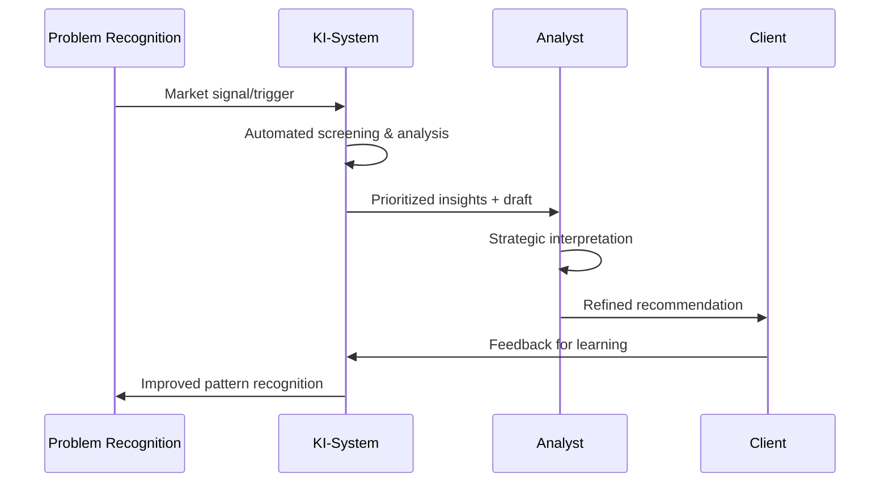

**Hybrid Excellence**: KI übernimmt Routine-Intelligence, Analyst fokussiert auf Strategy, Judgment, Client-Relationships

### KI-Enhanced Research Vorteile

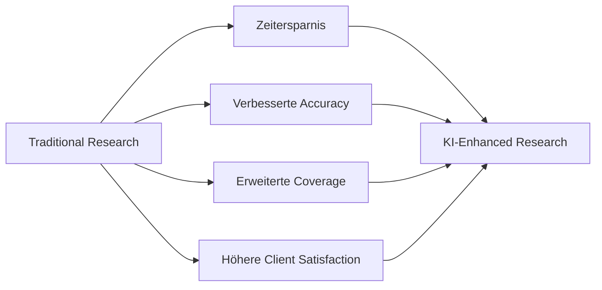

### Konkrete Anwendungsfälle

1) **Data Collection & Processing**
- **Traditionell**: Mehrstündige manuelle Earnings-Call-Analyse
- **Mit KI**: Automatisierte Analyse mit menschlicher Review
- **Qualitätsverbesserung**: Vollständige Abdeckung statt selektive Notizen
- **Skalierung**: Simultane Coverage mehrerer Calls

2) **Model Building & Validation**
- **Automated Data Import**: Direkte Integration Bloomberg/FactSet → Excel/Python
- **Model Templates**: Standardisierte DCF/Comps-Templates mit Auto-Update
- **Scenario Analysis**: Automated Sensitivitäten + Monte Carlo Simulation  
- **Error Checking**: Konsistenz-Checks + Formula-Validation

3) **Research Distribution**
- **Smart Targeting**: KI-basierte Client-Interest-Prediction
- **Timing Optimization**: Beste Versendzeiten für maximale Aufmerksamkeit
- **Follow-up Automation**: Automated Meeting-Requests bei High-Interest-Clients
- **Performance Tracking**: KI-enhanced Impact-Messung

## Navigation

- [← Private Research](06b_Research_Private_Companies.md) | [Research Übersicht](06_Research.md) | [→ Marktakteure](06d_Research_Market_Analysis.md)
- [Corporate Finance](01_Corporate_Finance_MA_Finanzierung.md) | [ECM - IPO](02_ECM_IPO.md) | [DCM](03_DCM_Anleiheemission.md) | [Secondary](04_ECM_Kapitalerhoehung_Secondary.md) | [Sales & Trading](05_Sales_Trading_Designated_Sponsoring.md) | [Research](06_Research.md) | [Risk & Compliance](07_Risk_Compliance.md) | [Operations & IT](08_Operations_IT.md)
- [Templates](templates/) | [README](README.md)

> Umfassende KI-Integration und technologische Innovation im modernen Investment Research