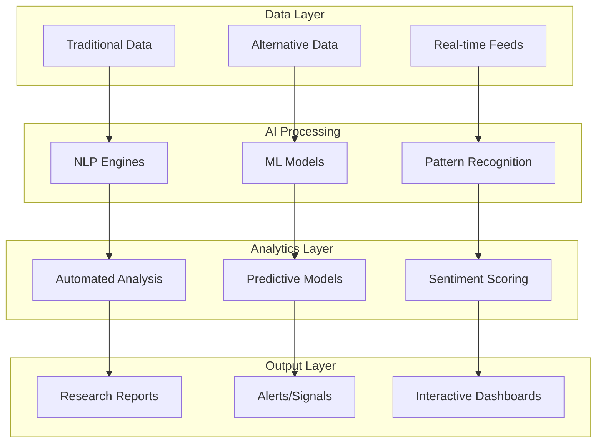
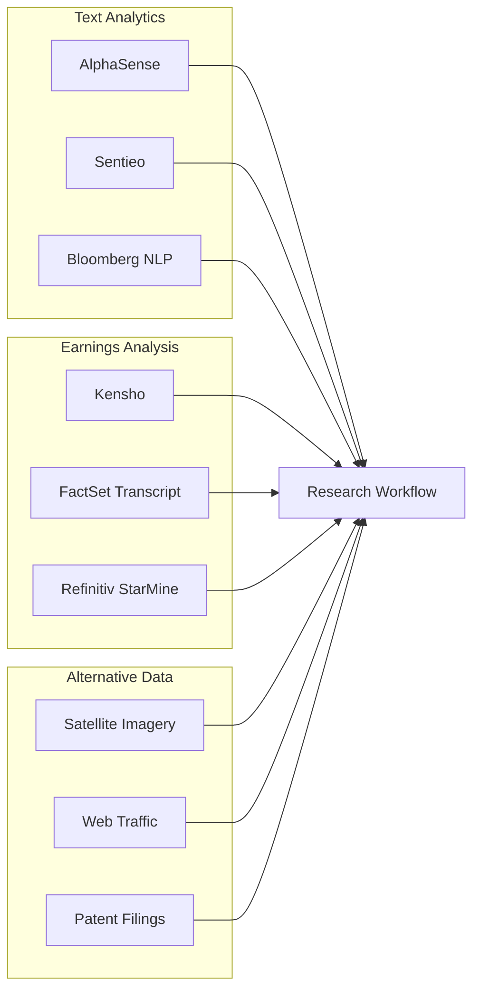
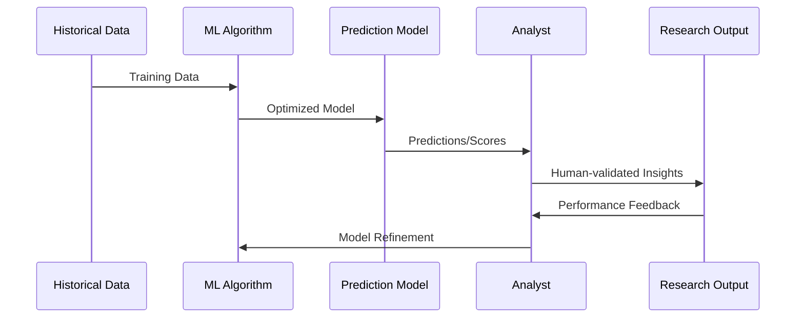
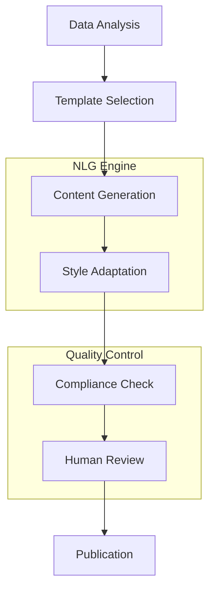
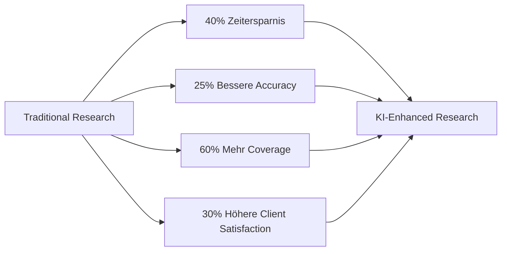
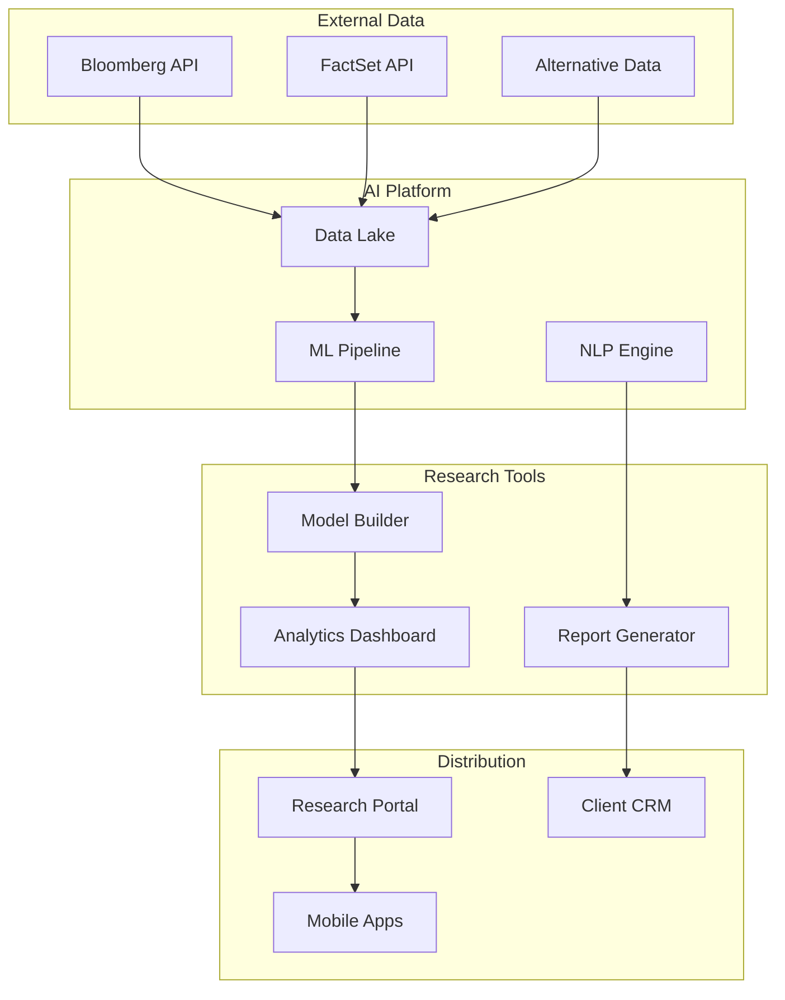
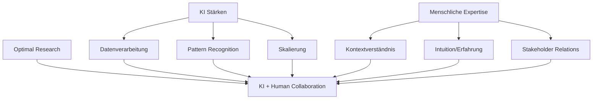
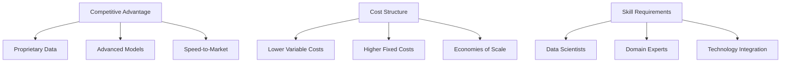

# KI und Technologie im Research

- Zweck: Automatisierung, Effizienzsteigerung und erweiterte Analytik im Research-Prozess.
- Output: Automated insights, erweiterte Datenanalyse, personalisierte Reports.
- Technologien: Machine Learning, NLP, Alternative Data, Predictive Analytics.

## Neue Technologien im Equity Research

Der Einsatz von KI und datengetriebenen Tools revolutioniert moderne Research-Prozesse angesichts exponentiell wachsender Datenmengen.

### Technologie-Stack im Research

## Automatisierte Datenaufbereitung

### NLP-basierte Textanalyse
- **Earnings Call Analysis**: Live-Transkription mit Sentiment-Markierung
- **Document Mining**: Key Information Extraction aus 10-Ks, Prospekten
- **News Processing**: Relevanz-Ranking und Impact-Assessment
- **Social Media Monitoring**: Sentiment-Tracking und Trend-Identification

### Konkrete Tools und Anbieter

### Implementierung und Vorteile

1) **AlphaSense & Sentieo**
- **Funktionalität**: Sekunden-Suche in Millionen Dokumenten
- **NLP-Features**: Synonym-Erkennung, Kontext-Analysis, Trend-Tracking
- **Integration**: Nahtlose Einbindung in Research-Workflows
- **ROI**: 60-80% Zeitersparnis bei Recherche-Aufgaben

2) **Automated Earnings Analysis**  
- **Kensho-Integration**: Historische Event-Impact-Analysen
- **Real-time Processing**: Live-Sentiment während Calls
- **Key Quote Extraction**: Automatische Management-Statement-Highlights
- **Competitive Intelligence**: Cross-Company-Themen-Tracking

## Analytische Modelle und Vorhersagen

### Machine Learning Applications

### Predictive Analytics Anwendungen

1) **Earnings Forecasting**
- **Model Type**: Ensemble Methods (Random Forest + Neural Networks)
- **Input Variables**: Fundamental data, macro indicators, sentiment
- **Output**: EPS/Revenue predictions mit Confidence Intervals
- **Performance**: 25-40% höhere Accuracy vs. traditional methods

2) **Stock Price Movement Prediction**
- **Event-driven Models**: Kensho-style historical pattern analysis
- **Technical Indicators**: ML-enhanced momentum/reversal signals  
- **Sentiment Integration**: Social media + news sentiment scoring
- **Risk Management**: VaR-Models mit ML-enhanced tail-risk estimates

3) **Sector Rotation Models**
- **Macro Integration**: Economic indicators + policy changes
- **Flow Analysis**: Fund flow patterns + institutional positioning
- **Relative Value**: Cross-sector momentum + mean reversion
- **Timing Signals**: Optimal sector allocation recommendations

### Alternative Data Integration

| Datentyp | Anwendung | Beispiel-Insights |
|----------|-----------|-------------------|
| **Satellite Imagery** | Retail/Industrial Activity | Parkplatz-Auslastung → Revenue-Proxy |
| **Web Traffic** | Digital Business Models | Page Views → User Growth |
| **Patent Filings** | Innovation Assessment | R&D Pipeline → Future Growth |
| **Supply Chain Data** | Operating Leverage | Shipping volumes → Demand trends |
| **Social Sentiment** | Brand/Product Reception | Twitter mentions → Sales correlation |

## Report-Erstellung und Personalisierung

### Natural Language Generation (NLG)

### Automated Content Creation

1) **Standardisierte Sections**
- **Company Descriptions**: Auto-generiert aus Filings + Website
- **Financial Summaries**: Template-basiert mit aktuellen Zahlen
- **Peer Comparisons**: Automatische Multiples-Tabellen
- **Risk Factors**: ML-extrahiert aus verschiedenen Dokumenten

2) **Personalisierte Reports**
- **ESG-Focus**: Erweiterte Nachhaltigkeits-Analysen für ESG-Investoren
- **Value-Metrics**: Detailed Bilanz-Analysen für Value-Investoren  
- **Growth-Stories**: Forward-looking statements für Growth-Investoren
- **Technical Analysis**: Chart-Integration für quantitative Clients

3) **Multi-Language Support**
- **Automated Translation**: Research-Reports in mehreren Sprachen
- **Cultural Adaptation**: Regional Investment-Style-Anpassungen
- **Regulatory Compliance**: Lokale Disclaimer-Anpassungen

## Produktivitätsgewinne und Effizienzsteigerung

### Quantified Benefits

### Konkrete Anwendungsfälle

1) **Data Collection & Processing**
- **Vor KI**: 4-6 Stunden für Earnings-Call-Analyse
- **Mit KI**: 30 Minuten + Review-Zeit
- **Qualitätsverbesserung**: Vollständige Abdeckung statt selektive Notizen
- **Skalierung**: Simultane Coverage mehrerer Calls

2) **Model Building & Validation**
- **Automated Data Import**: Direkte Integration Bloomberg/FactSet → Excel/Python
- **Model Templates**: Standardisierte DCF/Comps-Templates mit Auto-Update
- **Scenario Analysis**: Automated Sensitivitäten + Monte Carlo Simulation  
- **Error Checking**: Konsistenz-Checks + Formula-Validation

3) **Research Distribution**
- **Smart Targeting**: KI-basierte Client-Interest-Prediction
- **Timing Optimization**: Beste Versendzeiten für maximale Aufmerksamkeit
- **Follow-up Automation**: Automated Meeting-Requests bei High-Interest-Clients
- **Performance Tracking**: KI-enhanced Impact-Messung

## Technologie-Implementation

### Platform Architecture

### Technology Stack Components

1) **Cloud Infrastructure**
- **AWS/Azure**: Scalable computing für ML-Workloads
- **Databricks**: Collaborative Analytics Platform
- **Snowflake**: Modern Data Warehouse für Research Data
- **Security**: SOC2/GDPR-compliant Data Processing

2) **AI/ML Frameworks**
- **Python Stack**: Pandas, Scikit-learn, TensorFlow
- **R Integration**: Specialized financial modeling packages
- **API Ecosystem**: Bloomberg/FactSet/Alternative Data Integration
- **Version Control**: MLOps mit Model-Lifecycle-Management

3) **Research Applications**
- **Jupyter Notebooks**: Interactive Analysis Environment  
- **Tableau/PowerBI**: Advanced Data Visualization
- **Custom Dashboards**: Client-specific Research Interfaces
- **Mobile Solutions**: Research-on-the-go für Client Meetings

## Grenzen und menschliche Expertise

### KI-Limitationen im Research

### Unverzichtbare Human Elements

1) **Qualitative Bewertung**
- **Management Assessment**: Vertrauen, Kompetenz, Vision können KI nicht bewerten
- **Strategic Insights**: Disruptive Trends erfordern menschliche Intuition
- **Market Sentiment**: Subtile Markt-Psychology jenseits quantifizierbarer Daten
- **Regulatory Changes**: Policy-Impact-Einschätzung erfordert Erfahrung

2) **Client Relationship Management**  
- **Trust Building**: Persönliche Beziehungen entscheidend für Research-Credibility
- **Custom Insights**: Individuelle Client-Bedürfnisse erfordern menschliche Sensibilität
- **Complex Narratives**: Storytelling für Investment-Thesen
- **Crisis Communication**: Sensitive Situationen brauchen menschlichen Ansatz

3) **Ethical & Compliance Oversight**
- **Bias Detection**: KI-Modelle können versteckte Biases enthalten  
- **Regulatory Compliance**: MAR/MiFID II erfordern menschliches Urteil
- **Conflict Management**: Chinese Walls und Interessenkonflikte
- **Professional Standards**: CFA/CIIA-Standards verlangen menschliche Verantwortung

## Zukunftsausblick und Trends

### Emerging Technologies

1) **Large Language Models (LLMs)**
- **GPT-Integration**: Enhanced NLP für Financial Text Analysis
- **Multimodal AI**: Verarbeitung von Text, Charts, Videos gleichzeitig
- **Reasoning Capabilities**: Logische Schlussfolgerungen aus Datenkombinationen
- **Real-time Learning**: Kontinuierliche Model-Updates ohne Retraining

2) **Advanced Analytics**
- **Quantum Computing**: Komplexe Portfolio-Optimierung und Risk-Modeling
- **Graph Analytics**: Network-Effects in Supply Chains und Market Relationships
- **Time Series Forecasting**: Transformer-Models für Financial Predictions
- **Causal Inference**: ML-Methods für causality vs. correlation

3) **Interactive AI**
- **Conversational Research**: Chat-based Research-Assistant
- **Voice Analytics**: Spoken Earnings Calls → Real-time Sentiment
- **Augmented Reality**: 3D Data Visualization für Complex Models
- **Automated Fact-Checking**: Real-time Validation von Management Statements

### Strategic Implications

## Navigation

- [← Private Research](06b_Research_Private_Companies.md) | [Research Übersicht](06_Research.md) | [→ Marktakteure](06d_Research_Market_Analysis.md)
- [Corporate Finance](01_Corporate_Finance_MA_Finanzierung.md) | [ECM - IPO](02_ECM_IPO.md) | [DCM](03_DCM_Anleiheemission.md) | [Secondary](04_ECM_Kapitalerhoehung_Secondary.md) | [Sales & Trading](05_Sales_Trading_Designated_Sponsoring.md) | [Research](06_Research.md) | [Risk & Compliance](07_Risk_Compliance.md) | [Operations & IT](08_Operations_IT.md)
- [Templates](templates/) | [README](README.md)

> Technologie-Integration und KI-Anwendungen im modernen Investment Research