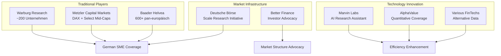
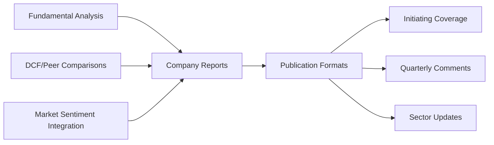
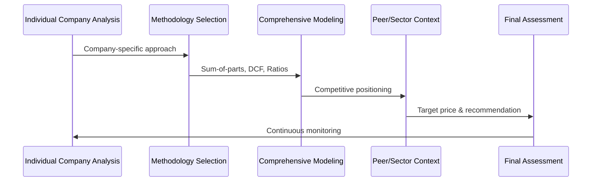
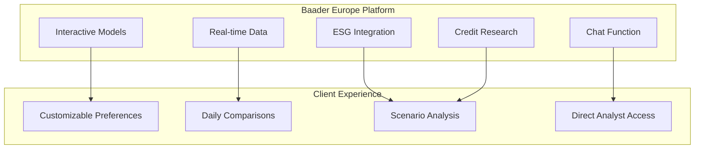
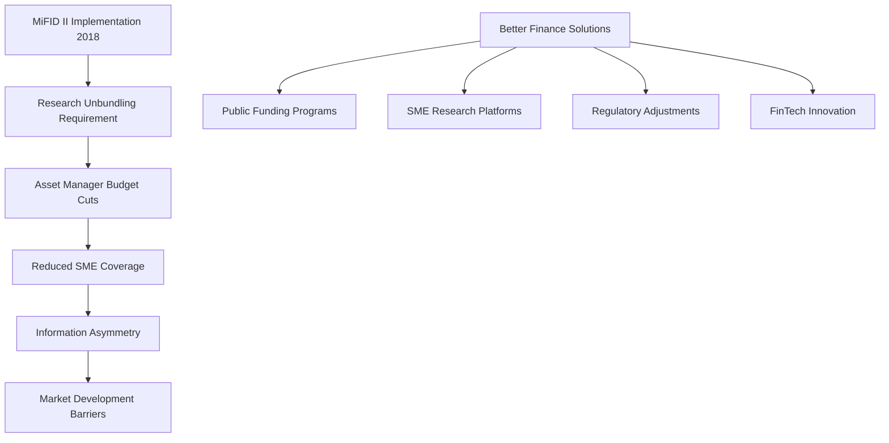
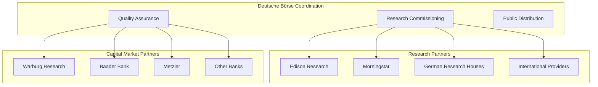
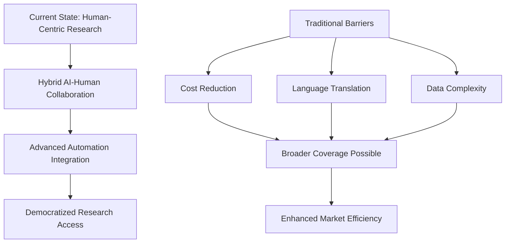

# Deutsche Equity Research Marktakteure

- Zweck: Umfassende Analyse der deutschen Equity Research Landschaft und Marktstrukturen.
- Fokus: Warburg Research, Metzler, Baader Bank, Deutsche Börse, Better Finance.
- Anwendung: Marktverständnis, Competitive Intelligence, Best Practices.

## Deutsche Research-Marktlandschaft Überblick

Die deutsche Equity Research Landschaft wird von spezialisierten Häusern dominiert, die sich auf Small-/Mid-Caps fokussieren und innovative Ansätze zur Bewältigung post-MiFID II Herausforderungen entwickeln.

### Marktstruktur & Wettbewerbslandschaft

## Warburg Research – Breite Coverage-Strategie

### Positionierung & Scope
- **Coverage**: ~200 deutsche Aktien (DAX bis Micro-Caps)
- **Marktposition**: Einer der breitesten deutschen Coverage-Anbieter
- **Zielgruppe**: Institutionelle Investoren, Focus auf Nebenwerte
- **Organisationsform**: Tochter von M.M. Warburg & Co

### Methodische Ansätze

#### Research-Methodik
1) **Bewertungsansätze**
- **DCF-Modelle**: Discounted Cash Flow für langfristige Bewertung
- **Peer-Group-Vergleiche**: Relative Multiples-Analyse
- **Sum-of-the-Parts**: Bei diversifizierten Geschäftsmodellen
- **Market Sentiment Integration**: Kursziel-Anpassungen basierend auf Markttrends

2) **Datenquellen & Tools**
- **FactSet**: Konsolidierte Finanzdaten und Konsensus-Schätzungen
- **Unternehmenskontakte**: Geschäftsberichte, Management-Gespräche
- **Eigene IT-Systeme**: Datenkonsolidierung und Qualitätssicherung
- **Plausibilitätsprüfungen**: Systematische Datenvalidierung

### Kapitalmarktrolle & Unabhängigkeit

**Chinese Wall Implementation**
- Organisatorische Trennung Research/Investment Banking
- Unabhängige Analystenvergütung (nicht transaktionsabhängig)
- Transparente Interessenkonflikt-Offenlegung bei Sponsored Research
- Designated Sponsoring-Aktivitäten klar gekennzeichnet

**Market Impact**
- Zentrale Rolle bei Small-/Mid-Cap Investor Relations
- Research für Scale-Segment der Deutschen Börse
- Issuer-Sponsored Research mit vollständiger Transparenz
- Liquiditätsunterstützung durch Designated Sponsoring

### Coverage-Strategie

| Segment | Anzahl Unternehmen | Research-Typ | Finanzierung |
|---------|-------------------|--------------|--------------| 
| **DAX/MDAX** | ~30 | Standard Coverage | Client-funded |
| **SDAX/Scale** | ~100 | Enhanced Coverage | Mixed |
| **Micro-Caps** | ~70 | Selective Coverage | Issuer-sponsored |

### Technologie-Integration
- **Moderne Datenplattformen**: Integrierte Finanzmodell-Updates
- **Dokumentenverarbeitung**: Effiziente Auswertung großer Textmengen
- **Deutsche Börse Kooperationen**: Digitale Research-Plattform-Beteiligung
- **KI-Beobachtung**: Evaluation neuer Automatisierungstools für Research-Optimierung

## Metzler Bank – Premium Fundamental Analysis

### Fokus & Positionierung
- **Zielmarkt**: DAX Blue-Chips + ausgewählte Mid-/Small-Caps
- **Methodischer Ansatz**: Konsequenter Bottom-up Fundamental-Ansatz
- **Differenzierung**: Individualisierte Bewertungsmethoden je Geschäftsmodell
- **Standortvorteil**: Frankfurt-Präsenz mit lokaler Marktkenntnis

### Analytische Methodik

#### Bewertungsframework
1) **Methodenvielfalt**
- **Sum-of-the-Parts**: Segmentweise Bewertung komplexer Konzerne
- **Break-up Valuation**: Aufbruchswert bei Konglomeraten
- **Sensitivitätsrechnungen**: Multiple Scenario-Analysen
- **Qualitative Bewertung**: Managementqualität, Strategic Moats

2) **Dateninfrastruktur**
- **Proprietäre Datenbanken**: Eigene Entwicklung für Datenkonsolidierung
- **Refinitiv Eikon/Bloomberg**: Standard Market Data Feeds
- **Historische Datenbanken**: Langfristige Peer-Vergleiche
- **Reaktionsgeschwindigkeit**: Schnelle Markt-Update-Zyklen

### Market Position & Awards
- **Auszeichnungen**: Mehrfache Research-Qualitäts-Awards
- **Unabhängigkeit**: Strikte organisatorische Trennung
- **Lokale Expertise**: Deutsche Mittelstands-Spezialkenntnisse
- **International Appeal**: Lokales Know-how für ausländische Investoren

### Small-/Mid-Cap Engagement

**Event-Marketing**
- **Metzler MicroCap Days**: Dedizierte Micro-Cap Investor-Konferenzen
- **Management Presentations**: Direct Company-Investor Access
- **Research Updates**: Post-Event Coverage-Initiation
- **Scale-Segment Participation**: Deutsche Börse SME-Initiative

**Sponsored Research Policy**
- **Transparenz**: Klare "Sponsored Research" Kennzeichnung
- **DVFA Compliance**: Deutscher Verband für Finanzanalyse Standards
- **Factual Review Process**: Unternehmen prüft Fakten, nicht Meinung
- **Editorial Independence**: Analyst behält inhaltliche Verantwortung

### Technology & Innovation Approach
- **Modern Platforms**: Integration von Refinitiv/Bloomberg APIs
- **Automated Updates**: Model-Refreshing bei neuen Unternehmensdaten
- **Digital Distribution**: Login-geschützte Kundenportale
- **DVFA Engagement**: Participation in Digital Research Workshops
- **Conservative Innovation**: Bewährte Fundamental-Methoden + moderne Tools

## Baader Bank – Technologie-Leadership

### Pan-Europäisches Research Network
- **Coverage**: 600+ Unternehmen aus 30 Sektoren (via AlphaValue Partnership)
- **Eigene Abdeckung**: ~150 Unternehmen in D-A-CH Region
- **Team**: 13+ Senior Analysts mit >10 Jahren Erfahrung
- **Rankings**: Top-3 bei Extel Small/Mid Cap Deutschland/Schweiz

### Innovative Research Platform

#### Platform-Features
1) **Interactive Capabilities**
- **Model Customization**: Kunden können Bewertungsparameter anpassen
- **What-if Scenarios**: Real-time Sensitivitäts-Analysen
- **Peer Comparisons**: Tägliche Multi-Company-Benchmarks
- **Personal Configuration**: Individual Research Preferences

2) **Integrated Research Suite**
- **360° Company View**: Equity + ESG + Credit Research kombiniert
- **Real-time Updates**: Tagesaktuelle Bewertungs-Updates
- **Chat Integration**: Direkte Analystenkommunikation
- **Data Visualization**: Interactive Charts und Dashboards

### Research-Ansatz Kombination

**Top-Down Market Analysis**
- **Index Targets**: Gesamtmarkt-Prognosen und Allokationsempfehlungen
- **Macro Integration**: Ökonomische Trends in Sektoranalysen
- **European Perspective**: Grenzüberschreitende Themen-Integration

**Bottom-Up Stock Picking**
- **Individual Company Analysis**: Detaillierte Einzeltitel-Bewertungen
- **Sector Specialization**: Branchen-fokussierte Analyst-Teams
- **Clear Recommendations**: Buy/Sell mit konkreten Kurszielen

### Technology Integration & Partnerships

**AlphaValue Collaboration**
- **Quantitative Models**: Standardisierte Bewertungssysteme
- **Daily Updates**: Algorithmus-basierte Empfehlungs-Updates
- **Systematic Screening**: ML-Enhanced Company Discovery
- **Risk Analytics**: Portfolio-Level Risk Assessment

**Platform Technology Stack**
- **Real-time Data Feeds**: Bloomberg/Refinitiv Integration
- **Cloud Infrastructure**: Scalable Computing Resources
- **Mobile Access**: Research-on-the-go Functionality
- **API Integration**: Third-party Tool Connectivity

### Small-Cap Market Making
- **Designated Sponsoring**: München/Frankfurt Exchange Activities
- **Liquidity Provision**: Active Trading in Nebenwerte
- **IPO Support**: Emissionsbegleitung für Mittelstands-IPOs
- **Exclusive Coverage**: Many German SMEs covered only by Baader

## Better Finance – Investoren-Advocacy Perspektive

### Organisationsprofil & Mission
- **Typ**: Pan-europäische Privatanleger-Interessenvertretung
- **Rolle**: Analytik und Lobby zu Marktstrukturen/Anlegerschutz
- **Focus Area**: Research-Verfügbarkeit für Small Caps
- **Methodology**: Positionspapiere, Studien, Konsultations-Responses

### Research Coverage Crisis Analysis

#### MiFID II Impact Assessment
1) **Coverage Decline Statistics**
- **Pre-MiFID II**: Limited but existing SME analyst coverage
- **Post-2018**: ~15% weitere Reduktion in Small-Cap Reports
- **Information Gap**: Ungleiche Informationslage Private vs. Institutional
- **Market Efficiency**: Reduzierte Price Discovery bei Nebenwerten

2) **Issuer-Sponsored Research Dilemma**
- **Necessity**: Oft einzige verfügbare Analyse für SMEs
- **Conflict Risk**: Konzeptionelle Interessenkonflikte möglich
- **Transparency Requirements**: Prominente Bias-Warnhinweise erforderlich
- **Not Prohibition**: Komplettverbot würde Research-Lücken verstärken

### Solution Framework & Recommendations

**Public Sector Initiatives**
- **EU SME Research Database**: Kostenlose Pan-EU Research-Plattform
- **Deutsche Börse Scale Model**: Börsen-finanzierte Studien als Vorbild
- **Warsaw Exchange Example**: Kostenlose SME-Coverage-Programme
- **Broad Investor Access**: Besonders Privatanleger-fokussiert

**Technology-Driven Solutions**
- **AI Cost Reduction**: "KI könnte Research-Analyse-Großteil unterstützen"
- **Automation Scaling**: Deutlich mehr kleine Unternehmen abdeckbar
- **Human + AI Hybrid**: Ergänzung, nicht Ersatz menschlicher Analysten
- **Regulatory Innovation**: Legislative Anreize für ML-Research-Entwicklung

### Policy Advocacy Focus Areas

| Issue | Better Finance Position | Proposed Solution |
|-------|------------------------|-------------------|
| **SME Research Gap** | Market failure post-MiFID II | Public funding/platforms |
| **Information Asymmetry** | Retail investors disadvantaged | Democratized research access |
| **Issuer-Sponsored Research** | Accept with transparency | Clear conflict disclosure |
| **AI Innovation** | Embrace with safeguards | Regulatory sandboxes |

## Deutsche Börse – Marktinfrastruktur Innovation

### Scale Research Initiative
- **Launch**: 2017 SME-Segment mit integriertem Research-Service
- **Financing Model**: Börse finanziert unabhängige Research-Studien
- **Coverage**: Alle Scale-gelisteten Unternehmen erhalten Research
- **Public Access**: Kostenlose Verfügbarkeit für alle Investoren

### Research Partner Network

#### Service Architecture
1) **Research Commissioning**
- **External Provider Network**: Edison, Morningstar, lokale Häuser
- **Update Frequency**: Zweimal jährlich pro Unternehmen
- **Independence**: Börse als Auftraggeber, nicht Emittent
- **European Uniqueness**: "Research für alle"-Modell selten in Europa

2) **Capital Market Partner Integration**
- **Bank Cooperation**: Warburg, Baader, Metzler als Betreuer
- **Quality Control**: Partner sichern Research-Standards
- **Company Guidance**: Hand-in-Hand Betreuung der Scale-Firmen
- **Market Making**: Liquidity Provision durch Partner-Banken

### Pre-IPO & Private Company Platform

**Venture Network (seit 2015)**
- **Purpose**: Pre-IPO Unternehmen mit Investoren verbinden
- **Not Research**: Keine öffentlichen Studien, aber Informationsvermittlung
- **Data Collection**: KPIs, Wachstumsraten, Funding-Rounds
- **Market Intelligence**: Aggregierte Trend-Reports zu Growth-Segment

**Data & Analytics Expansion**
- **ISS ESG**: ESG-Daten für nachhaltigkeits-orientierte Analysen
- **Qontigo/STOXX**: Index-Analytics und Faktor-Analysen
- **Alternative Data**: Transaktions-, Liquiditäts-, Orderbuch-Analytics
- **Best Execution**: ML-Enhanced Trade Quality Monitoring

## Zukunftsausblick & Trends

### Technology Convergence Trends

### Strategic Implications für Deutsche Akteure

1) **Competitive Positioning**
- **Technology Adoption**: Early AI-Integration als Competitive Advantage
- **Hybrid Models**: Kombinationen aus menschlicher Expertise + KI-Efficiency
- **Specialization**: Focus auf High-Value-Add Human Analysis
- **Scale Economics**: KI ermöglicht Cost-effective Small-Cap Coverage

2) **Market Structure Evolution**
- **Democratization**: Breiterer Research-Zugang durch KI-Cost-Reduction
- **Quality Differentiation**: Premium Human Analysis vs. Automated Commodity
- **New Business Models**: AI-as-a-Service für kleinere Research-Boutiques
- **Regulatory Adaptation**: Compliance-Technology wird Standard-Requirement

### Technologie-Entwicklungstrends

| Phase | Technology Focus | Market Impact |
|-------|------------------|---------------|
| **Nahe Zukunft** | NLP/LLM Integration | Effizienzsteigerungen |
| **Mittelfristig** | Advanced Automation | Coverage-Erweiterung |  
| **Langfristig** | AI-Human Hybrid Optimization | New Business Models |
| **Vision** | Fully Integrated AI Research | Democratized Access |

## Navigation

- [← KI im Research](06c_Research_KI_Technology.md) | [Research Übersicht](06_Research.md)
- [Corporate Finance](01_Corporate_Finance_MA_Finanzierung.md) | [ECM - IPO](02_ECM_IPO.md) | [DCM](03_DCM_Anleiheemission.md) | [Secondary](04_ECM_Kapitalerhoehung_Secondary.md) | [Sales & Trading](05_Sales_Trading_Designated_Sponsoring.md) | [Research](06_Research.md) | [Risk & Compliance](07_Risk_Compliance.md) | [Operations & IT](08_Operations_IT.md)
- [Templates](templates/) | [README](README.md)

> Umfassende Analyse der deutschen Equity Research Marktlandschaft und Marktakteure