# Deutsche Equity Research Marktakteure & KI-Innovationen

- Zweck: Umfassende Analyse der deutschen Equity Research Landschaft und KI-basierter Innovationen.
- Fokus: Warburg Research, Metzler, Baader Bank, Deutsche Börse, Marvin Labs, KI-Entwicklungen.
- Anwendung: Marktverständnis, Competitive Intelligence, Technologie-Trends, Best Practices.

## Deutsche Research-Marktlandschaft Überblick

Die deutsche Equity Research Landschaft wird von spezialisierten Häusern dominiert, die sich auf Small-/Mid-Caps fokussieren und innovative Ansätze zur Bewältigung post-MiFID II Herausforderungen entwickeln.

### Marktstruktur & Wettbewerbslandschaft

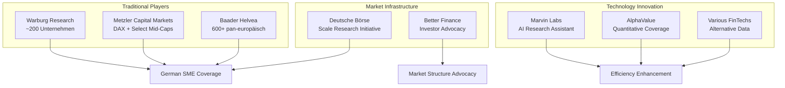

## Warburg Research – Breite Coverage-Strategie

### Positionierung & Scope
- **Coverage**: ~200 deutsche Aktien (DAX bis Micro-Caps)
- **Marktposition**: Einer der breitesten deutschen Coverage-Anbieter
- **Zielgruppe**: Institutionelle Investoren, Focus auf Nebenwerte
- **Organisationsform**: Tochter von M.M. Warburg & Co

### Methodische Ansätze

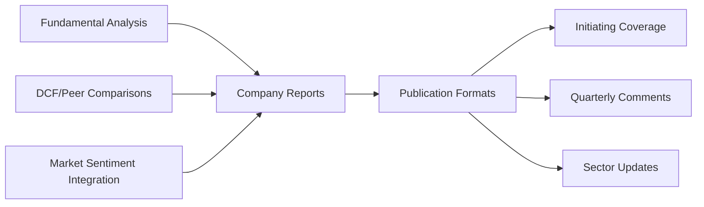

#### Research-Methodik
1) **Bewertungsansätze**
- **DCF-Modelle**: Discounted Cash Flow für langfristige Bewertung
- **Peer-Group-Vergleiche**: Relative Multiples-Analyse
- **Sum-of-the-Parts**: Bei diversifizierten Geschäftsmodellen
- **Market Sentiment Integration**: Kursziel-Anpassungen basierend auf Markttrends

2) **Datenquellen & Tools**
- **FactSet**: Konsolidierte Finanzdaten und Konsensus-Schätzungen
- **Unternehmenskontakte**: Geschäftsberichte, Management-Gespräche
- **Eigene IT-Systeme**: Datenkonsolidierung und Qualitätssicherung
- **Plausibilitätsprüfungen**: Systematische Datenvalidierung

### Kapitalmarktrolle & Unabhängigkeit

**Chinese Wall Implementation**
- Organisatorische Trennung Research/Investment Banking
- Unabhängige Analystenvergütung (nicht transaktionsabhängig)
- Transparente Interessenkonflikt-Offenlegung bei Sponsored Research
- Designated Sponsoring-Aktivitäten klar gekennzeichnet

**Market Impact**
- Zentrale Rolle bei Small-/Mid-Cap Investor Relations
- Research für Scale-Segment der Deutschen Börse
- Issuer-Sponsored Research mit vollständiger Transparenz
- Liquiditätsunterstützung durch Designated Sponsoring

### Coverage-Strategie

| Segment | Anzahl Unternehmen | Research-Typ | Finanzierung |
|---------|-------------------|--------------|--------------|
| **DAX/MDAX** | ~30 | Standard Coverage | Client-funded |
| **SDAX/Scale** | ~100 | Enhanced Coverage | Mixed |
| **Micro-Caps** | ~70 | Selective Coverage | Issuer-sponsored |

### Technologie-Integration
- **Moderne Datenplattformen**: Integrierte Finanzmodell-Updates
- **Dokumentenverarbeitung**: Effiziente Auswertung großer Textmengen
- **Deutsche Börse Kooperationen**: Digitale Research-Plattform-Beteiligung
- **KI-Beobachtung**: Evaluation neuer Automatisierungstools für Research-Optimierung

## Metzler Bank – Premium Fundamental Analysis

### Fokus & Positionierung
- **Zielmarkt**: DAX Blue-Chips + ausgewählte Mid-/Small-Caps
- **Methodischer Ansatz**: Konsequenter Bottom-up Fundamental-Ansatz
- **Differenzierung**: Individualisierte Bewertungsmethoden je Geschäftsmodell
- **Standortvorteil**: Frankfurt-Präsenz mit lokaler Marktkenntnis

### Analytische Methodik

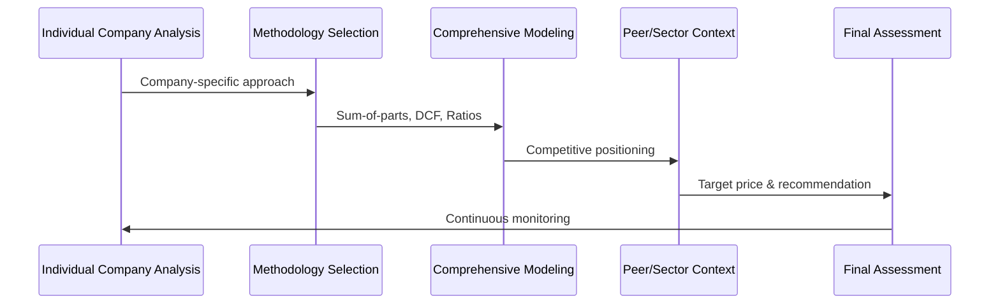

#### Bewertungsframework
1) **Methodenvielfalt**
- **Sum-of-the-Parts**: Segmentweise Bewertung komplexer Konzerne
- **Break-up Valuation**: Aufbruchswert bei Konglomeraten
- **Sensitivitätsrechnungen**: Multiple Scenario-Analysen
- **Qualitative Bewertung**: Managementqualität, Strategic Moats

2) **Dateninfrastruktur**
- **Proprietäre Datenbanken**: Eigene Entwicklung für Datenkonsolidierung
- **Refinitiv Eikon/Bloomberg**: Standard Market Data Feeds
- **Historische Datenbanken**: Langfristige Peer-Vergleiche
- **Reaktionsgeschwindigkeit**: Schnelle Markt-Update-Zyklen

### Market Position & Awards
- **Auszeichnungen**: Mehrfache Research-Qualitäts-Awards
- **Unabhängigkeit**: Strikte organisatorische Trennung
- **Lokale Expertise**: Deutsche Mittelstands-Spezialkenntnisse
- **International Appeal**: Lokales Know-how für ausländische Investoren

### Small-/Mid-Cap Engagement

**Event-Marketing**
- **Metzler MicroCap Days**: Dedizierte Micro-Cap Investor-Konferenzen
- **Management Presentations**: Direct Company-Investor Access
- **Research Updates**: Post-Event Coverage-Initiation
- **Scale-Segment Participation**: Deutsche Börse SME-Initiative

**Sponsored Research Policy**
- **Transparenz**: Klare "Sponsored Research" Kennzeichnung
- **DVFA Compliance**: Deutscher Verband für Finanzanalyse Standards
- **Factual Review Process**: Unternehmen prüft Fakten, nicht Meinung
- **Editorial Independence**: Analyst behält inhaltliche Verantwortung

### Technology & Innovation Approach
- **Modern Platforms**: Integration von Refinitiv/Bloomberg APIs
- **Automated Updates**: Model-Refreshing bei neuen Unternehmensdaten
- **Digital Distribution**: Login-geschützte Kundenportale
- **DVFA Engagement**: Participation in Digital Research Workshops
- **Conservative Innovation**: Bewährte Fundamental-Methoden + moderne Tools

## Baader Bank – Technologie-Leadership

### Pan-Europäisches Research Network
- **Coverage**: 600+ Unternehmen aus 30 Sektoren (via AlphaValue Partnership)
- **Eigene Abdeckung**: ~150 Unternehmen in D-A-CH Region
- **Team**: 13+ Senior Analysts mit >10 Jahren Erfahrung
- **Rankings**: Top-3 bei Extel Small/Mid Cap Deutschland/Schweiz

### Innovative Research Platform

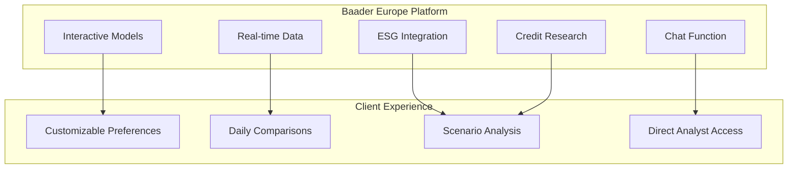

#### Platform-Features
1) **Interactive Capabilities**
- **Model Customization**: Kunden können Bewertungsparameter anpassen
- **What-if Scenarios**: Real-time Sensitivitäts-Analysen
- **Peer Comparisons**: Tägliche Multi-Company-Benchmarks
- **Personal Configuration**: Individual Research Preferences

2) **Integrated Research Suite**
- **360° Company View**: Equity + ESG + Credit Research kombiniert
- **Real-time Updates**: Tagesaktuelle Bewertungs-Updates
- **Chat Integration**: Direkte Analystenkommunikation
- **Data Visualization**: Interactive Charts und Dashboards

### Research-Ansatz Kombination

**Top-Down Market Analysis**
- **Index Targets**: Gesamtmarkt-Prognosen und Allokationsempfehlungen
- **Macro Integration**: Ökonomische Trends in Sektoranalysen
- **European Perspective**: Grenzüberschreitende Themen-Integration

**Bottom-Up Stock Picking**
- **Individual Company Analysis**: Detaillierte Einzeltitel-Bewertungen
- **Sector Specialization**: Branchen-fokussierte Analyst-Teams
- **Clear Recommendations**: Buy/Sell mit konkreten Kurszielen

### Technology Integration & Partnerships

**AlphaValue Collaboration**
- **Quantitative Models**: Standardisierte Bewertungssysteme
- **Daily Updates**: Algorithmus-basierte Empfehlungs-Updates
- **Systematic Screening**: ML-Enhanced Company Discovery
- **Risk Analytics**: Portfolio-Level Risk Assessment

**Platform Technology Stack**
- **Real-time Data Feeds**: Bloomberg/Refinitiv Integration
- **Cloud Infrastructure**: Scalable Computing Resources
- **Mobile Access**: Research-on-the-go Functionality
- **API Integration**: Third-party Tool Connectivity

### Small-Cap Market Making
- **Designated Sponsoring**: München/Frankfurt Exchange Activities
- **Liquidity Provision**: Active Trading in Nebenwerte
- **IPO Support**: Emissionsbegleitung für Mittelstands-IPOs
- **Exclusive Coverage**: Many German SMEs covered only by Baader

## Better Finance – Investoren-Advocacy Perspektive

### Organisationsprofil & Mission
- **Typ**: Pan-europäische Privatanleger-Interessenvertretung
- **Rolle**: Analytik und Lobby zu Marktstrukturen/Anlegerschutz
- **Focus Area**: Research-Verfügbarkeit für Small Caps
- **Methodology**: Positionspapiere, Studien, Konsultations-Responses

### Research Coverage Crisis Analysis

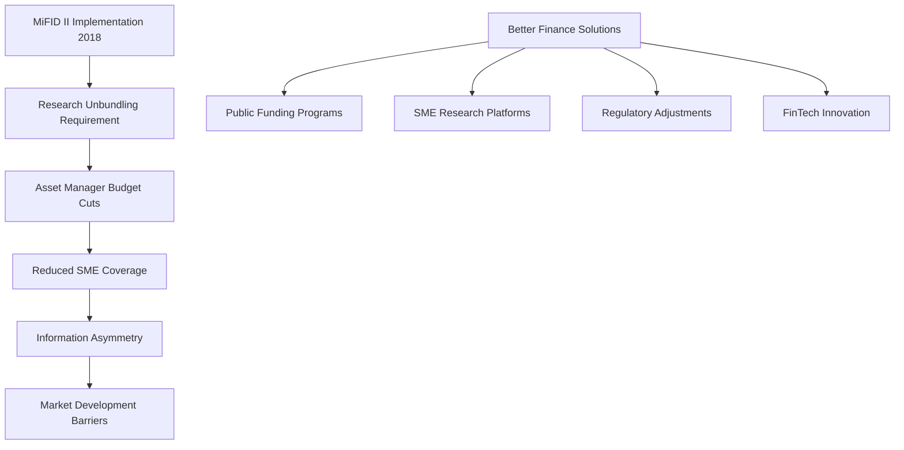

#### MiFID II Impact Assessment
1) **Coverage Decline Statistics**
- **Pre-MiFID II**: Limited but existing SME analyst coverage
- **Post-2018**: ~15% weitere Reduktion in Small-Cap Reports
- **Information Gap**: Ungleiche Informationslage Private vs. Institutional
- **Market Efficiency**: Reduzierte Price Discovery bei Nebenwerten

2) **Issuer-Sponsored Research Dilemma**
- **Necessity**: Oft einzige verfügbare Analyse für SMEs
- **Conflict Risk**: Konzeptionelle Interessenkonflikte möglich
- **Transparency Requirements**: Prominente Bias-Warnhinweise erforderlich
- **Not Prohibition**: Komplettverbot würde Research-Lücken verstärken

### Solution Framework & Recommendations

**Public Sector Initiatives**
- **EU SME Research Database**: Kostenlose Pan-EU Research-Plattform
- **Deutsche Börse Scale Model**: Börsen-finanzierte Studien als Vorbild
- **Warsaw Exchange Example**: Kostenlose SME-Coverage-Programme
- **Broad Investor Access**: Besonders Privatanleger-fokussiert

**Technology-Driven Solutions**
- **AI Cost Reduction**: "KI könnte Research-Analyse-Großteil unterstützen"
- **Automation Scaling**: Deutlich mehr kleine Unternehmen abdeckbar
- **Human + AI Hybrid**: Ergänzung, nicht Ersatz menschlicher Analysten
- **Regulatory Innovation**: Legislative Anreize für ML-Research-Entwicklung

### Policy Advocacy Focus Areas

| Issue | Better Finance Position | Proposed Solution |
|-------|------------------------|-------------------|
| **SME Research Gap** | Market failure post-MiFID II | Public funding/platforms |
| **Information Asymmetry** | Retail investors disadvantaged | Democratized research access |
| **Issuer-Sponsored Research** | Accept with transparency | Clear conflict disclosure |
| **AI Innovation** | Embrace with safeguards | Regulatory sandboxes |

## Marvin Labs – KI Research Revolution

### Technology Platform Overview
- **Founded**: 2023, London-based FinTech
- **Product**: AI-powered Investment Analysis Copilot
- **Target**: Buy-Side und Sell-Side Research Efficiency
- **Technology**: Advanced NLP, Large Language Models (LLMs)

### Core AI Capabilities

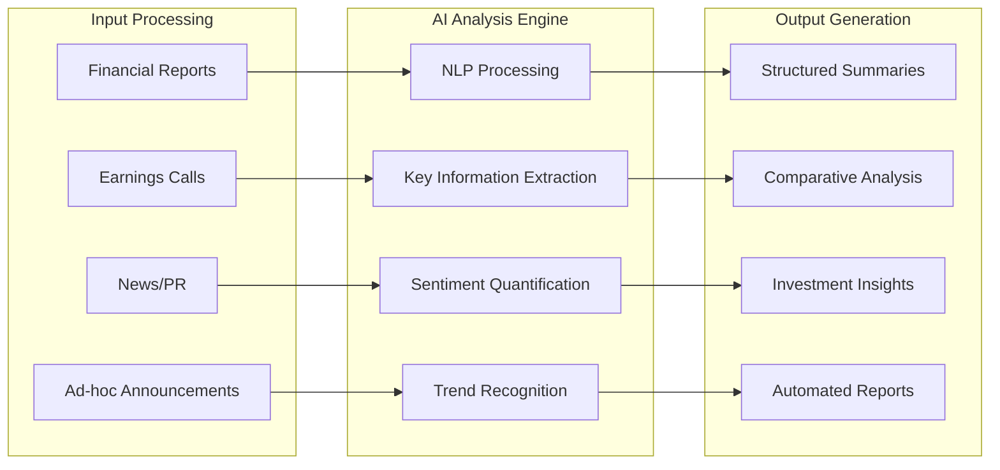

#### Advanced Features Portfolio

1) **Knowledge-Aware Summaries**
- **Context Integration**: Bestehendes Analyst-Expertise einbeziehen
- **Non-Generic Outputs**: Spezifische, relevante Erkenntnisse
- **Historical Context**: Trends über Zeit-Dimensionen hinweg
- **Comparative Elements**: Automatic Peer Benchmarking

2) **Guidance Tracking & Document Highlights**
- **Management Guidance**: Automatisches Forward-Looking Statement Tracking
- **Document Change Detection**: Kritische Änderungen vs. Previous Reports
- **Sentiment Scoring**: Numerische Stimmungsquantifizierung für Zeitreihen
- **Real-time Processing**: 10-Minuten Earnings Review Generation

3) **Interactive Chat Interface**
- **Natural Language Queries**: "Wie entwickelte sich Bruttomarge und warum?"
- **Source Attribution**: Direkter Verweis auf Original-Dokumente
- **Contextual Understanding**: KI versteht Finanz-Fachsprache
- **Validation Features**: Überprüfbare, nicht halluzinierte Antworten

### Efficiency & Cost Benefits

**Quantified Impact Metrics**
- **Earnings Season**: ~25% Kostenreduktion Junior Analysts, ~10% Senior
- **Overall Research Costs**: ~20% Reduktion bei höherer Qualität
- **Time Savings**: 5 Minuten für 5 Finanzberichte vs. Stunden manuell
- **Coverage Expansion**: Mehr Small Caps mit gleichem Ressourceneinsatz

**Workflow Integration**
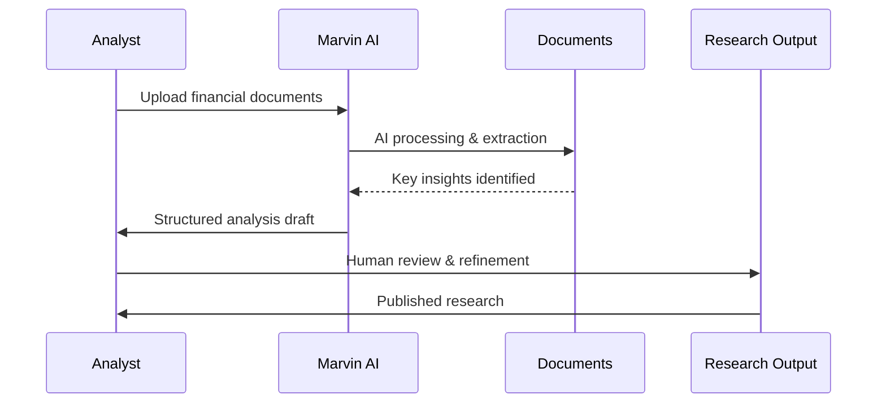

### Technology Validation & Quality Control

**AI Accuracy Framework**
- **Source Verification**: Alle Aussagen mit Primärquellen verknüpft
- **Comparative Analysis**: Querverweise zwischen Report-Generationen
- **No Hallucination**: Trained für überprüfbare, faktische Statements
- **Continuous Learning**: User Feedback Integration für Model Improvement

**German Market Application**
- **Language Processing**: Multi-language Support (DE/EN)
- **Bundesanzeiger Integration**: Potential für Private Company Analysis
- **Family Office Use Cases**: Cost-effective Private Equity Research
- **Barrier Reduction**: Sprachbarrieren bei internationalen Reports

## Deutsche Börse – Marktinfrastruktur Innovation

### Scale Research Initiative
- **Launch**: 2017 SME-Segment mit integriertem Research-Service
- **Financing Model**: Börse finanziert unabhängige Research-Studien
- **Coverage**: Alle Scale-gelisteten Unternehmen erhalten Research
- **Public Access**: Kostenlose Verfügbarkeit für alle Investoren

### Research Partner Network

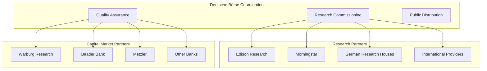

#### Service Architecture
1) **Research Commissioning**
- **External Provider Network**: Edison, Morningstar, lokale Häuser
- **Update Frequency**: Zweimal jährlich pro Unternehmen
- **Independence**: Börse als Auftraggeber, nicht Emittent
- **European Uniqueness**: "Research für alle"-Modell selten in Europa

2) **Capital Market Partner Integration**
- **Bank Cooperation**: Warburg, Baader, Metzler als Betreuer
- **Quality Control**: Partner sichern Research-Standards
- **Company Guidance**: Hand-in-Hand Betreuung der Scale-Firmen
- **Market Making**: Liquidity Provision durch Partner-Banken

### Pre-IPO & Private Company Platform

**Venture Network (seit 2015)**
- **Purpose**: Pre-IPO Unternehmen mit Investoren verbinden
- **Not Research**: Keine öffentlichen Studien, aber Informationsvermittlung
- **Data Collection**: KPIs, Wachstumsraten, Funding-Rounds
- **Market Intelligence**: Aggregierte Trend-Reports zu Growth-Segment

**Data & Analytics Expansion**
- **ISS ESG**: ESG-Daten für nachhaltigkeits-orientierte Analysen
- **Qontigo/STOXX**: Index-Analytics und Faktor-Analysen
- **Alternative Data**: Transaktions-, Liquiditäts-, Orderbuch-Analytics
- **Best Execution**: ML-Enhanced Trade Quality Monitoring

## KI-Entwicklungen im Equity Research

Die Equity Research-Branche durchläuft eine fundamentale technologische Transformation durch Künstliche Intelligenz, die besonders bei Private Companies und Small Caps neue Möglichkeiten eröffnet.

### KI-Enhanced Research: Problemlösung im Workflow

Das traditionelle Research steht vor strukturellen Herausforderungen, die KI gezielt addressiert - von der Coverage-Lücke bis zur Effizienz-Krise.

#### Problem-Solution Framework

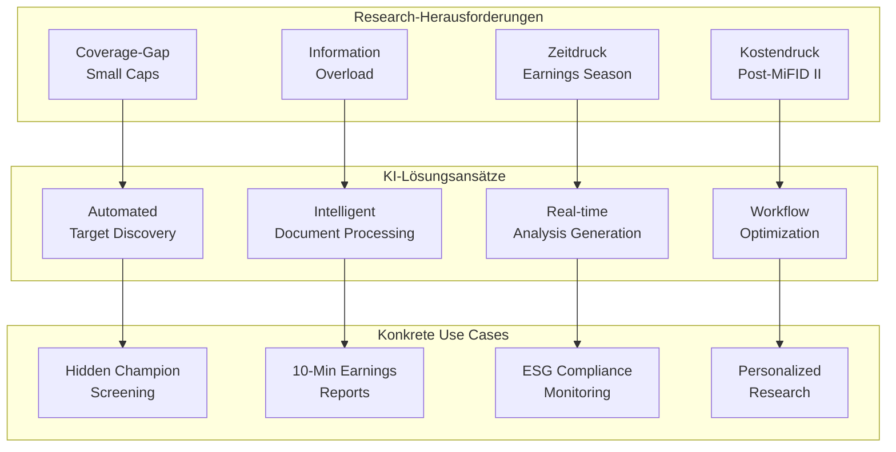

#### 1. Coverage-Gap Problem → Automated Target Discovery

**Das Problem**: Post-MiFID II ~15% Rückgang Small-Cap Coverage, Informationsasymmetrie bei deutschen Mittelständlern

**KI-Lösung**: Intelligent Screening & Discovery
- **"Hidden Champion" Detection**: ML-Patterns erkennen erfolgreiche Nischen-Player
- **Alternative Data Mining**: Web-Traffic, Hiring-Trends, Patent-Aktivität für Private Companies
- **Real-time Market Surveillance**: Kontinuierliche Opportunity-Discovery
- **Success Pattern Learning**: Automatische Filter-Optimierung basierend auf Deal-History

**Konkreter Use Case: Maschinenbau-Screening**
```
Input: "Alle Bayern-Unternehmen, Maschinenbau, €50-250M Umsatz"
KI-Enhancement: + Patent-Aktivität + Export-Wachstum + Mitarbeiter-LinkedIn-Trends
Output: 15 "Hidden Champions" mit Investment-Readiness-Score
Zeit: 15 Minuten statt 2 Wochen manuell
```

#### 2. Information Overload → Intelligent Document Processing

**Das Problem**: Analysten ertrinken in Dokumenten - Geschäftsberichte, News, Calls, Ad-hoc Meldungen

**KI-Lösung**: NLP-Enhanced Information Extraction
- **Document Summarization**: Kernaussagen aus 100-seitigen Reports in 2 Minuten
- **Change Detection**: "Was ist neu vs. Vorquartal?" automatisch identifiziert
- **Sentiment Tracking**: Management-Ton quantifiziert über Zeit-Horizonte
- **Key Metrics Extraction**: Automatische KPI-Tabellen aus unstrukturierten Texten

**Konkreter Use Case: Quarterly Earnings Analysis**
```
Traditionell: 4-6 Stunden Analyst-Zeit für Call-Transcript + Report
Mit KI: 10 Minuten für vollständigen Earnings-Review
Qualität: Alle relevanten Punkte, keine Oversight, Quellenverweise
Skalierung: 50 Companies statt 10 parallel bearbeitbar
```

#### 3. Zeitdruck Earnings Season → Real-time Analysis Generation

**Das Problem**: Earnings Season = 6 Wochen Chaos, 200+ Companies reporten gleichzeitig

**KI-Lösung**: Automated Report Generation & Real-time Processing
- **Live Earnings Analysis**: Während Conference Call bereits Highlights generieren
- **Instant Peer Comparison**: Sofortige Einordnung vs. Sector/Competitors
- **Automated First Drafts**: 3500-Wort Reports in 5 Minuten (OpenAI Beispiel)
- **Multi-language Output**: Deutsch/Englisch parallel für internationale Kunden

**Konkreter Use Case: DAX Earnings Coverage**
```
Challenge: 40 DAX Unternehmen berichten in 3 Wochen
KI-Solution: Parallel Processing aller Calls + Reports
Output: Same-day Commentary für alle 40 Companies
Analyst Role: Strategy/Interpretation statt Data-Gathering
```

#### 4. Kostendruck → Workflow-Automatisierung

**Das Problem**: Research-Teams 20% kleiner seit MiFID II, gleicher Coverage-Anspruch

**KI-Lösung**: End-to-End Workflow Enhancement
- **Research Pipeline**: Von Target-ID bis Report-Distribution automatisiert
- **Quality Assurance**: Automated Fact-Checking und Consistency-Validation
- **Client Personalization**: Individual Research-Feeds based auf Portfolio
- **Performance Analytics**: ML-Enhanced Research-Impact-Messung

**ROI-Metriken aus der Praxis**:
- **Marvin Labs**: 25% Kostenreduktion Junior Analysts, 20% Overall Research Costs
- **Coverage Expansion**: +50% mehr Unternehmen bei gleicher Team-Größe  
- **Time-to-Market**: Reports 80% schneller bei höherer Consistency
- **Client Satisfaction**: Personalized Content → +40% Engagement Rates

#### Research-Workflow Integration

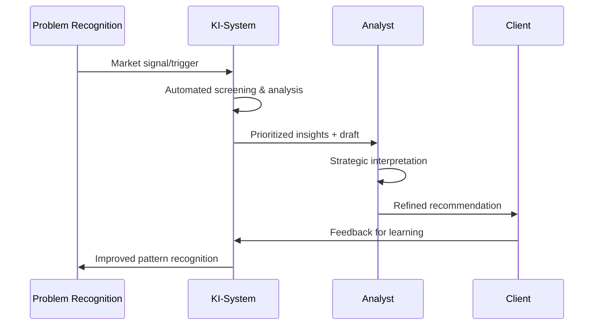

**Hybrid Excellence**: KI übernimmt Routine-Intelligence, Analyst fokussiert auf Strategy, Judgment, Client-Relationships

### Natural Language Processing & Large Language Models

#### Unstructured Data Revolution

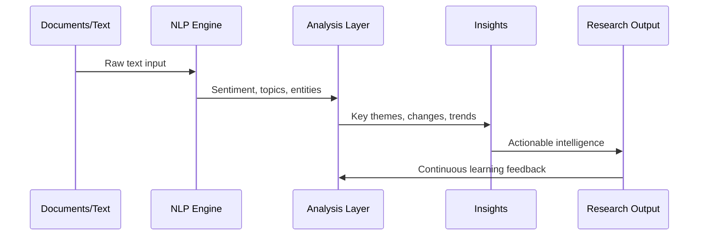

1) **Advanced Text Analysis**
- **Sentiment Quantification**: Management-Aussagen emotional scoring
- **Topic Modeling**: Hauptthemen aus Earnings Calls extrahieren
- **Entity Recognition**: Automatische Firmen/Personen/Produkt-Identifikation
- **Change Detection**: Tonality-Shifts über Zeit-Horizonte

2) **LLM-Powered Research Assistants**
- **JPMorgan LLM Suite**: Interne "virtueller Research Analyst"
- **Fintool**: SEC-Filing und Earnings Call Durchsuchung
- **Natural Language Queries**: "Hat Management zur Margenentwicklung etwas gesagt?"
- **Mobile Integration**: Real-time KI-Consultation während Investor-Meetings

#### Practical Implementation Benefits

**Research Workflow Enhancement**
- **Information Synthesis**: Hunderte Dokumente in Minuten zusammenfassen  
- **Competitive Intelligence**: Automatic Peer-Monitoring und Benchmarking
- **Due Diligence Acceleration**: ML-Enhanced Document Review
- **Language Barriers**: Multi-language Report Generation und Translation

**Personalization & Client Service**
- **Custom Report Generation**: Individual Client Interest Integration
- **Portfolio-Specific Analysis**: Holdings-based Research Prioritization
- **Communication Optimization**: Audience-appropriate Content Adaptation
- **Update Prioritization**: ML-basierte Client-Interest-Prognose

### Graph Analytics & Alternative Data Integration

#### Network Analysis Applications

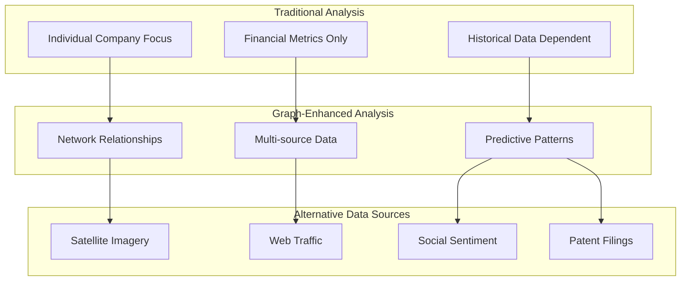

1) **Relationship Mapping**
- **Supply Chain Analysis**: Automated Vendor/Customer Network Discovery  
- **Investment Networks**: PE/VC Connection Pattern Recognition
- **Management Connectivity**: Board/Executive Cross-Company Analysis
- **Strategic Partnership Detection**: Joint Venture und Alliance Patterns

2) **Risk Propagation Modeling** 
- **Contagion Analysis**: Supply Chain Disruption Impact Simulation
- **Systemic Risk**: Network-based Portfolio Risk Assessment
- **Hidden Correlations**: Non-obvious Company Interdependencies
- **Fraud Detection**: Suspicious Entity Relationship Patterns

#### Alternative Data Applications

**Real-time Business Intelligence**
- **E-commerce Scraping**: Price/Sales Data für Retail-Prognosen
- **Satellite Analytics**: Mining-Output oder Retail-Traffic Estimation
- **Social Media Mining**: Brand-Sentiment und Product-Popularity Tracking
- **Geo-location Data**: Store-Visit Patterns und Regional-Performance

**Private Company Insights**
- **Web-Traffic Analysis**: Business Performance Proxies
- **Hiring Pattern Recognition**: Growth-Signale durch Job-Posting-Trends
- **Patent Activity Monitoring**: Innovation-Pipeline Assessment
- **Supplier Payment Behavior**: Working Capital und Credit-Quality Indicators

### Regulatory AI Applications

#### MiFID II Compliance Enhancement

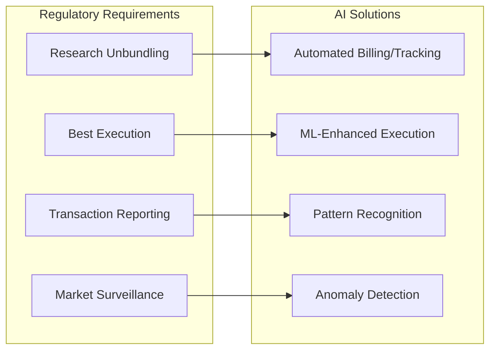

1) **Best Execution Optimization**
- **TORA Pre-Trade Analytics**: ML-basierte Slippage-Prognose
- **Historical Pattern Analysis**: Broker-Performance Machine Learning
- **Real-time Optimization**: Dynamic Execution-Venue Selection
- **Post-Trade Surveillance**: Automated Best-Ex Compliance Monitoring

2) **Research Distribution Management**  
- **Usage Tracking**: AI-Enhanced Research-Consumption Analytics
- **Pricing Optimization**: ML-basierte Research-Value Quantifikation
- **Client Segmentation**: Predictive Analytics für Research-Interest
- **Quality Assessment**: Automated Research-Report Scoring

#### Market Surveillance & Compliance

**Trade Monitoring Enhancement**
- **Market Manipulation Detection**: AI-Enhanced Layering/Spoofing Recognition
- **Systematic Risk Assessment**: Network-Analysis für Systemic Risk
- **Regulatory Reporting**: Automated Transaction Reporting Systems
- **Compliance Documentation**: NLP-Enhanced Regulatory Filing Review

### KI-Enhanced Sales & Distribution

#### Personalization Revolution

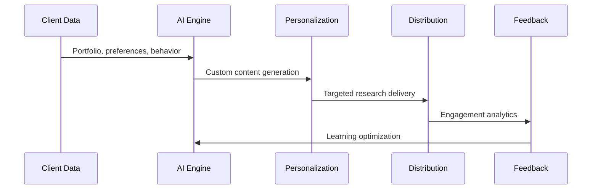

1) **Intelligent Content Customization**
- **Portfolio-Based Research**: Holdings-specific Analysis Generation
- **Interest Prediction**: ML-Enhanced Research-Relevance Scoring
- **Communication Timing**: Optimal Send-Time Prediction
- **Format Optimization**: Client-Preference-based Content Adaptation

2) **Sales Process Automation**
- **Lead Scoring**: ML-Enhanced Prospect Identification
- **Cross-selling Intelligence**: Predictive Analytics für Product-Fit
- **Meeting Optimization**: AI-Generated Meeting Summaries/Follow-ups
- **Relationship Mapping**: Network-Analysis für Business Development

#### Market Expansion Applications

**Language & Cultural Barriers**
- **Automated Translation**: High-quality Multi-language Research Generation
- **Cultural Adaptation**: Regional Investment-Style Content Adjustment
- **Accessibility Enhancement**: Complex Content Simplification für Retail
- **Global Distribution**: Scalable International Research Deployment

**Efficiency & Cost Management**
- **Resource Optimization**: AI-Enhanced Analyst-Time Allocation
- **Quality Assurance**: Automated Research-Consistency Checking
- **Client Satisfaction**: Predictive Analytics für Service-Quality
- **ROI Optimization**: ML-Enhanced Research-Investment Decisions

## Zukunftsausblick & Trends

### Technology Convergence Trends

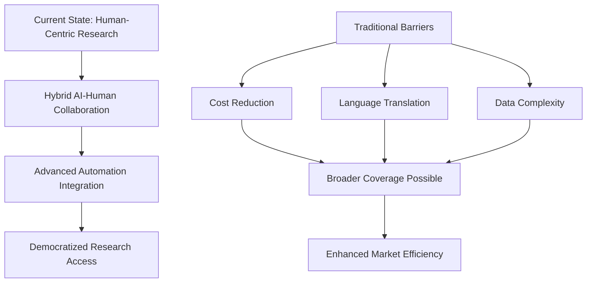

### Strategic Implications für Deutsche Akteure

1) **Competitive Positioning**
- **Technology Adoption**: Early AI-Integration als Competitive Advantage
- **Hybrid Models**: Kombinationen aus menschlicher Expertise + KI-Efficiency
- **Specialization**: Focus auf High-Value-Add Human Analysis
- **Scale Economics**: KI ermöglicht Cost-effective Small-Cap Coverage

2) **Market Structure Evolution**
- **Democratization**: Breiterer Research-Zugang durch KI-Cost-Reduction
- **Quality Differentiation**: Premium Human Analysis vs. Automated Commodity
- **New Business Models**: AI-as-a-Service für kleinere Research-Boutiques
- **Regulatory Adaptation**: Compliance-Technology wird Standard-Requirement

### Implementation Roadmap

| Zeitrahmen | Technology Focus | Market Impact |
|------------|------------------|---------------|
| **2024-2025** | NLP/LLM Integration | Efficiency Gains 20-40% |
| **2025-2026** | Advanced Automation | Coverage Expansion 50%+ |  
| **2026-2027** | AI-Human Hybrid Optimization | New Business Models |
| **2027+** | Fully Integrated AI Research | Democratized Access |

## Navigation

- [← KI im Research](06c_Research_KI_Technology.md) | [Research Übersicht](06_Research.md) 
- [Corporate Finance](01_Corporate_Finance_MA_Finanzierung.md) | [ECM - IPO](02_ECM_IPO.md) | [DCM](03_DCM_Anleiheemission.md) | [Secondary](04_ECM_Kapitalerhoehung_Secondary.md) | [Sales & Trading](05_Sales_Trading_Designated_Sponsoring.md) | [Research](06_Research.md) | [Risk & Compliance](07_Risk_Compliance.md) | [Operations & IT](08_Operations_IT.md)
- [Templates](templates/) | [README](README.md)

> Umfassende Analyse der deutschen Equity Research Marktlandschaft und KI-basierten Innovationen