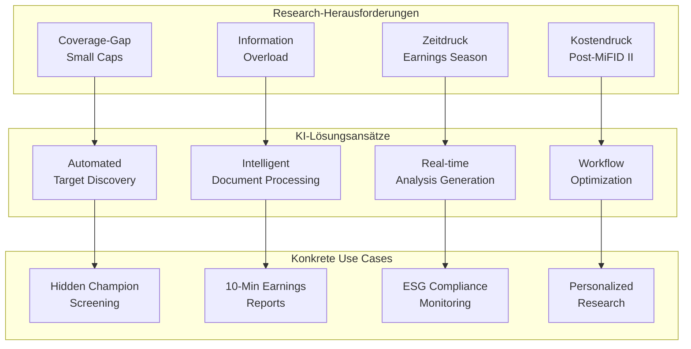
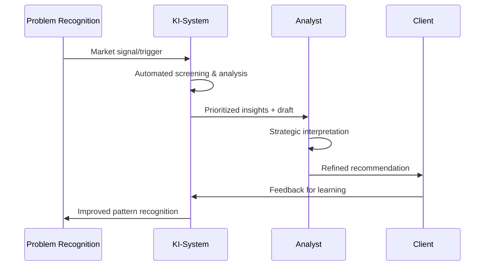
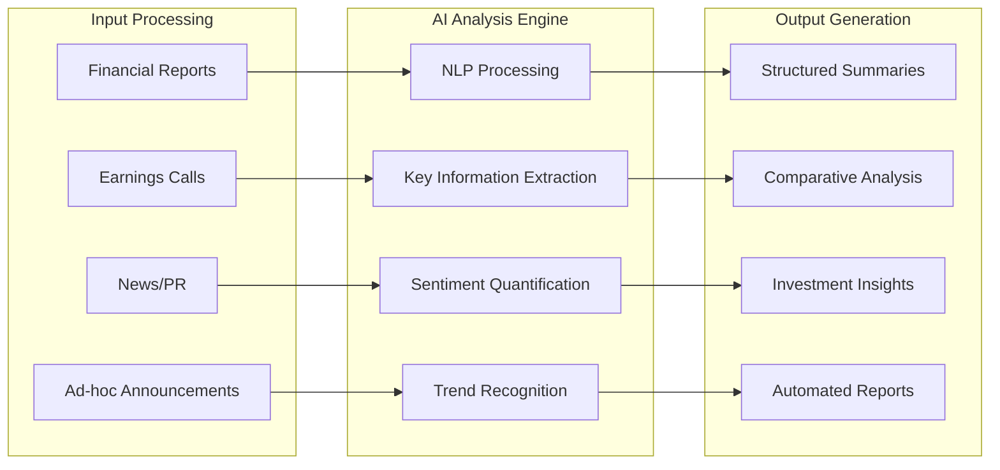
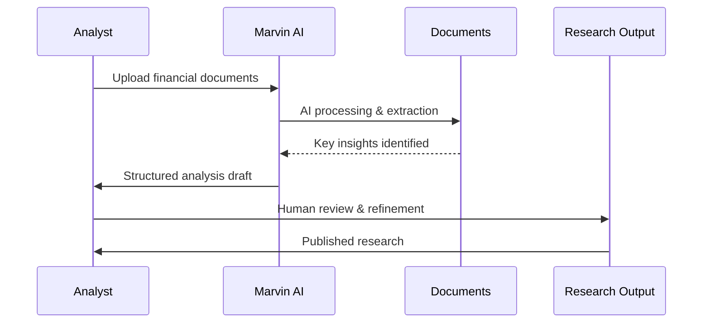
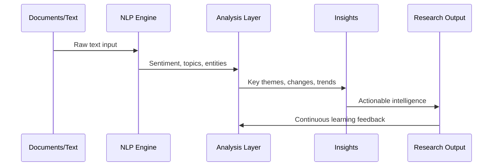
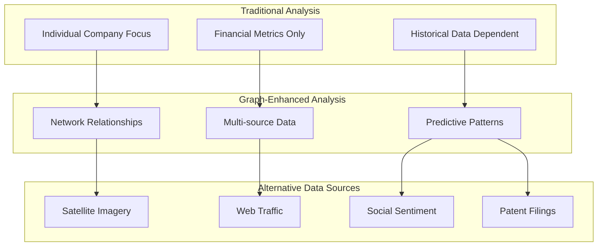
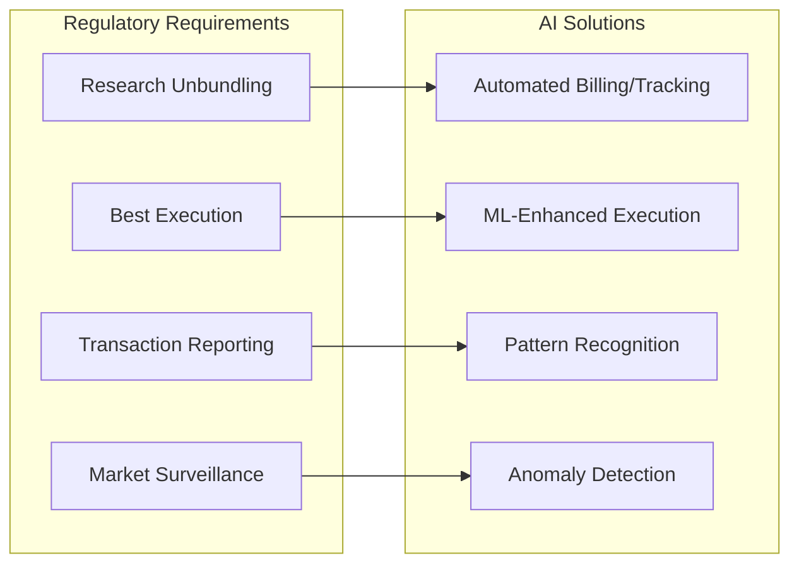
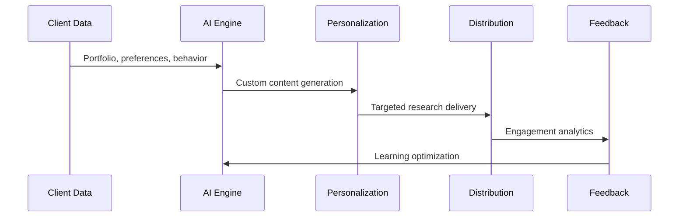
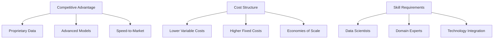

# KI-Entwicklungen im Equity Research

- Zweck: Analyse technologischer Innovation und KI-Integration im Research-Prozess.
- Fokus: Marvin Labs AI Assistant, NLP, Machine Learning, Alternative Data, Workflow-Automatisierung.
- Anwendung: Effizienzsteigerung, Coverage-Erweiterung, Research-Demokratisierung.

Die Equity Research-Branche durchläuft eine fundamentale technologische Transformation durch Künstliche Intelligenz, die besonders bei Private Companies und Small Caps neue Möglichkeiten eröffnet.

## KI-Enhanced Research: Problemlösung im Workflow

Das traditionelle Research steht vor strukturellen Herausforderungen, die KI gezielt addressiert - von der Coverage-Lücke bis zur Effizienz-Krise.

### Problem-Solution Framework



### 1. Coverage-Gap Problem → Automated Target Discovery

**Das Problem**: Post-MiFID II ~15% Rückgang Small-Cap Coverage, Informationsasymmetrie bei deutschen Mittelständlern

**KI-Lösung**: Intelligent Screening & Discovery
- **"Hidden Champion" Detection**: ML-Patterns erkennen erfolgreiche Nischen-Player
- **Alternative Data Mining**: Web-Traffic, Hiring-Trends, Patent-Aktivität für Private Companies
- **Real-time Market Surveillance**: Kontinuierliche Opportunity-Discovery
- **Success Pattern Learning**: Automatische Filter-Optimierung basierend auf Deal-History

**Konkreter Use Case: Maschinenbau-Screening**
```
Input: "Alle Bayern-Unternehmen, Maschinenbau, €50-250M Umsatz"
KI-Enhancement: + Patent-Aktivität + Export-Wachstum + Mitarbeiter-LinkedIn-Trends
Output: 15 "Hidden Champions" mit Investment-Readiness-Score
Zeit: Deutlich verkürzt gegenüber manueller Analyse
```

### 2. Information Overload → Intelligent Document Processing

**Das Problem**: Analysten ertrinken in Dokumenten - Geschäftsberichte, News, Calls, Ad-hoc Meldungen

**KI-Lösung**: NLP-Enhanced Information Extraction
- **Document Summarization**: Kernaussagen aus umfangreichen Reports extrahieren
- **Change Detection**: "Was ist neu vs. Vorquartal?" automatisch identifiziert
- **Sentiment Tracking**: Management-Ton quantifiziert über Zeit-Horizonte
- **Key Metrics Extraction**: Automatische KPI-Tabellen aus unstrukturierten Texten

**Konkreter Use Case: Quarterly Earnings Analysis**
```
Traditionell: Mehrstündige Analyst-Zeit für Call-Transcript + Report
Mit KI: Automatisierte Analyse mit vollständigem Earnings-Review
Qualität: Alle relevanten Punkte, keine Oversight, Quellenverweise
Skalierung: Deutlich mehr Companies parallel bearbeitbar
```

### 3. Zeitdruck Earnings Season → Real-time Analysis Generation

**Das Problem**: Earnings Season = 6 Wochen Chaos, 200+ Companies reporten gleichzeitig

**KI-Lösung**: Automated Report Generation & Real-time Processing
- **Live Earnings Analysis**: Während Conference Call bereits Highlights generieren
- **Instant Peer Comparison**: Sofortige Einordnung vs. Sector/Competitors
- **Automated First Drafts**: Umfassende Reports in kurzer Zeit generieren
- **Multi-language Output**: Deutsch/Englisch parallel für internationale Kunden

**Konkreter Use Case: DAX Earnings Coverage**
```
Challenge: 40 DAX Unternehmen berichten in 3 Wochen
KI-Solution: Parallel Processing aller Calls + Reports
Output: Same-day Commentary für alle 40 Companies
Analyst Role: Strategy/Interpretation statt Data-Gathering
```

### 4. Kostendruck → Workflow-Automatisierung

**Das Problem**: Research-Teams 20% kleiner seit MiFID II, gleicher Coverage-Anspruch

**KI-Lösung**: End-to-End Workflow Enhancement
- **Research Pipeline**: Von Target-ID bis Report-Distribution automatisiert
- **Quality Assurance**: Automated Fact-Checking und Consistency-Validation
- **Client Personalization**: Individual Research-Feeds based auf Portfolio
- **Performance Analytics**: ML-Enhanced Research-Impact-Messung

**Praxis-Erfahrungen**:
- **Marvin Labs**: Kostenreduktion bei Junior Analysts und Research-Kosten
- **Coverage Expansion**: Deutlich mehr Unternehmen bei gleicher Team-Größe  
- **Time-to-Market**: Beschleunigte Reports bei höherer Consistency
- **Client Satisfaction**: Personalized Content steigert Engagement

### Research-Workflow Integration



**Hybrid Excellence**: KI übernimmt Routine-Intelligence, Analyst fokussiert auf Strategy, Judgment, Client-Relationships

## Marvin Labs – KI Research Revolution

### Technology Platform Overview
- **Founded**: 2023, London-based FinTech
- **Product**: AI-powered Investment Analysis Copilot
- **Target**: Buy-Side und Sell-Side Research Efficiency
- **Technology**: Advanced NLP, Large Language Models (LLMs)

### Core AI Capabilities



#### Advanced Features Portfolio

1) **Knowledge-Aware Summaries**
- **Context Integration**: Bestehendes Analyst-Expertise einbeziehen
- **Non-Generic Outputs**: Spezifische, relevante Erkenntnisse
- **Historical Context**: Trends über Zeit-Dimensionen hinweg
- **Comparative Elements**: Automatic Peer Benchmarking

2) **Guidance Tracking & Document Highlights**
- **Management Guidance**: Automatisches Forward-Looking Statement Tracking
- **Document Change Detection**: Kritische Änderungen vs. Previous Reports
- **Sentiment Scoring**: Numerische Stimmungsquantifizierung für Zeitreihen
- **Real-time Processing**: Schnelle Earnings Review Generation

3) **Interactive Chat Interface**
- **Natural Language Queries**: "Wie entwickelte sich Bruttomarge und warum?"
- **Source Attribution**: Direkter Verweis auf Original-Dokumente
- **Contextual Understanding**: KI versteht Finanz-Fachsprache
- **Validation Features**: Überprüfbare, nicht halluzinierte Antworten

### Efficiency & Cost Benefits

**Impact Metrics**
- **Earnings Season**: Kostenreduktion bei Junior und Senior Analysts
- **Overall Research Costs**: Kostenreduktion bei höherer Qualität
- **Time Savings**: Deutliche Zeitersparnis bei Finanzberichten
- **Coverage Expansion**: Mehr Small Caps mit gleichem Ressourceneinsatz

**Workflow Integration**


### Technology Validation & Quality Control

**AI Accuracy Framework**
- **Source Verification**: Alle Aussagen mit Primärquellen verknüpft
- **Comparative Analysis**: Querverweise zwischen Report-Generationen
- **No Hallucination**: Trained für überprüfbare, faktische Statements
- **Continuous Learning**: User Feedback Integration für Model Improvement

**German Market Application**
- **Language Processing**: Multi-language Support (DE/EN)
- **Bundesanzeiger Integration**: Potential für Private Company Analysis
- **Family Office Use Cases**: Cost-effective Private Equity Research
- **Barrier Reduction**: Sprachbarrieren bei internationalen Reports

## Natural Language Processing & Large Language Models

### Unstructured Data Revolution



1) **Advanced Text Analysis**
- **Sentiment Quantification**: Management-Aussagen emotional scoring
- **Topic Modeling**: Hauptthemen aus Earnings Calls extrahieren
- **Entity Recognition**: Automatische Firmen/Personen/Produkt-Identifikation
- **Change Detection**: Tonality-Shifts über Zeit-Horizonte

2) **LLM-Powered Research Assistants**
- **JPMorgan LLM Suite**: Interne "virtueller Research Analyst"
- **Fintool**: SEC-Filing und Earnings Call Durchsuchung
- **Natural Language Queries**: "Hat Management zur Margenentwicklung etwas gesagt?"
- **Mobile Integration**: Real-time KI-Consultation während Investor-Meetings

### Practical Implementation Benefits

**Research Workflow Enhancement**
- **Information Synthesis**: Hunderte Dokumente in Minuten zusammenfassen  
- **Competitive Intelligence**: Automatic Peer-Monitoring und Benchmarking
- **Due Diligence Acceleration**: ML-Enhanced Document Review
- **Language Barriers**: Multi-language Report Generation und Translation

**Personalization & Client Service**
- **Custom Report Generation**: Individual Client Interest Integration
- **Portfolio-Specific Analysis**: Holdings-based Research Prioritization
- **Communication Optimization**: Audience-appropriate Content Adaptation
- **Update Prioritization**: ML-basierte Client-Interest-Prognose

## Graph Analytics & Alternative Data Integration

### Network Analysis Applications



1) **Relationship Mapping**
- **Supply Chain Analysis**: Automated Vendor/Customer Network Discovery  
- **Investment Networks**: PE/VC Connection Pattern Recognition
- **Management Connectivity**: Board/Executive Cross-Company Analysis
- **Strategic Partnership Detection**: Joint Venture und Alliance Patterns

2) **Risk Propagation Modeling** 
- **Contagion Analysis**: Supply Chain Disruption Impact Simulation
- **Systemic Risk**: Network-based Portfolio Risk Assessment
- **Hidden Correlations**: Non-obvious Company Interdependencies
- **Fraud Detection**: Suspicious Entity Relationship Patterns

### Alternative Data Applications

**Real-time Business Intelligence**
- **E-commerce Scraping**: Price/Sales Data für Retail-Prognosen
- **Satellite Analytics**: Mining-Output oder Retail-Traffic Estimation
- **Social Media Mining**: Brand-Sentiment und Product-Popularity Tracking
- **Geo-location Data**: Store-Visit Patterns und Regional-Performance

**Private Company Insights**
- **Web-Traffic Analysis**: Business Performance Proxies
- **Hiring Pattern Recognition**: Growth-Signale durch Job-Posting-Trends
- **Patent Activity Monitoring**: Innovation-Pipeline Assessment
- **Supplier Payment Behavior**: Working Capital und Credit-Quality Indicators

## Regulatory AI Applications

### MiFID II Compliance Enhancement



1) **Best Execution Optimization**
- **TORA Pre-Trade Analytics**: ML-basierte Slippage-Prognose
- **Historical Pattern Analysis**: Broker-Performance Machine Learning
- **Real-time Optimization**: Dynamic Execution-Venue Selection
- **Post-Trade Surveillance**: Automated Best-Ex Compliance Monitoring

2) **Research Distribution Management**  
- **Usage Tracking**: AI-Enhanced Research-Consumption Analytics
- **Pricing Optimization**: ML-basierte Research-Value Quantifikation
- **Client Segmentation**: Predictive Analytics für Research-Interest
- **Quality Assessment**: Automated Research-Report Scoring

### Market Surveillance & Compliance

**Trade Monitoring Enhancement**
- **Market Manipulation Detection**: AI-Enhanced Layering/Spoofing Recognition
- **Systematic Risk Assessment**: Network-Analysis für Systemic Risk
- **Regulatory Reporting**: Automated Transaction Reporting Systems
- **Compliance Documentation**: NLP-Enhanced Regulatory Filing Review

## KI-Enhanced Sales & Distribution

### Personalization Revolution



1) **Intelligent Content Customization**
- **Portfolio-Based Research**: Holdings-specific Analysis Generation
- **Interest Prediction**: ML-Enhanced Research-Relevance Scoring
- **Communication Timing**: Optimal Send-Time Prediction
- **Format Optimization**: Client-Preference-based Content Adaptation

2) **Sales Process Automation**
- **Lead Scoring**: ML-Enhanced Prospect Identification
- **Cross-selling Intelligence**: Predictive Analytics für Product-Fit
- **Meeting Optimization**: AI-Generated Meeting Summaries/Follow-ups
- **Relationship Mapping**: Network-Analysis für Business Development

### Market Expansion Applications

**Language & Cultural Barriers**
- **Automated Translation**: High-quality Multi-language Research Generation
- **Cultural Adaptation**: Regional Investment-Style Content Adjustment
- **Accessibility Enhancement**: Complex Content Simplification für Retail
- **Global Distribution**: Scalable International Research Deployment

**Efficiency & Cost Management**
- **Resource Optimization**: AI-Enhanced Analyst-Time Allocation
- **Quality Assurance**: Automated Research-Consistency Checking
- **Client Satisfaction**: Predictive Analytics für Service-Quality
- **ROI Optimization**: ML-Enhanced Research-Investment Decisions

## Zukunftsausblick & Trends

### Emerging Technologies

1) **Large Language Models (LLMs)**
- **GPT-Integration**: Enhanced NLP für Financial Text Analysis
- **Multimodal AI**: Verarbeitung von Text, Charts, Videos gleichzeitig
- **Reasoning Capabilities**: Logische Schlussfolgerungen aus Datenkombinationen
- **Real-time Learning**: Kontinuierliche Model-Updates ohne Retraining

2) **Advanced Analytics**
- **Quantum Computing**: Komplexe Portfolio-Optimierung und Risk-Modeling
- **Graph Analytics**: Network-Effects in Supply Chains und Market Relationships
- **Time Series Forecasting**: Transformer-Models für Financial Predictions
- **Causal Inference**: ML-Methods für causality vs. correlation

3) **Interactive AI**
- **Conversational Research**: Chat-based Research-Assistant
- **Voice Analytics**: Spoken Earnings Calls → Real-time Sentiment
- **Augmented Reality**: 3D Data Visualization für Complex Models
- **Automated Fact-Checking**: Real-time Validation von Management Statements

### Strategic Implications



### Implementation Roadmap für Deutsche Akteure

| Zeitrahmen | Technology Focus | Market Impact |
|------------|------------------|---------------|
| **2024-2025** | NLP/LLM Integration | Efficiency Gains 20-40% |
| **2025-2026** | Advanced Automation | Coverage Expansion 50%+ |  
| **2026-2027** | AI-Human Hybrid Optimization | New Business Models |
| **2027+** | Fully Integrated AI Research | Democratized Access |

### Deutsche Markt-Spezifika

**Regulatory Environment**
- **GDPR Compliance**: Strenge Datenschutz-Anforderungen für AI-Training Data
- **BaFin Oversight**: Aufsichtliche Guidance für AI in Financial Services
- **EU AI Act**: Kommende Regulierung für High-Risk AI Applications
- **Market Structure**: Mittelstands-fokussierte AI-Lösungen erforderlich

**Competitive Landscape**
- **Technology Adoption**: Deutsche Häuser konservativer bei AI-Integration
- **Quality Standards**: Höhere Compliance-Anforderungen vs. internationale Konkurrenz
- **Language Barriers**: Deutsch-Englisch Bilingual AI-Capabilities erforderlich
- **Local Market Knowledge**: AI muss deutsche Besonderheiten verstehen

## Navigation

- [← Marktakteure](06d_Research_Market_Analysis.md) | [Research Übersicht](06_Research.md)
- [Corporate Finance](01_Corporate_Finance_MA_Finanzierung.md) | [ECM - IPO](02_ECM_IPO.md) | [DCM](03_DCM_Anleiheemission.md) | [Secondary](04_ECM_Kapitalerhoehung_Secondary.md) | [Sales & Trading](05_Sales_Trading_Designated_Sponsoring.md) | [Research](06_Research.md) | [Risk & Compliance](07_Risk_Compliance.md) | [Operations & IT](08_Operations_IT.md)
- [Templates](templates/) | [README](README.md)

> Umfassende Analyse der KI-Entwicklungen und technologischen Innovation im Equity Research