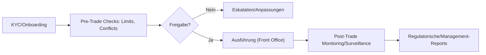
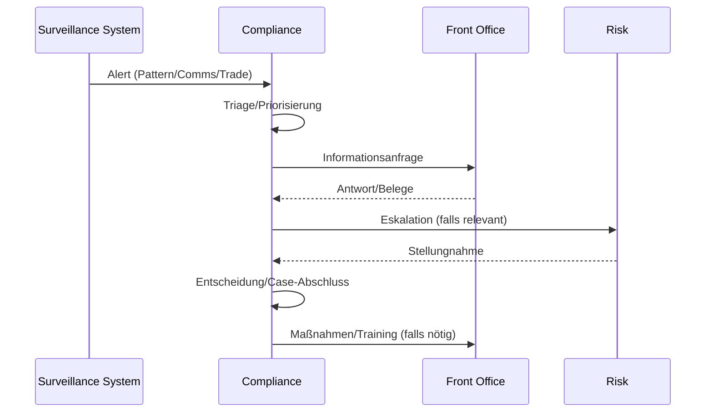
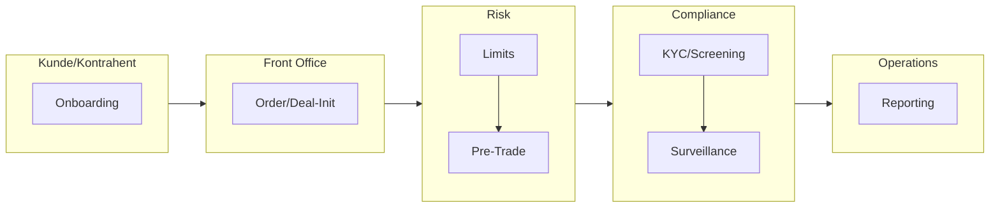

# Risk Management & Compliance (Middle Office)

- Zweck: Schutz der Bank; Regelkonformität; robuste Limit-, KYC- und Überwachungsprozesse.
- Output: Freigaben, Überwachung, Eskalationen, Berichte.
- Schnittstellen: Front Office (Pre-/Post-Trade), Back Office, Management/Aufsicht.

## Kernprozesse – Risiko

- Limitierung: Positions-/Kontrahenten-/Kreditlimits, Intraday/Overnight, Portfolio-Views.
- Messung: VaR/Sensitivitäten, Stresstests, Szenarioanalysen, Backtesting.
- Freigaben: Pre-Trade-Checks, Underwriting/Commitments, Neue-Produkte-Prozess.
- Monitoring: Ex-ante/Ex-post, Breach-Handling, Eskalationspfade.

## Kernprozesse – Compliance

- KYC/AML/Onboarding: Identifikation, Sanktionslisten, PEP/UBO, Risiko-Score.
- Informationsbarrieren: Insiderlisten, Wall-Crossing, Research-Independence.
- Marktüberwachung: Trade/Comms-Surveillance, MAR-Alerts, Untersuchungen.
- Publikationen: Prospekte/Research/Marketing-Freigaben, Disclosures.

## Freigabe- und Überwachungsflow

## Alert‑Handling (Sequence)

## Kontrollmatrix (Auszug)

| Bereich | Hauptrisiko | Kontrolle | Nachweis |
|---|---|---|---|
| KYC/Onboarding | Falsche Einstufung | Risk Scoring, 4‑Augen | KYC‑Dossier |
| Limits | Überschreitung | Intraday/Overnight‑Monitoring | Limit‑Reports |
| Pre‑Trade | Conflicts/Limits | Automatisierte Checks, SoD | Audit‑Trail |
| Surveillance | False Positives/Negatives | Tuning/Reviews | Tuning‑Protokolle |
| Reporting | Unvollständigkeit | Abgleich/Lineage | Reconciliation |

## RACI

| Aktivität | R | A | C | I |
|---|---|---|---|---|
| KYC/Onboarding | Compliance/CLM | Compliance Head | Sales | Management |
| Limits | Risk | CRO | Trading/Finance | Management |
| Pre‑Trade Checks | Risk/Compliance | CRO/CCO | Front Office | Management |
| Surveillance Cases | Compliance | CCO | Trading/Risk | Management |
| Regulatorische Reports | Compliance/Ops | CCO/COO | IT/Data | Aufsicht/Management |

## Governance & Policies

- Policies: KYC/AML, Conflicts of Interest, Surveillance, Limit Framework.
- Committees: Neue Produkte, Risk Committee, Compliance Committee.
- Evidenz: Audit‑Trails, SoD, Data‑Lineage.
## Rollen & Verantwortlichkeiten (Swimlane)

## Detaillierter Ablauf

1) KYC/Onboarding
- Owner: Compliance/CLM • Support: Sales
- Inputs: Corporate Docs, UBO/PEP, Sanktionslisten
- Outputs: Risiko-Score, KYC-Freigabe, Kundennummer
- Kontrollen: 4-Augen-Prinzip, Screening-Logs

2) Limit-/Kreditfreigaben
- Owner: Risk • Support: Finance, Trading
- Inputs: Finanzdaten, Exposure, Stress-Tests
- Outputs: Positions-/Kontrahentenlimits, Kreditlinien
- Kontrollen: IC-Gremien, Limit-Reportings

3) Pre-Trade Checks
- Owner: Risk/Compliance • Support: Front Office
- Inputs: Order/Deal-Details, Konfliktlisten, Limits
- Outputs: Freigabe/Block, Auflagen
- Kontrollen: Audit-Trail, SLA-Zeiten

4) Post-Trade Monitoring & Surveillance
- Owner: Compliance/SRM • Support: IT/Data
- Inputs: Trades, Comms, Alerts
- Outputs: Reviews, Fälle, Eskalationen
- Kontrollen: Schwellen/Modelle, Periodic Tuning

5) Reporting & Audits
- Owner: Risk/Compliance • Support: Ops, IT
- Inputs: Systemdaten, Policies
- Outputs: Berichte (BaFin/Bundesbank/Management), Findings/Actions
- Kontrollen: Data Lineage, Reconciliation, Evidence Library

## Regulatorik (DE/EU – Auswahl)
- KWG, MaRisk, WpHG, MAR, GwG/AML, BAIT, MiFID II.

## KPIs (Beispiele)
- KYC-Durchlaufzeit, Alert-Precision/Recall, Breach-Quote/Time-to-Resolve, Audit-Findings.

## KPIs

- Breach-Quote/Time-to-Resolve, KYC-Durchlaufzeit, Alert-Precision/Recall, Audit-Findings.

## IT-Systeme

- Limit-/Risikoplattform, Surveil­lance/Comms-Monitoring, KYC/CLM, Policy-Workflows.

> Zurück zur Übersicht: [Kernprozesse_Investmentbank_Mittelstand.md](./Kernprozesse_Investmentbank_Mittelstand.md)
