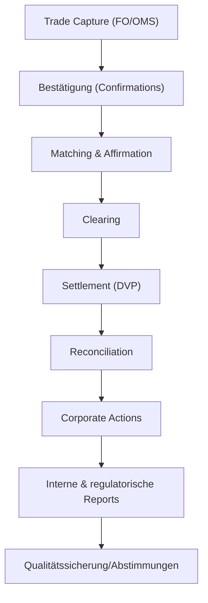
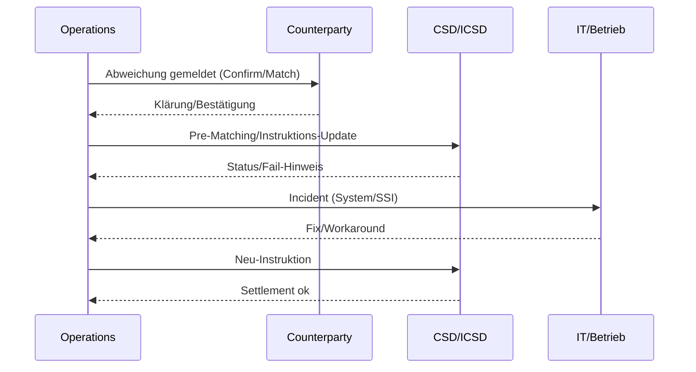
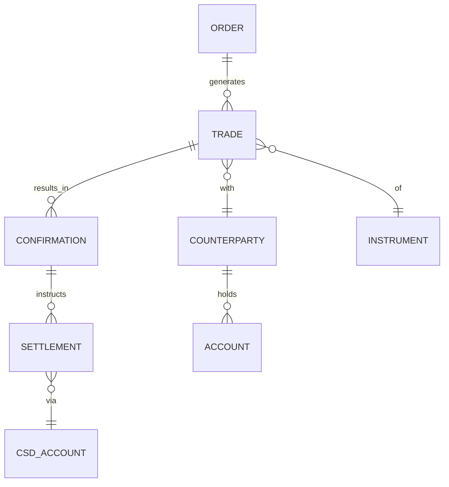
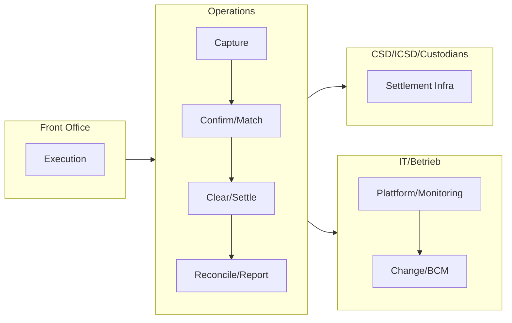

# Operations & IT (Back Office)

- Zweck: Fehlerfreie Abwicklung, Datenqualität, Stabilität, BAIT-konforme IT.
- Output: Bestätigte/abgerechnete Trades, saubere Bücher, Reports, stabile Systeme.
- Bereiche: Trade Support/Confirmations, Matching, Clearing/Settlement, Reconciliation, Corporate Actions, IT-Betrieb.

## Kernprozesse – Operations

- Trade Capture & Confirmations: Verbuchung, Gegenbestätigungen, Abweichungsmanagement.
- Matching & Affirmation: STP-Quote steigern, Abgleich über Middleware/Utility.
- Clearing & Settlement: DVP-Prozesse, CSD/ICSD, Fails-Management, Penalty-Regime.
- Reconciliation & Reporting: Konto-/Positionsabstimmungen, regulatorische/Management-Reports.
- Corporate Actions: Ereignisverarbeitung, Wahlrechte, Fristenkontrolle.

## Kernprozesse – IT

- Plattformbetrieb: Börsen-/Marktdaten-Anbindungen, OMS/EMS, Datenplattform, Security.
- Change/Release: SDLC/DevOps, Bereitstellung, Notfall-/BCM, Outsourcing-Steuerung.

## Post-Trade-Prozess (Flow)

## Ausnahme‑Behandlung (Sequence)

## Kontrollmatrix (Auszug)

| Bereich | Hauptrisiko | Kontrolle | Nachweis |
|---|---|---|---|
| Capture/Enrichment | Falsche Stammdaten | Static‑Data‑Kontrollen | Validierungslogs |
| Confirmations | Abweichungen/Verspätung | SLA/Timeliness, Abgleich | Confirm‑Reports |
| Settlement | Fails/Strafen | Pre‑Matching, Cut‑off‑Kontrollen | CSDR‑Reports |
| Reconciliation | Dauerhafte Breaks | Ageing/Priorisierung | Break‑Listen |
| Reporting | Unvollständig/Falsch | Abgleiche, SoD | Reconciliation/Sign‑off |

## RACI

| Aktivität | R | A | C | I |
|---|---|---|---|---|
| Trade Capture | Trade Support | Ops Lead | Trading | Risk |
| Confirmations | Confirmations | Ops Lead | Counterparty | Compliance |
| Clearing/Settlement | Settlements | Ops Lead | Custodian/CSD | Trading |
| Reconciliation | Recs | Ops Lead | IT/Data | Finance |
| Incident/Change | IT Ops/Change | CIO/COO | Vendors/Ops | Management |

## Governance & Policies

- BAIT/VAIT‑konforme IT‑Prozesse; Change‑/Release‑Management mit CAB.
- CSDR Settlement Discipline: Fails/Buy‑ins/Strafgebühren‑Monitoring.
- Data Lineage/Evidence: Buchungs‑/Report‑Abstimmungen, SoD, Backup/Recovery.
## Datenmodell (ER)

## Rollen & Verantwortlichkeiten (Swimlane)

## Detaillierter Ablauf (Operations)

1) Trade Capture & Enrichment
- Owner: Trade Support • Support: Trading
- Inputs: Order/Execution, Static Data
- Outputs: Vollständiger Trade (Econ/Legal), Enriched Fields
- Kontrollen: Validation Rules, Static-Data-Checks

2) Confirmations & Matching
- Owner: Confirmations • Support: Counterparty
- Inputs: Trade Details, SSI
- Outputs: Elektronische/physische Bestätigungen, Affirmation
- Kontrollen: Abweichungsmanagement, SLA/Timeliness

3) Clearing & Settlement
- Owner: Settlements • Support: Custodians/CSD/ICSD
- Inputs: Settlement-Parameter, Cash/Securities Availability
- Outputs: DVP-Settlement, Status Reports
- Kontrollen: Pre-Matching, Fails/Buy-ins, Penalty-Monitoring (CSDR)

4) Reconciliation & Reporting
- Owner: Recs/Reg Reporting • Support: IT/Data
- Inputs: Buch-/Depotbestände, Handels-/Payments-Daten
- Outputs: Break-Listen, Abgleiche, regulatorische Meldungen
- Kontrollen: Ageing, Materiality, Vier-Augen-Prinzip

## Detaillierter Ablauf (IT)

1) Plattformbetrieb
- Owner: IT Ops • Support: Vendors
- Inputs: Release-Pläne, Patches
- Outputs: Verfügbarkeit, Latenz, Monitoring
- Kontrollen: SLOs/SLAs, Security-Controls

2) Change/Release/BCM
- Owner: IT Change • Support: DevOps/Sec
- Inputs: Change Requests, Tests
- Outputs: Releases, Backout-Pläne, Notfalltests
- Kontrollen: CAB, SoD, Audit Trails

## Regulatorik (DE/EU – Auswahl)
- BAIT/VAIT, CSDR (Settlement), EMIR (falls Derivate), DSGVO (Daten), MaRisk.

## KPIs (Beispiele)
- STP-Quote, Fail-Rate/Strafgebühren, Ageing von Breaks, MTTR, Systemverfügbarkeit/Latenz.

## KPIs

- STP-Quote, Fail-Rate/Strafgebühren, Ageing von Breaks, Incident-MTTR, Systemverfügbarkeit.

## IT-/Datenarchitektur

- Master-/Referenzdaten, Buchungs-/Ledger-Systeme, Echtzeit-Streaming für Post-Trade.

## Navigation

- [← Risk & Compliance](07_Risk_Compliance.md) | [Übersicht](Kernprozesse_Investmentbank_Mittelstand.md)
- [Corporate Finance](01_Corporate_Finance_MA_Finanzierung.md) | [ECM - IPO](02_ECM_IPO.md) | [DCM](03_DCM_Anleiheemission.md) | [Secondary](04_ECM_Kapitalerhoehung_Secondary.md) | [Sales & Trading](05_Sales_Trading_Designated_Sponsoring.md) | [Research](06_Research.md) | [Risk & Compliance](07_Risk_Compliance.md) | [Operations & IT](08_Operations_IT.md)
- [Templates](templates/) | [README](README.md)
