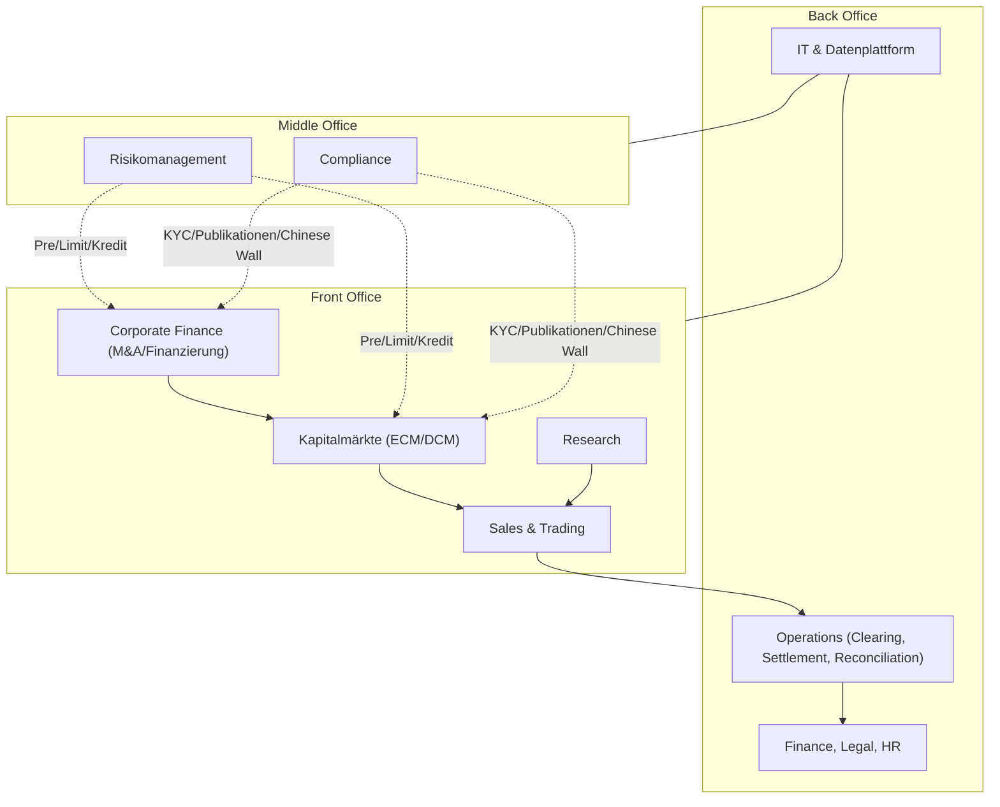
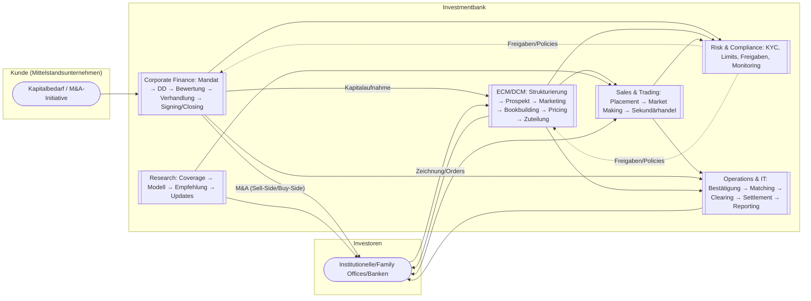
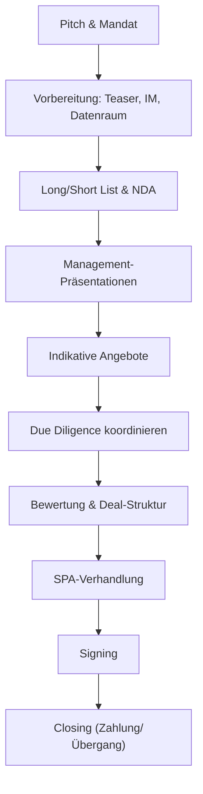
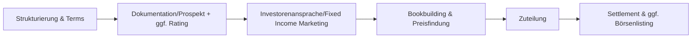
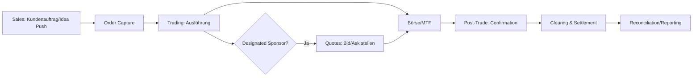
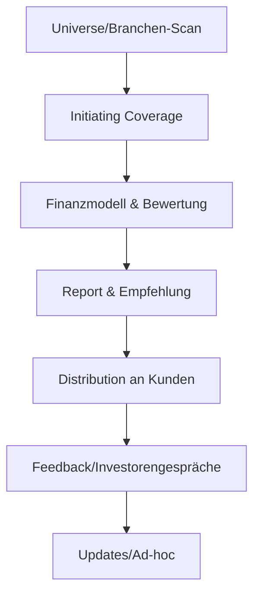
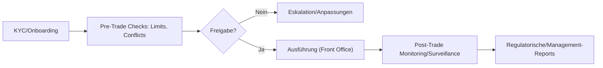
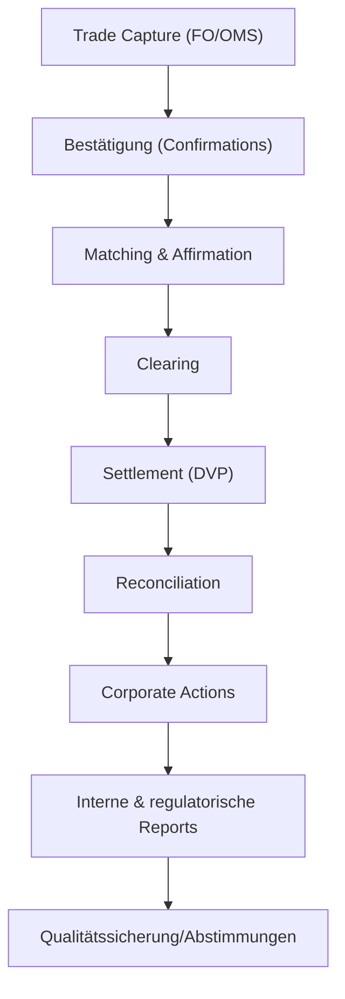

# Kernprozesse einer Investmentbank (Mittelstand) – Visualisierung & Kurzleitfaden

- Ziel: Klarer, visueller End-to-End-Überblick der Kernprozesse.
- Fokus: Mittelstand, Full-Service-Investmentbank, Front/Middle/Back Office.
- Stil: Prägnant, MECE, praktikabel für Umsetzung und Diskussion.

---

## Navigation

- Executive Overview: [README.md](README.md)
- Corporate Finance – M&A/Finanzierung: [01_Corporate_Finance_MA_Finanzierung.md](01_Corporate_Finance_MA_Finanzierung.md)
- ECM – IPO: [02_ECM_IPO.md](02_ECM_IPO.md)
- DCM – Anleiheemission: [03_DCM_Anleiheemission.md](03_DCM_Anleiheemission.md)
- ECM – Kapitalerhöhungen & Secondary: [04_ECM_Kapitalerhoehung_Secondary.md](04_ECM_Kapitalerhoehung_Secondary.md)
- Sales & Trading inkl. DS: [05_Sales_Trading_Designated_Sponsoring.md](05_Sales_Trading_Designated_Sponsoring.md)
- Research: [06_Research.md](06_Research.md)
- Risk & Compliance: [07_Risk_Compliance.md](07_Risk_Compliance.md)
- Operations & IT: [08_Operations_IT.md](08_Operations_IT.md)

Vorlagen/Templates:
- Teaser: [templates/Teaser_Template.md](templates/Teaser_Template.md)
- CIM-Outline: [templates/CIM_Outline.md](templates/CIM_Outline.md)
- Allocation Policy: [templates/Allocation_Policy_Template.md](templates/Allocation_Policy_Template.md)
- CP-Checklist (Closing Conditions): [templates/CP_Checklist_Template.md](templates/CP_Checklist_Template.md)

---

## Organisationsüberblick (Front/Middle/Back Office)

---

## Gesamtfluss (Kunde – Bank – Investoren)

---

## Prozessdetails (prägnant + visuell)

### 1) Corporate Finance – M&A (Fokus Mittelstand)

- Zweck: Wertmaximierender Verkauf/Zukauf; Nachfolge (MBO/MBI) strukturiert umsetzen.
- Output: Signiertes SPA, Preis/Konditionen, gesicherte Finanzierung, Closing.
- Schlüsselentscheidungen: Prozessdesign (Bieterverfahren vs. Bilateral), Valuation-Band, Deal-Struktur.

### 2) Kapitalaufnahme – IPO (ECM)

- Zweck: Eigenkapital für Wachstum, Sichtbarkeit, Investorenbasis verbreitern.
- Output: Zulassung, Erlös, Free Float, stabile Erstnotiz.
- Schlüsselentscheidungen: Timing, Preisspanne, Volumen, Allokation, Stabilisierungsrahmen.

### 3) Kapitalaufnahme – Anleiheemission (DCM)

- Zweck: Fremdkapital zu passenden Laufzeiten/Konditionen mobilisieren.
- Output: Emittierte Schuldverschreibungen, erfolgreicher Platzierungsgrad, Listing (optional).
- Schlüsselentscheidungen: Volumen, Laufzeit, Kupon/Preis, Covenants, Rating.

### 4) Sales & Trading inkl. Designated Sponsoring

- Zweck: Liquidität, faire Preisfindung, Investorenversorgung; Platzierungsunterstützung.
- Output: Ausgeführte Orders, enge Spreads, verlässlicher Sekundärmarkt.
- Schlüsselentscheidungen: Ausführungsstrategie, Risikolimits, Sponsoring-Parameter.

### 5) Research (Small-/Mid-Cap Fokus)

- Zweck: Fundierte, unabhängige Analysen; Informationsvorsprung für Kunden; Deal‑Sourcing.
- Output: Initiations- und Updates, Modelle, Empfehlungen, Events.
- Schlüsselentscheidungen: Coverage-Universum, Annahmen, Trigger, Bewertung.

### 6) Risk & Compliance (Middle Office)

- Zweck: Schutz der Bank; Regelkonformität; robuste Limit- und KYC-Prozesse.
- Output: Freigaben, Überwachung, Eskalationen, Berichte.
- Schlüsselentscheidungen: Limits, Kreditlinien, Konfliktmanagement, Eskalationspfade.

### 7) Operations & IT (Back Office)

- Zweck: Fehlerfreie Abwicklung, Datenqualität, Stabilität, BAIT-konforme IT.
- Output: Bestätigte/abgerechnete Trades, saubere Bücher, Reports.
- Schlüsselentscheidungen: Automatisierungsgrad, Systemarchitektur, Kontrollen, Notfallkonzepte.

---

## Hinweise für Umsetzung/Steuerung

- Governance: Klare Verantwortlichkeiten je Prozess; verbindliche RACI-Matrix.
- Schnittstellen: Definierte Übergaben zwischen FO/MO/BO; minimale manuelle Brüche.
- Daten & IT: Einheitliche Datenmodelle; revisionssichere Speicherung; API‑First.
- KPI/Controlling: Durchlaufzeiten, Platzierungsgrad, Fehlerraten, P&L/Value at Risk, Compliance‑Findings.
- Regulierung: KYC/AML, Marktmissbrauch, Prospektrecht, BAIT; regelmäßige Audits/Tests.

> Vereinfachte, aber praxistaugliche Darstellung. Konkrete Schritte je Jurisdiktion und Produkt feingranular anzupassen.
