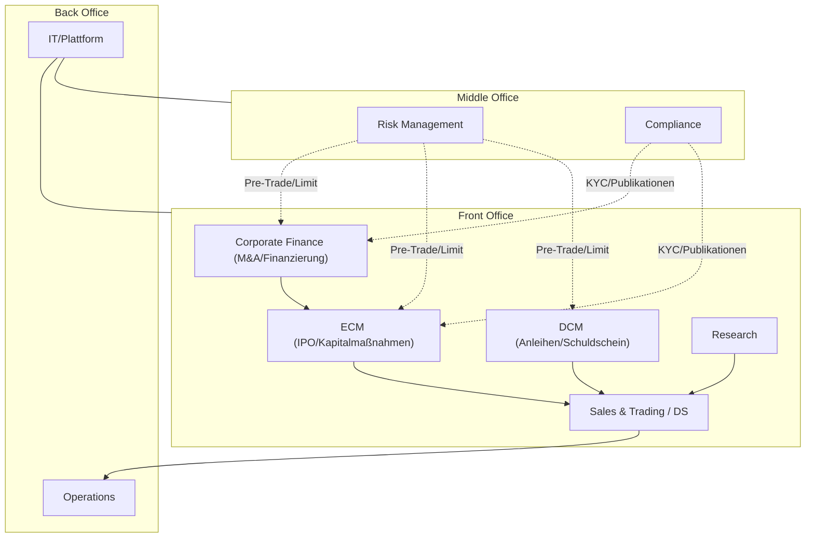

# investment-bank

## Executive Overview – Kernprozesse Investmentbank (Mittelstand)

- Ziel: Ein prägnantes, visuelles Cockpit aller Kernprozesse mit schnell erfassbaren Abläufen, Rollen, Zeitplänen und Kontrollpunkten.
- Fokus: M&A/Finanzierung (CF), IPO/ECM, DCM, Sales & Trading inkl. DS, Research, Risk/Compliance, Operations/IT.

## Gesamtbild (Front/Middle/Back Office)

## Navigation

- Corporate Finance – M&A/Finanzierung: `01_Corporate_Finance_MA_Finanzierung.md`
- ECM – IPO: `02_ECM_IPO.md`
- DCM – Anleiheemission: `03_DCM_Anleiheemission.md`
- ECM – Kapitalerhöhungen & Secondary: `04_ECM_Kapitalerhoehung_Secondary.md`
- Sales & Trading inkl. DS: `05_Sales_Trading_Designated_Sponsoring.md`
- Research: `06_Research.md`
- Risk & Compliance: `07_Risk_Compliance.md`
- Operations & IT: `08_Operations_IT.md`
